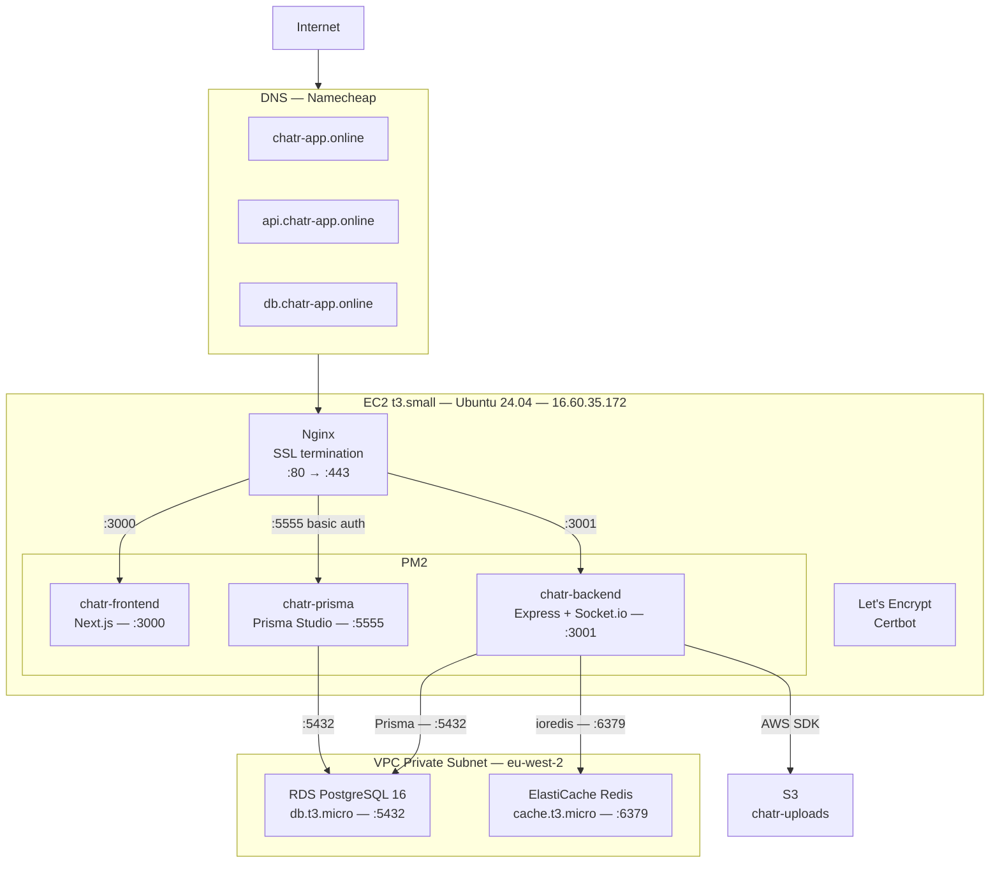
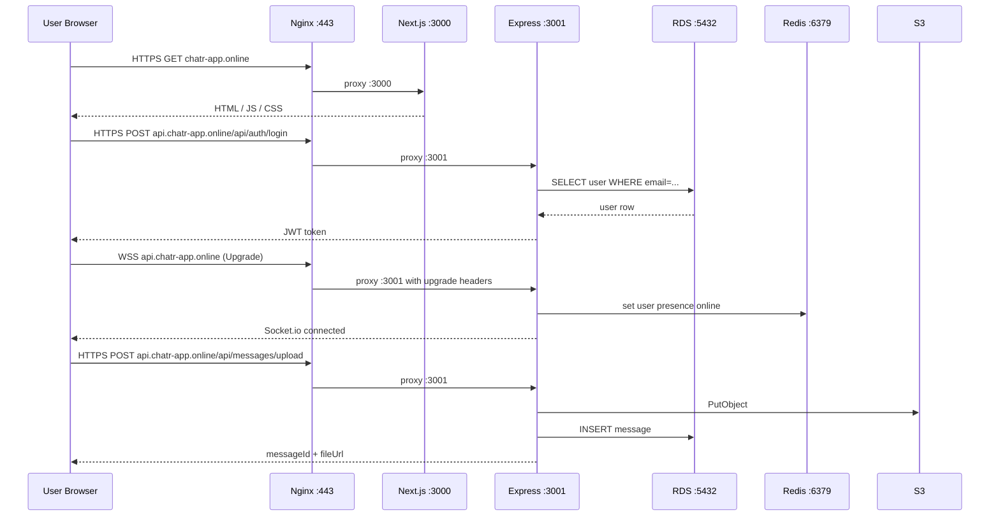

# AWS Infrastructure

## Overview

Chatr runs entirely in AWS `eu-west-2` (London). All services are in the same region. The EC2 instance is the only publicly exposed resource — RDS and ElastiCache are on the private VPC and not reachable from the internet.

---

## Service Map



---

## Nginx Routing

| Domain | Proxies to | Notes |
|--------|-----------|-------|
| `chatr-app.online` | `:3000` | Next.js frontend |
| `www.chatr-app.online` | `:3000` | www redirect |
| `api.chatr-app.online` | `:3001` | Express API + WebSocket |
| `db.chatr-app.online` | `:5555` | Prisma Studio — basic auth required |

All domains terminate SSL at Nginx via Let's Encrypt certificates. HTTP (port 80) is auto-redirected to HTTPS (port 443) by Certbot.

WebSocket upgrade headers are passed through on `api.chatr-app.online`:
```
proxy_set_header Upgrade $http_upgrade;
proxy_set_header Connection "upgrade";
proxy_read_timeout 86400;
```

---

## EC2 Instance

| Property | Value |
|----------|-------|
| Instance type | t3.small |
| OS | Ubuntu 24.04 LTS |
| Public IP | `16.60.35.172` |
| Region | eu-west-2 (London) |
| App directory | `/home/ubuntu/chatr` |
| Log directory | `/var/log/chatr/` |
| Process manager | PM2 |

### PM2 Processes

| Name | Script | Port | Logs |
|------|--------|------|------|
| `chatr-frontend` | `next start` | `3000` | `/var/log/chatr/frontend-out.log` |
| `chatr-backend` | `node dist/index.js` | `3001` | `/var/log/chatr/backend-out.log` |
| `chatr-prisma` | `prisma studio` | `5555` | `/var/log/chatr/prisma-out.log` |

### Security Group Ports

| Port | Protocol | Source | Purpose |
|------|----------|--------|---------|
| 22 | TCP | Your IP | SSH access |
| 80 | TCP | 0.0.0.0/0 | HTTP (redirects to HTTPS) |
| 443 | TCP | 0.0.0.0/0 | HTTPS + WSS |

> Ports 3000, 3001, and 5555 are **not** open to the internet — traffic reaches them only via Nginx on the same host.

---

## RDS PostgreSQL

| Property | Value |
|----------|-------|
| Engine | PostgreSQL 16 |
| Instance class | db.t3.micro |
| Host | `chatr-db.cb20yaey0epm.eu-west-2.rds.amazonaws.com` |
| Port | `5432` |
| Database | `chatr` |
| User | `chatr_user` |
| Access | VPC private only — EC2 security group |

---

## ElastiCache Redis

| Property | Value |
|----------|-------|
| Engine | Redis |
| Instance class | cache.t3.micro |
| Host | `master.chatr-redis.bxugin.euw2.cache.amazonaws.com` |
| Port | `6379` |
| Access | VPC private only — EC2 security group |
| Used for | User presence, online status maps |

---

## S3

| Property | Value |
|----------|-------|
| Bucket | `chatr-uploads` |
| Region | `eu-west-2` |
| Access | IAM key from EC2 only |
| Contents | Profile images, cover images, audio, file attachments |

---

## SSL Certificates

Managed by Certbot with the Nginx plugin. Certificates are auto-renewed via a cron job installed by Certbot.

```
Domains:  chatr-app.online
          www.chatr-app.online
          api.chatr-app.online
          db.chatr-app.online

Issuer:   Let's Encrypt
Cert dir: /etc/letsencrypt/live/chatr-app.online/
```

---

## Network Flow



---

## Deployment

The full infrastructure is provisioned and configured by `deployAWS.sh`. Run locally via:

```bash
bash aws.sh
```

See [Deployment Guide](../Getting-Started/DEPLOYMENT.md) for full details.

