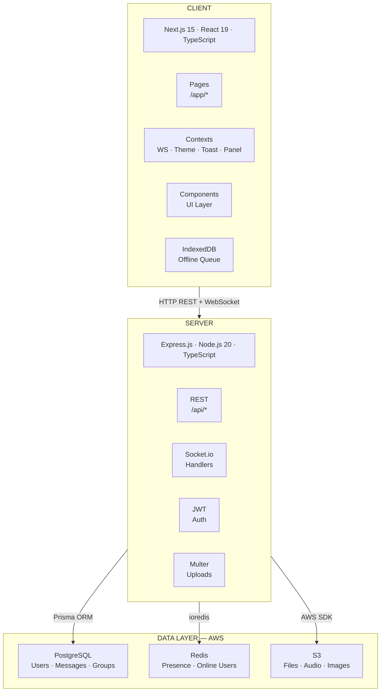
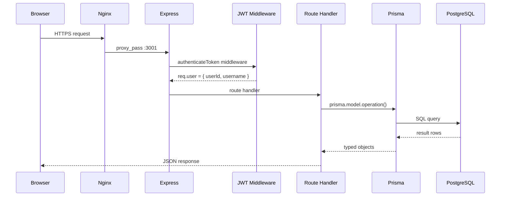
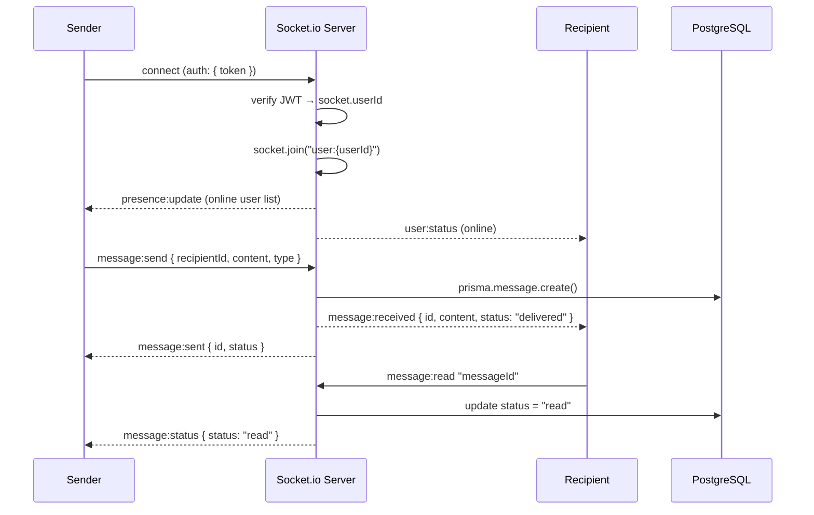
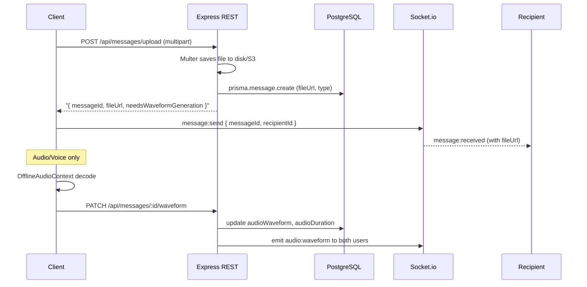
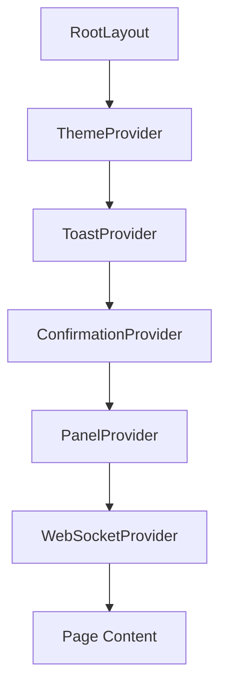
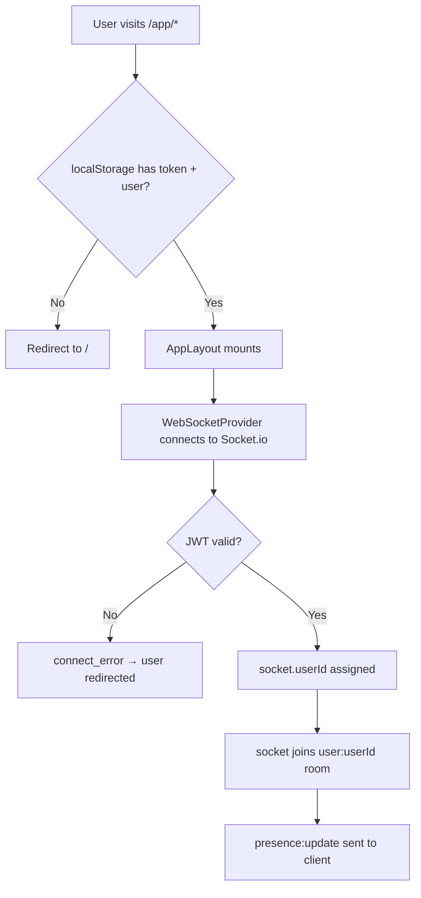

# System Architecture

## Overview

Chatr is a three-tier real-time messaging platform: a Next.js 15 client, an Express 4 API server, and a PostgreSQL 16 database. Real-time communication runs over Socket.io on the same Express process. File uploads are stored locally (`/uploads`) in development and on AWS S3 in production. Presence and session state are managed in Redis.

## High-Level Architecture

## Technology Stack

### Frontend

| Layer | Technology | Version |
|-------|-----------|---------|
| Framework | Next.js | 15.x |
| UI Library | React | 19.x |
| Language | TypeScript | 5.x |
| Styling | CSS Modules + CSS custom properties | — |
| Real-time | Socket.io Client | 4.x |
| State Management | React Context API | — |
| Offline Storage | Dexie (IndexedDB wrapper) | 4.x |
| Animation | Framer Motion | 12.x |
| HTTP Client | Fetch API (native) | — |

### Backend

| Layer | Technology | Version |
|-------|-----------|---------|
| Runtime | Node.js | 20.x |
| Framework | Express.js | 4.x |
| Language | TypeScript | 5.x |
| Real-time | Socket.io | 4.x |
| ORM | Prisma | 5.x |
| Database | PostgreSQL | 16.x |
| Cache / Presence | Redis (ioredis) | 7.x |
| Auth | JWT (jsonwebtoken, HS256) | 9.x |
| File Upload | Multer | 1.x |
| Password Hashing | bcryptjs (10 rounds) | — |
| 2FA | speakeasy (TOTP) | — |
| SMS | Twilio | — |
| Email | Nodemailer | — |
| API Docs | Swagger UI + swagger-jsdoc | — |

### Infrastructure (Production)

| Service | AWS Product | Spec |
|---------|------------|------|
| App Server | EC2 | t3.small, Ubuntu 24.04 |
| Database | RDS PostgreSQL | db.t3.micro, pg16 |
| Cache | ElastiCache Redis | cache.t3.micro |
| File Storage | S3 | Standard |
| Reverse Proxy | Nginx | on EC2 |
| Process Manager | PM2 | on EC2 |
| SSL | Let's Encrypt (Certbot) | — |

## Request Lifecycle

### REST Request

### WebSocket Connection & Messaging

### File Upload Flow

## Directory Structure

```mermaid
graph TD
    chatr --> frontend
    chatr --> backend
    chatr --> prisma

    frontend --> fapp["app/<br/>pages + layouts"]
    frontend --> fcomponents["components/<br/>UI library"]
    frontend --> fcontexts["contexts/<br/>WS · Theme · Toast · Panel · Confirmation"]
    frontend --> fhooks["hooks/<br/>useAuth · useOfflineSync"]
    frontend --> flib["lib/<br/>api · auth · db · offline · imageServices"]
    frontend --> ftypes["types/<br/>User · Message · Group"]
    frontend --> futils["utils/<br/>extractWaveform"]

    fapp --> apppages["login · register · setup-2fa<br/>demo · docs · email-preview"]
    fapp --> appauth["app/ authenticated<br/>chat · settings · groups · updates · test"]

    fcomponents --> messaging["messaging/<br/>MessageBubble · AudioPlayer<br/>VoiceRecorder · ChatInput · ChatMessageList"]
    fcomponents --> formcontrols["form-controls/<br/>Button · Input · Select · Textarea<br/>Checkbox · Radio · DatePicker · Calendar<br/>RangeSlider · DualRangeSlider"]
    fcomponents --> dialogs["dialogs/<br/>BottomSheet · ConfirmationDialog · Lightbox"]
    fcomponents --> imagemanip["image-manip/<br/>ProfileImage · CoverImage<br/>Uploader + Cropper"]
    fcomponents --> formcomps["forms/<br/>LoginForm · LoginVerification<br/>EmailVerification · ForgotPassword"]
    fcomponents --> panels["panels/<br/>PanelContainer · AuthPanel"]
    fcomponents --> layout["layout/<br/>MobileLayout · BackgroundBlobs"]
    fcomponents --> utility["utility/<br/>Logo · ThemeToggle · ToastContainer<br/>ConnectionIndicator · BurgerMenu<br/>WebSocketStatusBadge · RoutePreloader"]

    backend --> bsrc["src/"]
    bsrc --> bindexts["index.ts<br/>Express + Socket.io entry"]
    bsrc --> bmiddleware["middleware/<br/>auth.ts — JWT"]
    bsrc --> broutes["routes/<br/>auth · users · messages<br/>groups · file-upload · email-templates"]
    bsrc --> bsocket["socket/<br/>handlers.ts — all events + presence"]
    bsrc --> bservices["services/<br/>email · sms · waveform"]

    prisma --> schema["schema.prisma"]
    prisma --> migrations["migrations/"]
```

## Context Provider Tree

## Authentication & Session Flow

---

## See Also

- [AWS Infrastructure](./AWS.md) — EC2, RDS, Redis, S3, Nginx ports and config
