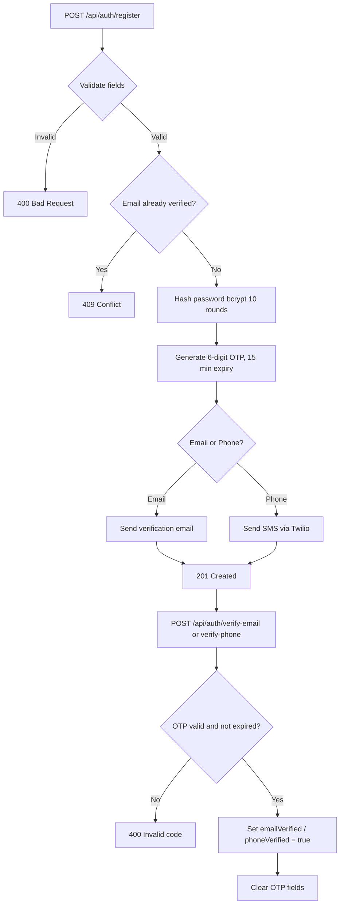
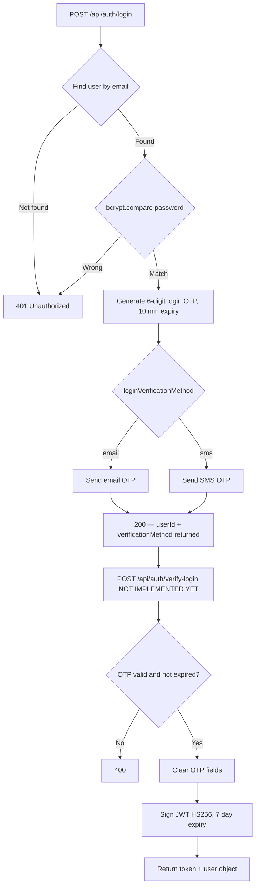
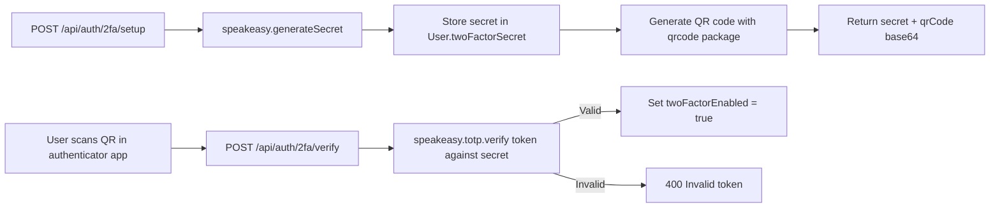
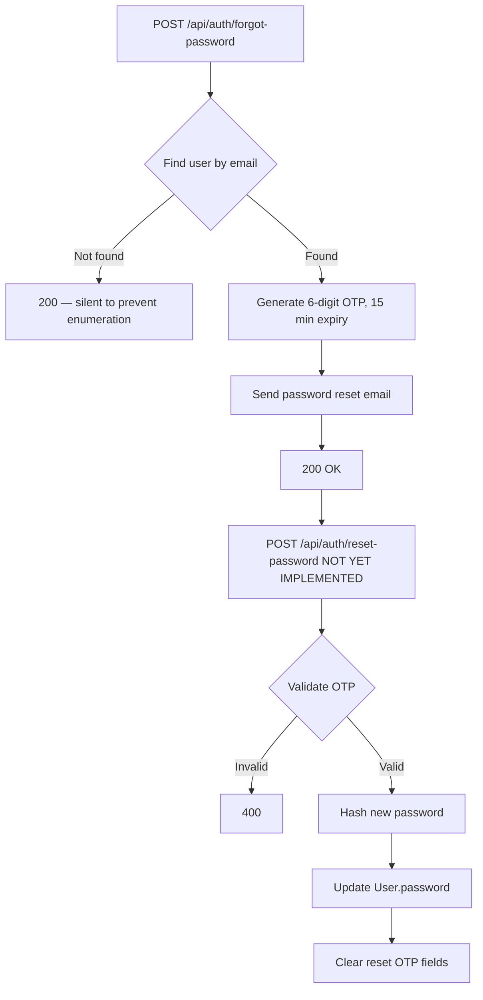

# Authentication

## Overview

Chatr uses a multi-step authentication flow. Registration requires either an email or phone number, a username, and a password. Login requires password + OTP. Optionally, TOTP-based 2FA can be enabled as an additional step.

All API access beyond public endpoints requires a JWT bearer token in the `Authorization` header.

---

## Registration Flow



**Password validation rules:**
- Minimum 8 characters
- At least one uppercase letter
- At least one special character (`!@#$%^&*` etc.)

**Username validation rules:**
- 3–20 characters
- Alphanumeric and underscores only
- Automatically prefixed with `@` if not provided

---

## Login Flow



> ⚠️ `POST /api/auth/verify-login` is referenced in the login flow but is not yet a standalone endpoint. Login OTP verification is handled within the login route itself.

---

## JWT

Tokens are signed with `HS256` using `JWT_SECRET` from environment variables.

**Payload:**
```json
{
  "userId": "uuid",
  "username": "@johndoe",
  "iat": 1740000000,
  "exp": 1740604800
}
```

**Default expiry:** `7d`

**REST usage:**
```
Authorization: Bearer <token>
```

**WebSocket usage:**
```javascript
io.connect(url, { auth: { token } })
```

The `authenticateToken` middleware (`backend/src/middleware/auth.ts`) validates the token and attaches `req.user` to the request. Invalid or expired tokens return `401`.

---

## Two-Factor Authentication (TOTP)

When 2FA is enabled, a TOTP code is required after password + OTP verification.



- Secret generated with `speakeasy.generateSecret({ length: 20 })`
- Stored in `User.twoFactorSecret`
- Verified with `speakeasy.totp.verify()` (±1 window)
- QR code rendered as `data:image/png;base64,...` for authenticator apps (Google Authenticator, Authy etc.)

---

## Password Reset Flow



> ⚠️ `POST /api/auth/reset-password` is documented for completeness but is not yet implemented as a standalone endpoint.

---

## Phone Verification

Phone numbers are stored in E.164 format (e.g. `+447911123456`). The `validatePhoneNumber` and `formatPhoneNumber` helpers in `services/sms.ts` normalise input before storage.

**Dev bypass:** A whitelist of dev phone numbers is hardcoded in `auth.ts`. These numbers skip duplicate checks and log OTPs to the console instead of sending real SMS — useful for local development without a real Twilio account.

---

## Token Storage (Frontend)

Tokens are stored in `localStorage`:

```typescript
localStorage.setItem('token', token);
localStorage.setItem('user', JSON.stringify(user));
```

The `useAuth` hook reads these on mount and provides `login()` and `logout()` helpers. `AppLayout` enforces the presence of both before rendering protected routes.

WebSocketContext reads the token from `localStorage` and passes it as `auth.token` in the Socket.io handshake. If the token is absent or invalid, the connection is skipped or rejected.
