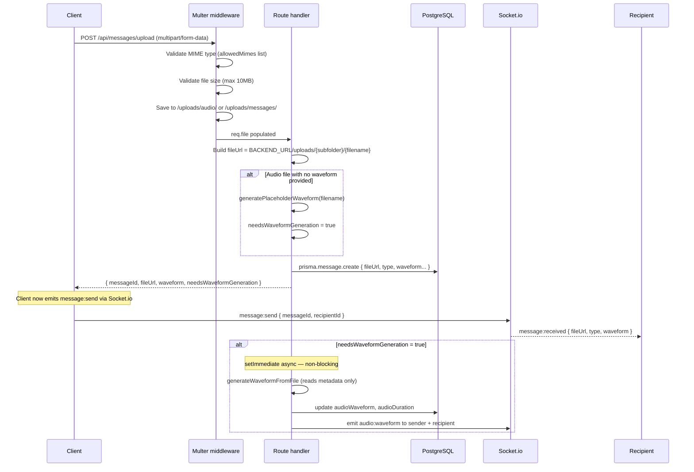
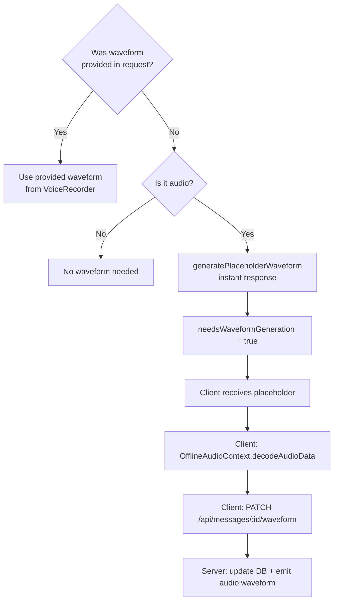

# File Upload

## Overview

File, image, and audio uploads are handled by the `file-upload.ts` route, mounted at `POST /api/messages/upload`. It uses [Multer](https://github.com/expressjs/multer) for multipart form parsing and disk storage.

---

## Upload Flow



---

## Storage Layout

```
backend/uploads/
├── messages/    # Images and document files
│   └── {originalName}-{timestamp}-{random}{ext}
└── audio/       # Audio and voice messages
    └── {originalName}-{timestamp}-{random}{ext}
```

Directories are created automatically on server start if they don't exist.

---

## Multer Configuration

### Storage

`multer.diskStorage` — files are written directly to disk.

**Destination:** determined by MIME type:
- `audio/*` → `uploads/audio/`
- everything else → `uploads/messages/`

**Filename:** `{originalName}-{Date.now()}-{random9digits}{ext}`  
Prevents collisions and preserves the original extension.

### File Size Limit

**10 MB** per upload. Returns `400` if exceeded.

### Allowed MIME Types

| Category | Types |
|----------|-------|
| Images | `image/jpeg`, `image/png`, `image/gif`, `image/webp` |
| Audio | `audio/webm`, `audio/mp4`, `audio/mpeg`, `audio/ogg`, `audio/wav`, `audio/x-m4a` |
| Documents | `application/pdf`, `application/msword`, `application/vnd.openxmlformats-officedocument.wordprocessingml.document`, `text/plain` |

Unrecognised MIME types are rejected with `400`.

---

## Request Format

`Content-Type: multipart/form-data`

| Field | Type | Required | Description |
|-------|------|----------|-------------|
| `file` | File | Yes | The file to upload |
| `recipientId` | String | Yes | Target user UUID |
| `type` | String | No | `image`, `file`, or `audio` — used for non-audio type classification |
| `waveform` | String (JSON) | No | Pre-computed waveform array (from VoiceRecorder) |

---

## Response

```json
{
  "success": true,
  "messageId": "uuid",
  "fileUrl": "https://api.chatr-app.online/uploads/audio/voice-1740123456-987654321.webm",
  "fileName": "voice.webm",
  "fileSize": 48200,
  "fileType": "audio/webm",
  "waveform": [0.08, 0.12, 0.20, ...],
  "needsWaveformGeneration": true
}
```

`needsWaveformGeneration: true` tells the client it should decode the audio client-side and call `PATCH /api/messages/:id/waveform` with the real waveform data.

---

## Waveform Strategy



**VoiceRecorder uploads** (recorded in the browser) include a pre-computed waveform in the request — no further processing needed.

**MP3/audio file uploads** receive a deterministic placeholder waveform immediately, then the real waveform is generated asynchronously client-side.

---

## Static File Serving

Uploaded files are served statically from `/uploads`:

```
GET /uploads/audio/voice-1740123456.webm
GET /uploads/messages/photo-1740123457.jpg
```

CORS headers are set explicitly on the `/uploads` route to allow cross-origin image/audio loading in the browser:

```
Access-Control-Allow-Origin: {FRONTEND_URL}
Cross-Origin-Resource-Policy: cross-origin
```

---

## Error Handling

| Scenario | Response |
|----------|----------|
| No file in request | `400 No file uploaded` |
| Missing `recipientId` | `400 Recipient ID required` — file deleted from disk |
| Unauthenticated | `401 Unauthorized` — file deleted from disk |
| MIME type not allowed | `400` (Multer rejects before handler) |
| File too large | `400` (Multer rejects before handler) |
| Unexpected error | `500 File upload failed` — file deleted if it exists |

