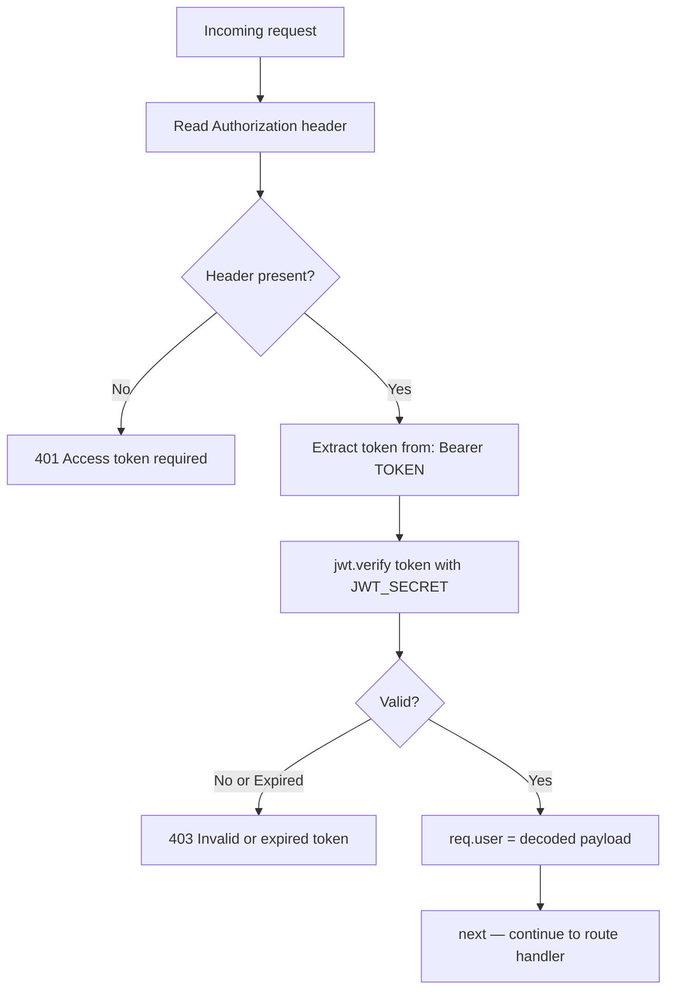

# Middleware

## `authenticateToken` (`middleware/auth.ts`)

JWT bearer token authentication middleware. Applied to all protected routes.

---

## How It Works



---

## Usage

```typescript
import { authenticateToken } from '../middleware/auth';

// Applied to a single route
router.get('/me', authenticateToken, handler);

// Applied to all routes in a router
router.use(authenticateToken);
```

---

## Token Payload

After successful verification, `req.user` is set to:

```typescript
req.user = {
  userId: string,   // UUID of the authenticated user
  username: string  // @ prefixed username
}
```

This is available in all downstream route handlers via `req.user.userId`.

---

## Error Responses

| Condition | Status | Body |
|-----------|--------|------|
| No `Authorization` header | `401` | `{ "error": "Access token required" }` |
| Invalid signature / malformed | `403` | `{ "error": "Invalid or expired token" }` |
| Token expired | `403` | `{ "error": "Invalid or expired token" }` |

---

## TypeScript Declaration

The middleware extends Express's `Request` type globally so `req.user` is available without casting:

```typescript
declare global {
  namespace Express {
    interface Request {
      user?: {
        userId: string;
        username: string;
      };
    }
  }
}
```

---

## WebSocket Authentication

The same JWT is validated in `socket/handlers.ts` via Socket.io middleware:

```typescript
io.use(async (socket, next) => {
  const token = socket.handshake.auth.token
               || socket.handshake.headers.authorization?.split(' ')[1];
  // jwt.verify → find user in DB → socket.userId = user.id
});
```

Socket.io returns a `connect_error` event to the client if the token is missing or invalid. The user is additionally looked up in the database to confirm they still exist (guards against deleted accounts with valid tokens).

