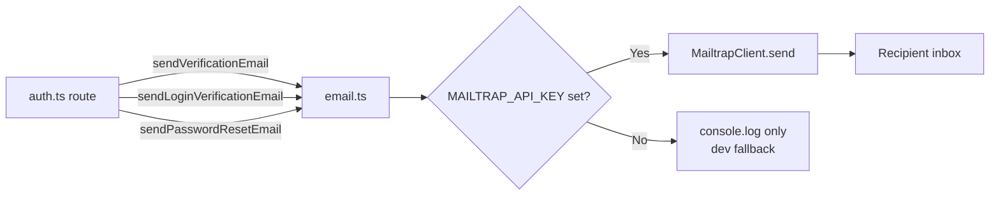
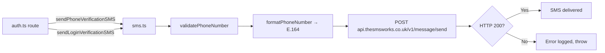
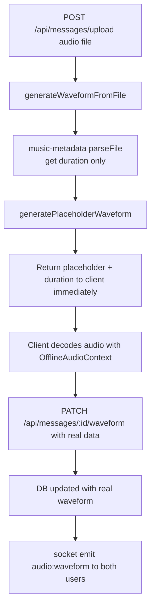

# Backend Services

## Overview

The backend has three internal services in `backend/src/services/`:

| Service | File | Purpose |
|---------|------|---------|
| Email | `email.ts` | Transactional email via Mailtrap |
| SMS | `sms.ts` | SMS OTP delivery via SMS Works |
| Waveform | `waveform.ts` | Audio duration extraction + placeholder waveform |

---

## Email Service (`services/email.ts`)

### Provider

**Mailtrap** — used for transactional email in both development (inbox testing) and production (sending API).



### Configuration

| Env Variable | Default | Description |
|-------------|---------|-------------|
| `MAILTRAP_API_KEY` | — | Mailtrap sending API key |
| `MAIL_FROM_ADDRESS` | `noreply@emberlyn.co.uk` | Sender address |
| `MAIL_FROM_NAME` | `Chatr` | Sender display name |
| `FRONTEND_URL` | `http://localhost:3000` | Used to build verification links |

If `MAILTRAP_API_KEY` is not set, emails are logged to the console only — useful for local development without a Mailtrap account.

### Email Functions

#### `sendVerificationEmail(to, code, userId)`
Sends a styled HTML email with a 6-digit OTP code and a verification deep-link to `{FRONTEND_URL}/verify?code={code}&userId={userId}`.

#### `sendLoginVerificationEmail(to, code)`
Sends a login OTP email. Same HTML template, different subject line.

#### `sendPasswordResetEmail(to, code)`
Sends a password reset OTP email.

### Email Template

All emails share the same branded HTML template:
- Gradient header background (`#667eea → #764ba2`)
- Inline base64 logo image (from `logo-base64-constant.ts`)
- Large OTP code box with letter-spacing
- Short expiry notice
- Footer with product name

---

## SMS Service (`services/sms.ts`)

### Provider

**SMS Works** — UK-based SMS gateway (`https://thesmsworks.co.uk`).



### Configuration

| Env Variable | Default | Description |
|-------------|---------|-------------|
| `SMS_WORKS_JWT` | hardcoded dev token | JWT auth token for SMS Works API |
| `SMS_WORKS_SENDER` | `PRODUCT_NAME` | Sender name shown on recipient's phone |
| `PRODUCT_NAME` | `Chatr` | Fallback sender name |

> ⚠️ The SMS Works JWT token in the codebase is a development token. Replace with a production token in the `backend/.env` for live deployments.

### Authentication

SMS Works uses `Authorization: JWT <token>` header (not `Bearer`).

### Phone Number Handling

```typescript
validatePhoneNumber(phone: string): boolean
// Accepts: +447911123456, 07911123456, 447911123456
// Returns false for anything that can't be normalised

formatPhoneNumber(phone: string): string
// Normalises to E.164 with + prefix: +447911123456
```

Numbers are stored in E.164 format in the DB. SMS Works API requires the number **without** the `+` prefix — the service strips it before sending.

### SMS Functions

#### `sendPhoneVerificationSMS(to, code)`
Sends the registration OTP: `"Your Chatr verification code is: 123456. Valid for 15 minutes."`

#### `sendLoginVerificationSMS(to, code)`
Sends the login OTP: `"Your Chatr login code is: 123456. Valid for 10 minutes."`

---

## Waveform Service (`services/waveform.ts`)

Handles audio waveform generation for uploaded audio messages.



### `generatePlaceholderWaveform(seed)`

Returns a deterministic 100-bar waveform array immediately after upload, before client-side analysis completes. Uses a repeating amplitude pattern with a sine-wave variation seeded by the filename to give each voice note a slightly unique shape.

```typescript
// Returns: number[] of length 100, values in range [0.04, 0.90]
generatePlaceholderWaveform(filename: string): number[]
```

### `getAudioDuration(filePath)`

Uses `music-metadata` to read the audio file's duration from its metadata headers — no PCM decoding on the server side. Returns `0` if metadata is unreadable.

```typescript
getAudioDuration(filePath: string): Promise<number> // seconds
```

### `generateWaveformFromFile(filePath)`

Convenience wrapper — returns `{ waveform: number[], duration: number }`. Used by the upload route for instant response.

### Design Decision

Server-side waveform generation (PCM decode + RMS analysis) was considered but rejected because:
1. It's CPU-intensive for a single-process server
2. The browser's `OfflineAudioContext` is faster and produces higher-quality results
3. The placeholder is shown instantly, so the UX is seamless

The real waveform is extracted client-side and sent back via `PATCH /api/messages/:id/waveform`, then pushed to both users via `audio:waveform` Socket.io event.

