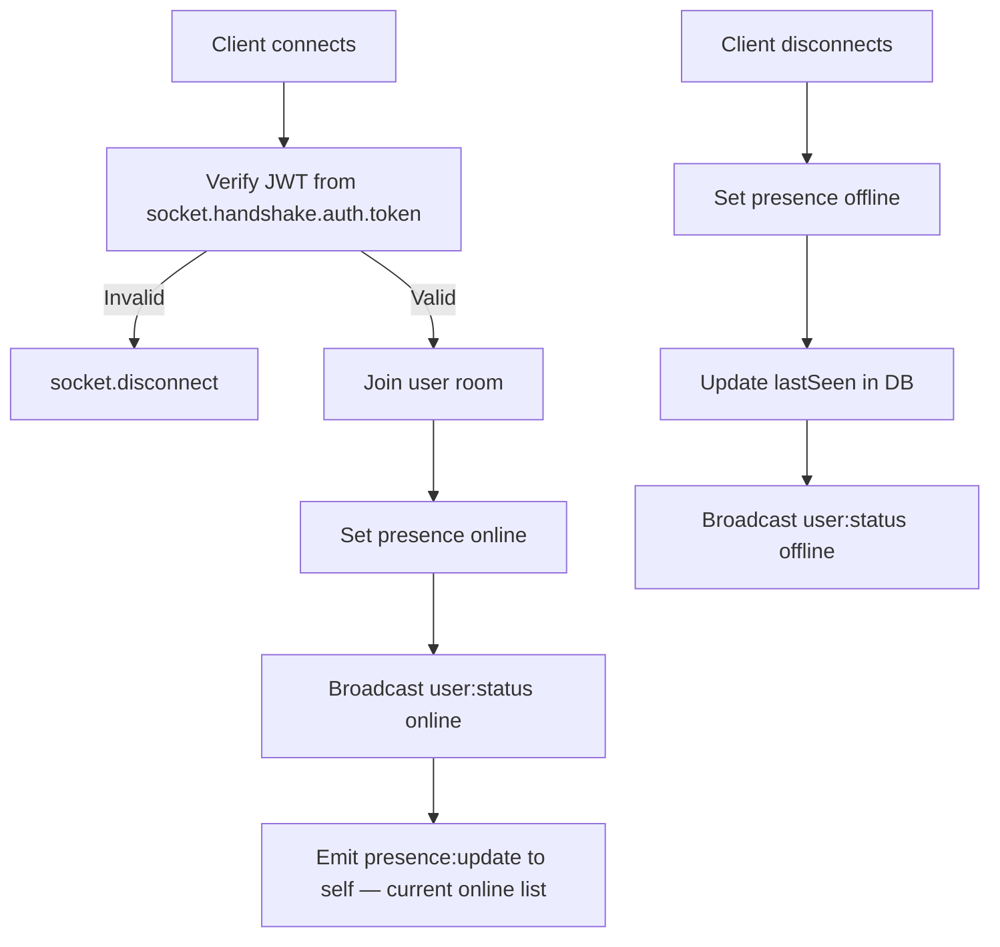

# Socket Handlers

**File:** `backend/src/socket/handlers.ts`

All Socket.io event handlers. Registered on every new connection by `index.ts`. Manages presence state, messaging, typing indicators, and audio status.

---

## Connection Lifecycle



---

## In-Memory Presence Store

```typescript
userPresence: Map<userId, { userId, socketId, status, lastSeen }>
userSockets:  Map<userId, socketId>
```

> ⚠️ Per-process only. In multi-instance deployments move to Redis (already configured on the AWS stack).

---

## Client → Server Events

### `message:send`
```json
{ "recipientId": "uuid", "content": "hello", "type": "text" }
```
Saves message to DB, emits `message:received` to recipient's room and `message:sent` back to sender.

### `message:read`
```json
{ "messageId": "uuid", "senderId": "uuid" }
```
Marks message read in DB, emits `message:read` to sender's room.

### `typing:start` / `typing:stop`
```json
{ "recipientId": "uuid" }
```
Forwards `typing:start` or `typing:stop` to the recipient's room.

### `ghost:typing`
```json
{ "recipientId": "uuid", "text": "partial message..." }
```
Forwards ghost text in real time to the recipient.

### `audio:recording:start` / `audio:recording:stop`
```json
{ "recipientId": "uuid" }
```
Notifies the recipient the sender is recording/has stopped.

### `audio:listening`
```json
{ "messageId": "uuid", "senderId": "uuid", "isPlaying": true }
```
Notifies the message sender that someone is listening to their audio message.

### `presence:update`
```json
{ "status": "online" | "away" | "offline" }
```
Updates the user's own presence status, broadcasts `user:status` to all.

### `presence:request`
```json
["userId1", "userId2", "..."]
```
Returns current presence data for the listed users via `presence:response`.

---

## Server → Client Events

| Event | Payload | Description |
|---|---|---|
| `message:received` | `Message` | New inbound message |
| `message:sent` | `Message` | Confirmation of sent message |
| `message:read` | `{ messageId, readAt }` | Recipient read a message |
| `typing:start` | `{ userId, username }` | Remote user started typing |
| `typing:stop` | `{ userId }` | Remote user stopped typing |
| `ghost:typing` | `{ userId, text }` | Remote user's live draft text |
| `audio:recording:start` | `{ userId }` | Remote user started recording |
| `audio:recording:stop` | `{ userId }` | Remote user stopped recording |
| `audio:listening` | `{ userId, messageId, isPlaying }` | Remote user playing your audio |
| `user:status` | `{ userId, username, status, lastSeen }` | Presence change broadcast |
| `presence:update` | `PresenceInfo[]` | Full online user list on connect |
| `presence:response` | `PresenceInfo[]` | Response to `presence:request` |

---

## See Also

- [WebSocket Events](../../WebSocket/Events.md) — full event reference
- [Features — Presence System](../../Features/Messaging.md#presence-system)
- [Backend Overview](./index.md)

