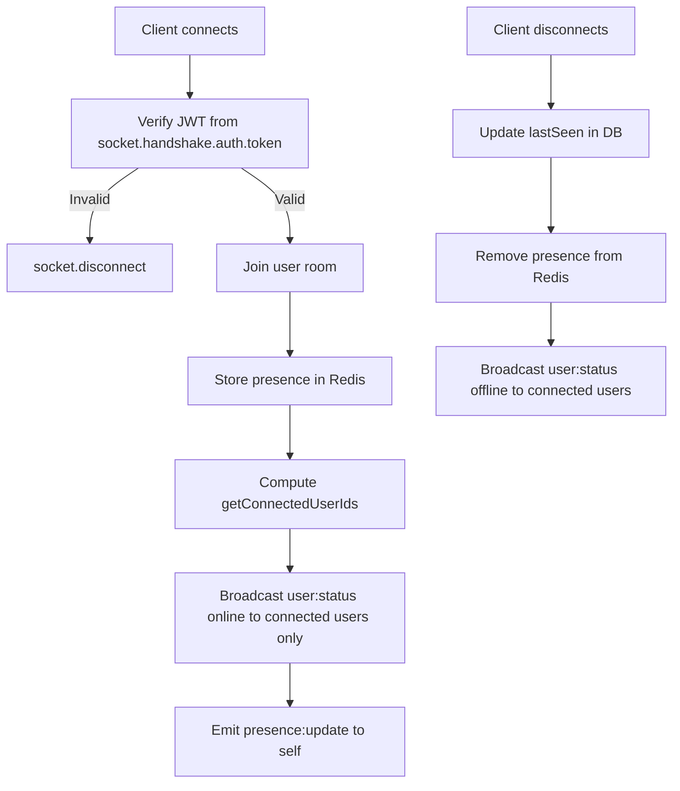
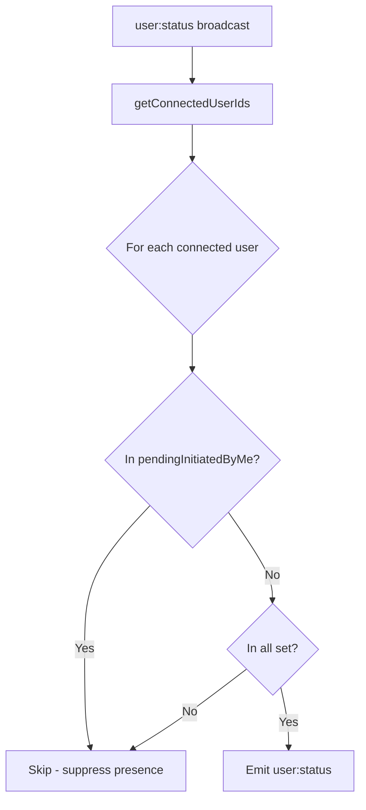
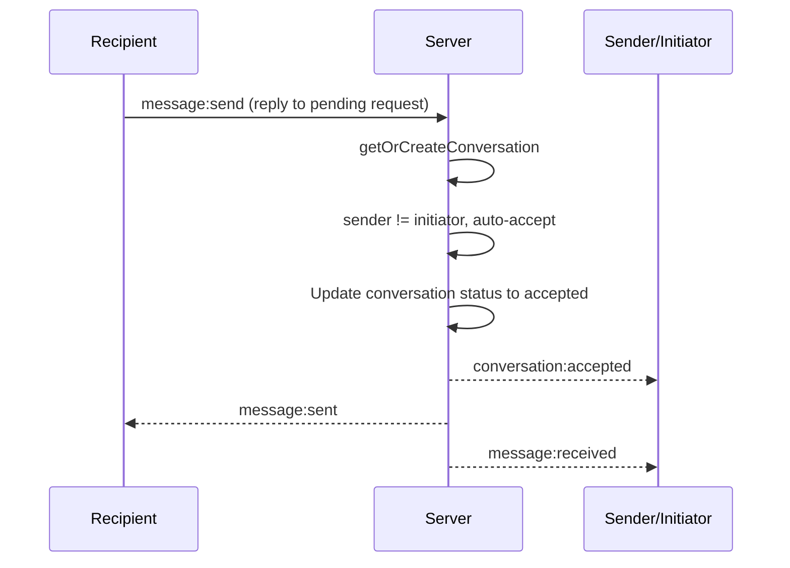

# Socket Handlers

**File:** `backend/src/socket/handlers.ts`

All Socket.io event handlers. Registered on every new connection by `index.ts`. Manages presence state via Redis, messaging with conversation-aware broadcasting, typing indicators, and audio status.

---

## Connection Lifecycle


```mermaid
flowchart TD
    A[Client connects] --> B[Verify JWT from socket.handshake.auth.token]
    B -- Invalid --> C[socket.disconnect]
    B -- Valid --> D[Join user room]
    D --> E[Store presence in Redis]
    E --> F[Compute getConnectedUserIds]
    F --> G[Broadcast user:status online to connected users only]
    G --> H[Emit presence:update to self]

    I[Client disconnects] --> J[Update lastSeen in DB]
    J --> K[Remove presence from Redis]
    K --> L[Broadcast user:status offline to connected users]
```

---

## Redis Presence

Presence is stored in Redis via `lib/redis.ts`. Socket IDs are mapped to user IDs for targeted messaging.

- `setUserPresence(userId, socketId, status)` — stores the user's presence entry
- `removeUserPresence(userId)` — removes it on disconnect
- `getUserPresence(userId)` — returns current status and socketId
- `getAllOnlineUserIds()` — returns the set of all currently online users

> No longer in-memory per-process. All instances share presence state through Redis.

---

## Conversation-Aware Broadcasting

All `user:status` broadcasts use `getConnectedUserIds()` from `lib/conversation.ts` to determine who should receive presence updates.

`getConnectedUserIds(userId)` returns:

```typescript
{ all: Set<string>, pendingInitiatedByMe: Set<string> }
```

- **`all`** — includes friends, accepted conversations, and both sides of pending conversations
- **`pendingInitiatedByMe`** — conversations where the current user sent the initial message request (used to suppress presence for those recipients)

### Presence Suppression Logic


```mermaid
flowchart TD
    A[user:status broadcast] --> B[getConnectedUserIds]
    B --> C{For each connected user}
    C --> D{In pendingInitiatedByMe?}
    D -- Yes --> E[Skip - suppress presence]
    D -- No --> F{In all set?}
    F -- Yes --> G[Emit user:status]
    F -- No --> E
```

---

## Client → Server Events

### `message:send`
```json
{ "recipientId": "uuid", "content": "hello", "type": "text" }
```
Calls `getOrCreateConversation` to find or create a conversation record. If the conversation is pending and the sender is **not** the initiator, the conversation is auto-accepted. Saves the message to DB, emits `message:received` to the recipient's room and `message:sent` back to the sender. Suppresses `message:status` for pending conversations.

#### Message Request Auto-Acceptance


```mermaid
sequenceDiagram
    participant R as Recipient
    participant SV as Server
    participant S as Sender/Initiator

    R->>SV: message:send (reply to pending request)
    SV->>SV: getOrCreateConversation
    SV->>SV: sender != initiator, auto-accept
    SV->>SV: Update conversation status to accepted
    SV-->>S: conversation:accepted
    SV-->>R: message:sent
    SV-->>S: message:received
```

### `message:read`
```json
{ "messageId": "uuid", "senderId": "uuid" }
```
Marks message read in DB. Checks conversation status; suppresses `message:status` if pending. Emits `message:read` to the sender's room.

### `message:received`
```json
{ "messageId": "uuid" }
```
Acknowledges message delivery. Checks conversation status; suppresses `message:status` if pending.

### `typing:start` / `typing:stop`
```json
{ "recipientId": "uuid" }
```
Forwards `typing:start` or `typing:stop` to the recipient's room. Checks conversation status; returns early (suppressed) if pending.

### `ghost:typing`
```json
{ "recipientId": "uuid", "text": "partial message..." }
```
Forwards ghost text in real time to the recipient. Checks conversation status; returns early if pending.

### `audio:recording`
```json
{ "recipientId": "uuid", "isRecording": true }
```
Notifies the recipient the sender is recording or has stopped. Checks conversation status; returns early if pending.

### `audio:listening`
```json
{ "messageId": "uuid", "senderId": "uuid", "isPlaying": true }
```
Notifies the message sender that someone is listening to their audio message. Checks conversation status; suppresses `message:status` if pending.

### `presence:update`
```json
{ "status": "online" | "away" | "offline" }
```
Updates the user's own presence status in Redis. Broadcasts `user:status` to connected users only (via `getConnectedUserIds`).

### `presence:request`
```json
["userId1", "userId2", "..."]
```
Returns current presence data for the listed users via `presence:response`. Returns real presence only for connected users. Suppresses presence for pending outgoing requests.

### `settings:update`
```json
{ "showOnlineStatus": true }
```
Persists `showOnlineStatus` to the user's record in the DB.

### `profile:imageUpdated`
```json
{ "profileImage": "url" }
```
Updates the in-scope `profileImage` variable used for subsequent messages sent during this socket session.

---

## Server → Client Events

| Event | Payload | Description |
|---|---|---|
| `message:received` | `Message` | New inbound message |
| `message:sent` | `Message` | Confirmation of sent message |
| `message:read` | `{ messageId, readAt }` | Recipient read a message |
| `message:status` | `{ messageId, status }` | Delivery/read status update |
| `typing:start` | `{ userId, username }` | Remote user started typing |
| `typing:stop` | `{ userId }` | Remote user stopped typing |
| `ghost:typing` | `{ userId, text }` | Remote user's live draft text |
| `audio:recording` | `{ userId, isRecording }` | Remote user recording status |
| `audio:listening` | `{ userId, messageId, isPlaying }` | Remote user playing your audio |
| `user:status` | `{ userId, username, status, lastSeen }` | Presence change broadcast (connected users only) |
| `presence:update` | `PresenceInfo[]` | Full online user list on connect |
| `presence:response` | `PresenceInfo[]` | Response to `presence:request` |
| `conversation:accepted` | `{ conversationId, acceptedBy }` | Sent to initiator when their message request is accepted |
| `conversation:declined` | `{ conversationId, declinedBy, otherUserId }` | Sent when a conversation is declined or nuked |
| `friend:notify` | `{ type, friendship }` | Sent for friend request events |
| `user:profileUpdate` | `{ userId, profileImage }` | Sent when a user updates their profile image |

---

## See Also

- [WebSocket Events](../WebSocket/EVENTS.md) — full event reference
- [Features — Presence System](../Features/MESSAGING.md#presence-system)
- [Backend Overview](./index.md)
