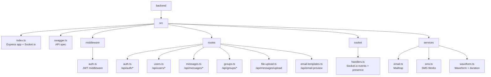
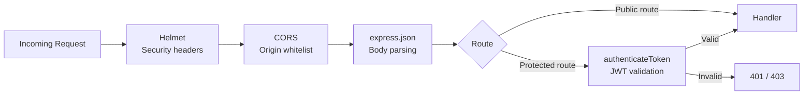

# Backend

## Overview

The backend is an Express 4 application written in TypeScript, running on Node.js 20. It serves both a REST API and a Socket.io WebSocket server on a single HTTP port (`3001`). Prisma ORM manages all database access to PostgreSQL. Redis is used for presence state. File uploads are handled by Multer and stored locally in development or on S3 in production.

---

## Structure



---

## Middleware Stack

Requests pass through the following layers in order:



### Helmet
Security headers applied globally. `contentSecurityPolicy` and `frameguard` are disabled to support Swagger UI and email preview iframes. `crossOriginResourcePolicy` is set to `cross-origin` for upload serving.

### CORS
Origin restricted to `FRONTEND_URL` env var (default `http://localhost:3000`). `credentials: true` allows cookies/auth headers.

### authenticateToken
JWT bearer token middleware in `middleware/auth.ts`. Extracts the token from `Authorization: Bearer <token>`, verifies with `JWT_SECRET`, and attaches `req.user = { userId, username }`. Returns `401` if no token, `403` if invalid or expired.

---

## Route Mounting

```typescript
app.get('/api/health')                  // Health check — no auth
app.use('/api/docs')                    // Swagger UI — basic auth in production
app.use('/uploads')                     // Static file serving — CORS headers
app.use('/api/auth',     authRoutes)    // Registration, login, OTP, 2FA
app.use('/api/users',    userRoutes)    // User profiles, image upload
app.use('/api/messages', messageRoutes) // Message history, waveform
app.use('/api/messages', fileRoutes)    // File/audio upload (same prefix)
app.use('/api/groups',   groupRoutes)   // Group CRUD (stubs)
app.use('/api',          emailRoutes)   // Email preview
```

---

## Environment Variables

| Variable | Required | Description |
|----------|----------|-------------|
| `PORT` | No | Express port (default `3001`) |
| `NODE_ENV` | No | `development` or `production` |
| `DATABASE_URL` | Yes | PostgreSQL connection string |
| `REDIS_URL` | Yes | Redis connection string |
| `JWT_SECRET` | Yes | HS256 signing secret (32+ chars recommended) |
| `FRONTEND_URL` | Yes | CORS origin + email links |
| `BACKEND_URL` | Yes | Used in file URLs returned to clients |
| `MAILTRAP_API_KEY` | No | Mailtrap sending API key |
| `MAIL_FROM_ADDRESS` | No | From address (default `noreply@emberlyn.co.uk`) |
| `MAIL_FROM_NAME` | No | From name (default `Chatr`) |
| `SMS_WORKS_JWT` | No | SMS Works API JWT token |
| `SMS_WORKS_SENDER` | No | SMS sender name (default: `PRODUCT_NAME`) |
| `AWS_REGION` | Prod | S3 region |
| `AWS_ACCESS_KEY_ID` | Prod | IAM access key |
| `AWS_SECRET_ACCESS_KEY` | Prod | IAM secret |
| `S3_BUCKET` | Prod | S3 bucket name |
| `PRODUCT_NAME` | No | App display name (default `Chatr`) |
| `SWAGGER_USER` | No | Basic auth username for `/api/docs` in production |
| `SWAGGER_PASS` | No | Basic auth password for `/api/docs` in production |

---

## Graceful Shutdown

The server listens for `SIGTERM` and `SIGINT` and closes the HTTP server cleanly before exiting. Forces exit after 10 seconds if connections don't close.

```typescript
process.on('SIGTERM', gracefulShutdown);
process.on('SIGINT', gracefulShutdown);
```

This ensures PM2 restarts are clean with no dangling connections.

---

## Sub-sections

- [Authentication](./AUTHENTICATION.md) — Registration, login, OTP, JWT, 2FA, password reset
- [Services](./SERVICES.md) — Email, SMS, Waveform services
- [File Upload](./FILE_UPLOAD.md) — Multer config, upload flow, waveform generation
- [Middleware](./MIDDLEWARE.md) — JWT auth middleware detail

