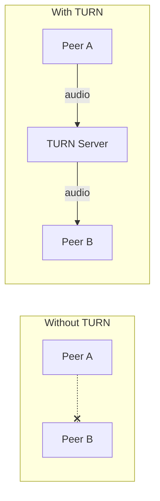
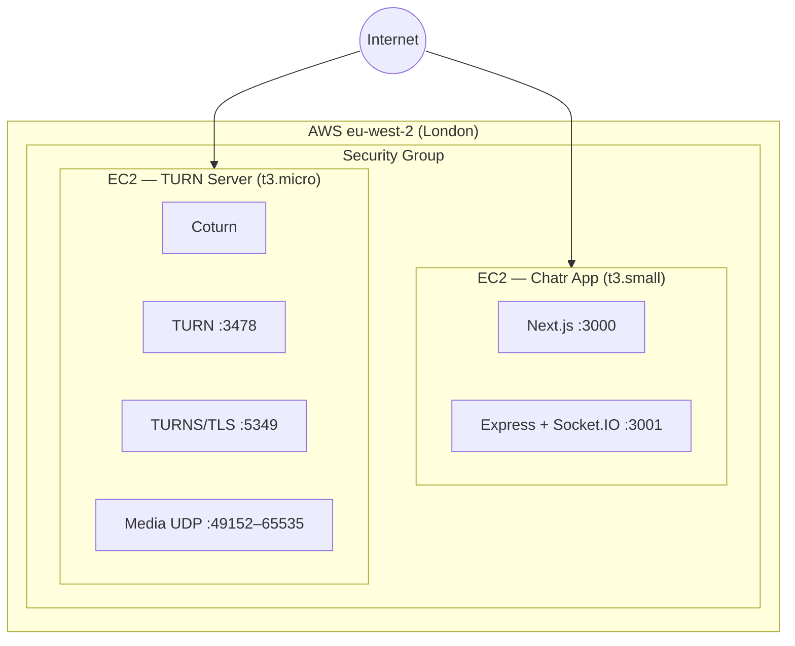

# TURN Server on AWS (Coturn)

> **Purpose:** When Chatr moves to production, calls between users behind strict NATs (corporate firewalls, some mobile carriers) will fail without a TURN relay. This guide provisions a dedicated Coturn TURN server on AWS.

## What this solves

STUN lets peers discover their public address, but some network configurations (symmetric NATs) block direct connections entirely. A TURN server acts as a relay — audio flows through it when no direct path exists. Think of it as a courier service for calls that can't find a direct route.



---

## Architecture



---

## Step 1: Launch EC2 Instance

1. Open the AWS Console → EC2 → Launch Instance
2. Configure:

| Setting | Value |
|---------|-------|
| **Name** | `chatr-turn` |
| **AMI** | Ubuntu 24.04 LTS |
| **Instance type** | `t3.micro` (sufficient for low-medium call volume) |
| **Key pair** | Use your existing key pair or create a new one |
| **Region** | Same as your Chatr app (`eu-west-2`) |
| **Storage** | 8 GB gp3 (default is fine) |

3. Create or assign a **Security Group** with these inbound rules:

| Type | Protocol | Port Range | Source | Purpose |
|------|----------|-----------|--------|---------|
| SSH | TCP | 22 | Your IP | Admin access |
| Custom UDP | UDP | 3478 | 0.0.0.0/0 | TURN relay |
| Custom TCP | TCP | 3478 | 0.0.0.0/0 | TURN relay (TCP fallback) |
| Custom TCP | TCP | 5349 | 0.0.0.0/0 | TURNS (TLS) |
| Custom UDP | UDP | 49152–65535 | 0.0.0.0/0 | Media relay ports |

4. Launch the instance and note the **Elastic IP** (allocate one and associate it — the IP must be static).

---

## Step 2: Install Coturn

SSH into the instance:

```bash
ssh -i ~/.ssh/your-key.pem ubuntu@<TURN_SERVER_IP>
```

Install Coturn:

```bash
sudo apt update && sudo apt upgrade -y
sudo apt install -y coturn
```

Enable the TURN server daemon:

```bash
sudo sed -i 's/#TURNSERVER_ENABLED=1/TURNSERVER_ENABLED=1/' /etc/default/coturn
```

---

## Step 3: Configure Coturn

Edit the configuration file:

```bash
sudo nano /etc/turnserver.conf
```

Replace the contents with:

```ini
# Network
listening-port=3478
tls-listening-port=5349
min-port=49152
max-port=65535

# Use the server's public IP (replace with your Elastic IP)
external-ip=<ELASTIC_IP>

# Realm — use your domain or any identifier
realm=chatr-app.online
server-name=turn.chatr-app.online

# Authentication
lt-cred-mech
user=chatr:<CHOOSE_A_STRONG_PASSWORD>

# TLS certificates (optional but recommended — use Let's Encrypt)
# cert=/etc/letsencrypt/live/turn.chatr-app.online/fullchain.pem
# pkey=/etc/letsencrypt/live/turn.chatr-app.online/privkey.pem

# Logging
log-file=/var/log/turnserver.log
verbose

# Security
no-multicast-peers
no-cli
fingerprint
```

Replace `<ELASTIC_IP>` with the instance's Elastic IP and `<CHOOSE_A_STRONG_PASSWORD>` with a strong password.

---

## Step 4: TLS Certificate (Optional but Recommended)

For encrypted TURN (TURNS on port 5349), set up Let's Encrypt:

1. Point a DNS record: `turn.chatr-app.online` → `<ELASTIC_IP>`

2. Install Certbot:

```bash
sudo apt install -y certbot
sudo certbot certonly --standalone -d turn.chatr-app.online
```

3. Uncomment the `cert` and `pkey` lines in `/etc/turnserver.conf`

4. Set up auto-renewal:

```bash
sudo crontab -e
# Add this line:
0 3 * * * certbot renew --quiet && systemctl restart coturn
```

---

## Step 5: Start Coturn

```bash
sudo systemctl enable coturn
sudo systemctl start coturn
sudo systemctl status coturn
```

Verify it's listening:

```bash
sudo ss -tulnp | grep turnserver
```

You should see ports 3478 and 5349 (if TLS is configured).

---

## Step 6: Test the TURN Server

Use the [Trickle ICE tool](https://webrtc.github.io/samples/src/content/peerconnection/trickle-ice/) to verify:

1. Add a TURN server:
   - **URI:** `turn:<ELASTIC_IP>:3478`
   - **Username:** `chatr`
   - **Password:** your chosen password
2. Click "Gather candidates"
3. You should see `relay` candidates appear — this confirms TURN is working

---

## Step 7: Configure Chatr

Update the ICE servers in `frontend/src/contexts/CallContext.tsx`:

```typescript
const ICE_SERVERS: RTCIceServer[] = [
  { urls: 'stun:stun.l.google.com:19302' },
  { urls: 'stun:stun1.l.google.com:19302' },
  {
    urls: 'turn:<ELASTIC_IP>:3478',
    username: 'chatr',
    credential: '<YOUR_TURN_PASSWORD>',
  },
  // If TLS is configured:
  {
    urls: 'turns:turn.chatr-app.online:5349',
    username: 'chatr',
    credential: '<YOUR_TURN_PASSWORD>',
  },
];
```

> **Security note:** In production, TURN credentials should not be hardcoded. Use short-lived credentials generated by the backend via the TURN REST API (time-limited HMAC tokens). See [Future Improvements](#future-improvements) below.

---

## Cost Estimate

| Resource | Spec | Monthly Cost (approx.) |
|----------|------|----------------------|
| EC2 instance | t3.micro, on-demand | ~$8 |
| Elastic IP | Associated with running instance | Free |
| Data transfer | First 100 GB/month | Free tier, then ~$0.09/GB |
| Storage | 8 GB gp3 | ~$0.64 |
| **Total (low usage)** | | **~$9/month** |

TURN bandwidth is the main variable cost. Audio-only calls use roughly 50–100 kbps per direction, so even heavy usage stays cheap. Video would increase this significantly.

---

## Monitoring

Check active connections:

```bash
sudo turnadmin -l
```

Watch logs:

```bash
sudo tail -f /var/log/turnserver.log
```

Monitor instance metrics in AWS CloudWatch (CPU, network in/out).

---

## Scaling Notes

| Call volume | Recommendation |
|-------------|---------------|
| < 50 concurrent relayed calls | `t3.micro` is sufficient |
| 50–200 concurrent calls | Upgrade to `t3.small` or `t3.medium` |
| 200+ concurrent calls | Multiple TURN servers behind a Network Load Balancer |

Not every call uses TURN — only those where direct connection fails (typically 10–20% of calls). STUN handles the rest at zero relay cost.

---

## Future Improvements

- **Short-lived credentials:** Instead of a static username/password, the Chatr backend generates time-limited HMAC credentials per call via the TURN REST API. This prevents credential leakage and allows per-user accounting.
- **Multiple regions:** Deploy TURN servers in regions close to your users (e.g., `us-east-1`, `ap-southeast-1`) and return the nearest server's credentials from the backend.
- **Auto-scaling:** Use an ASG (Auto Scaling Group) to spin up TURN instances during peak hours.
- **Metrics dashboard:** Export Coturn stats to CloudWatch or Prometheus for visibility into relay usage, connection failures, and bandwidth.

---

> See also: [Voice Calls](../Features/VOICE_CALLS.md) · [AWS Infrastructure](../Architecture/AWS.md) · [Glossary](../GLOSSARY.md)
