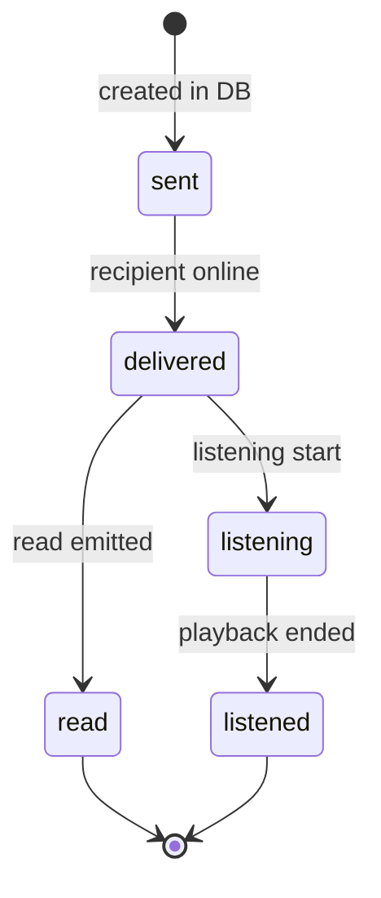
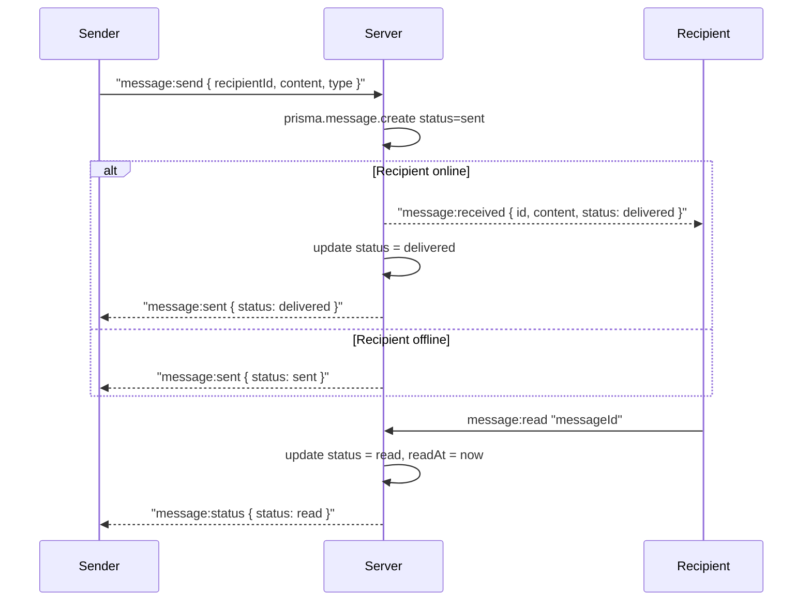
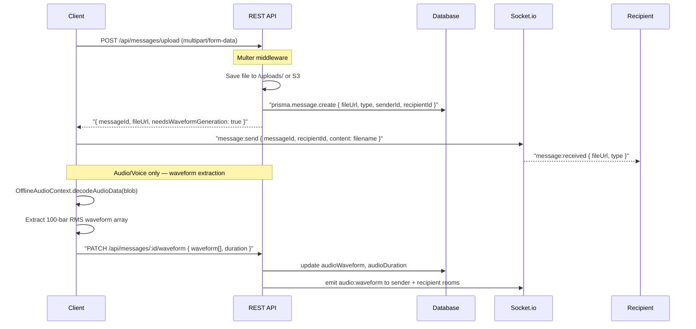
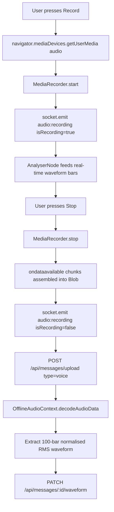
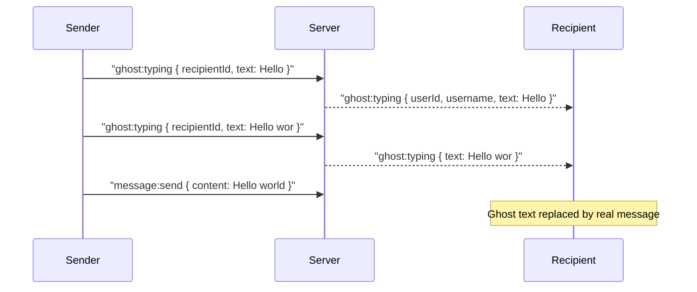
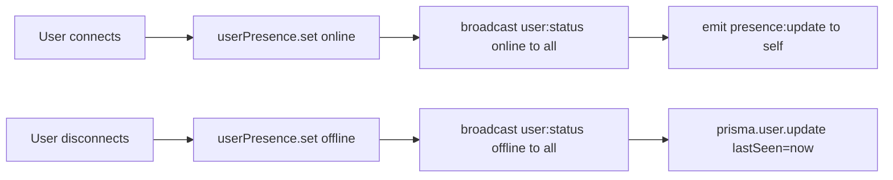

# Messaging

## Message Types

| Type | Description | Storage Path |
|------|-------------|--------------|
| `text` | Plain text content | — |
| `image` | JPEG, PNG, GIF, WebP | `/uploads/messages/` |
| `file` | Any document/binary | `/uploads/messages/` |
| `audio` | MP3 or uploaded audio | `/uploads/audio/` |
| `voice` | WebM/Opus browser recording | `/uploads/audio/` |

---

## Message Status Lifecycle



| Status | Trigger | Message Types |
|--------|---------|---------------|
| `sent` | Message saved to DB | All |
| `delivered` | Recipient socket online and acknowledged | All |
| `read` | Recipient explicitly marks as read | text, image, file |
| `listening` | Recipient starts playback | audio, voice |
| `listened` | Recipient finishes playback (100%) | audio, voice |

Status is displayed below the sender's last consecutive message bubble.

---

## Direct Messaging Flow



---

## File & Audio Upload Flow



---

## Voice Recording

Voice messages are recorded in the browser using the `MediaRecorder` API.

**Codec selection:**
- Chrome/Edge: WebM/Opus
- Safari: MP4/AAC



**Real-time waveform** uses the Web Audio API `AnalyserNode`:
1. `audioContext.createAnalyser()` → `analyser.fftSize = 256`
2. `analyser.getByteTimeDomainData(dataArray)` at 60fps via `requestAnimationFrame`
3. RMS values normalised to `[0, 1]` and rendered as 40–60 live bars in the UI

---

## Audio Player

`MessageAudioPlayer` renders audio messages with a 100-bar SVG waveform.

**Waveform data flow:**
1. `audioWaveform` array (100 values, `0–1`) stored in DB
2. Fetched with message history
3. Rendered as SVG `<rect>` elements, height proportional to amplitude
4. Playback progress overlays bars with a brighter colour using `currentTime / duration`

**Listening status events:**
```
Play button pressed     → socket.emit('audio:listening', { isListening: true })
Pause button pressed    → socket.emit('audio:listening', { isListening: false })
Audio ended (100%)      → socket.emit('audio:listening', { isEnded: true })
                          → server updates status = 'read' in DB
                          → server emits message:status to sender
```

---

## Ghost Typing

Ghost typing sends the sender's keystrokes in real-time to the recipient before the message is sent. The recipient sees the text appearing live in a ghost bubble above the input area.



---

## Typing Indicators

Standard typing indicator (no text content, just a visual "..." animation).

```
Client emits:  typing:start { recipientId }
Server emits:  typing:status { userId, isTyping: true, type: "direct" }

Client emits:  typing:stop { recipientId }
Server emits:  typing:status { userId, isTyping: false, type: "direct" }
```

Also supports group typing with `groupId` instead of `recipientId`.

---

## Presence System

User presence is stored in-memory on the server in two Maps:

```typescript
userPresence: Map<userId, { userId, socketId, status, lastSeen }>
userSockets:  Map<userId, socketId>
```

On connect: status set to `online`, broadcast to all.
On disconnect: status set to `offline`, `lastSeen` updated in DB.



Clients can request presence for specific users:
```
client → presence:request [userId1, userId2]
server → presence:response [{ userId, status, lastSeen }]
```

> ⚠️ The in-memory presence Maps are per-process. In a multi-instance deployment this should be moved to Redis.
