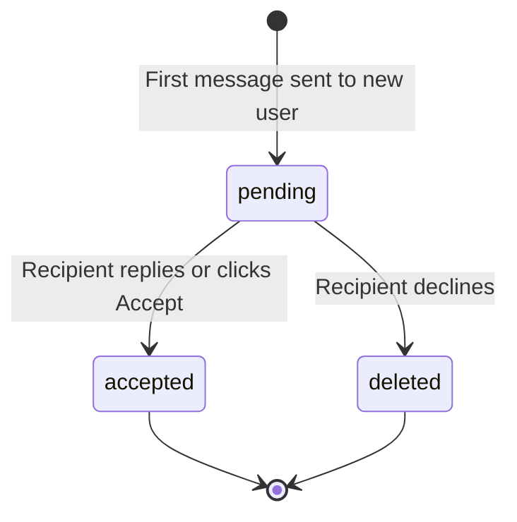
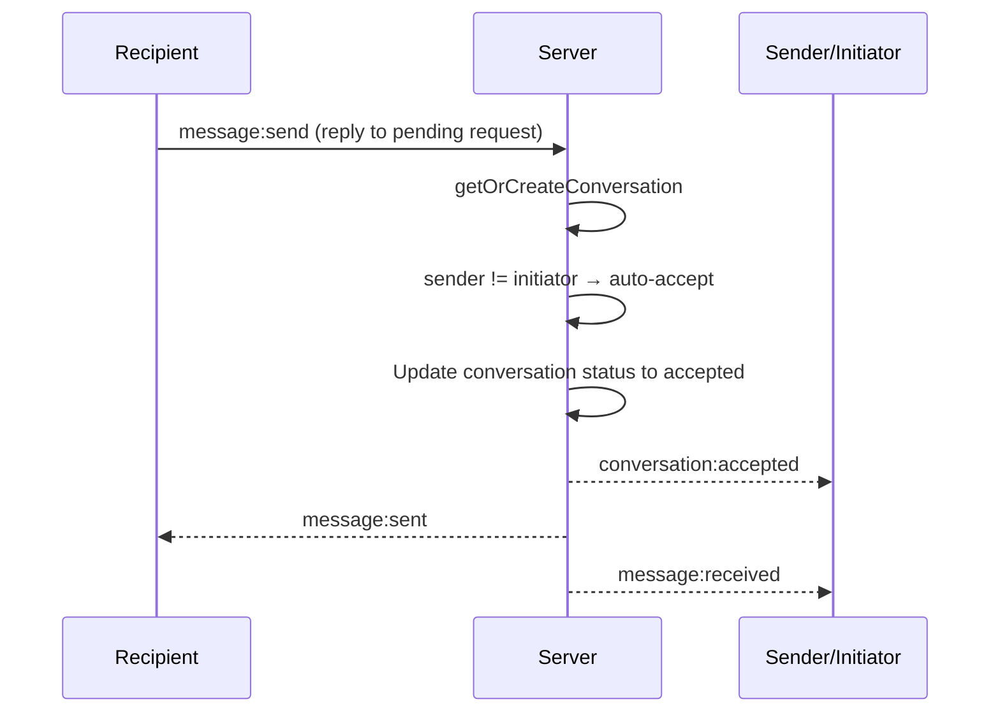
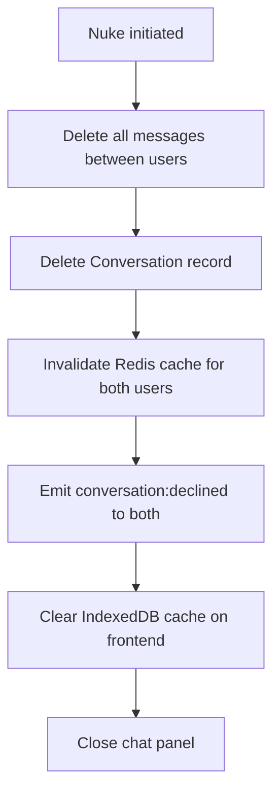
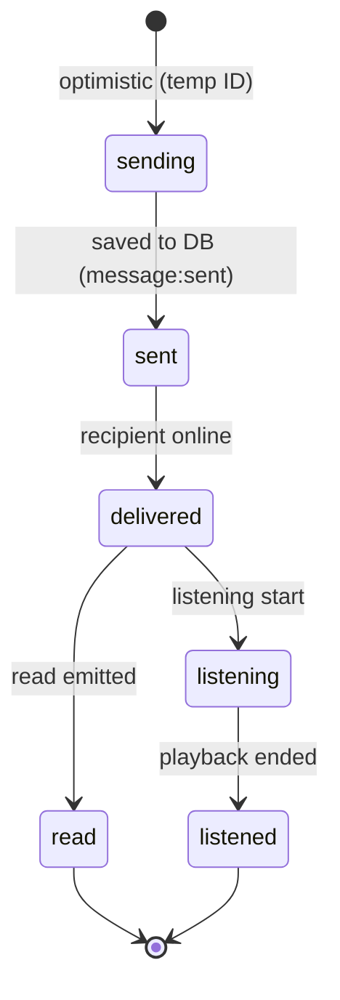
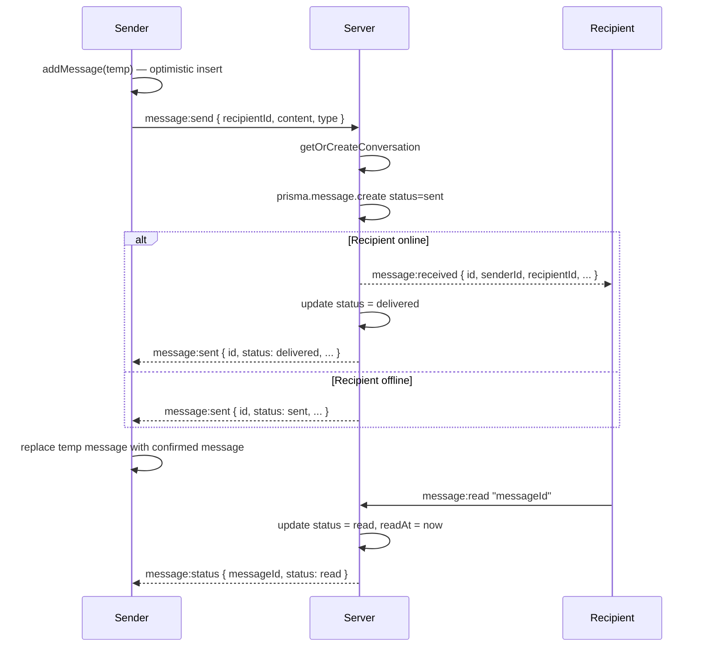
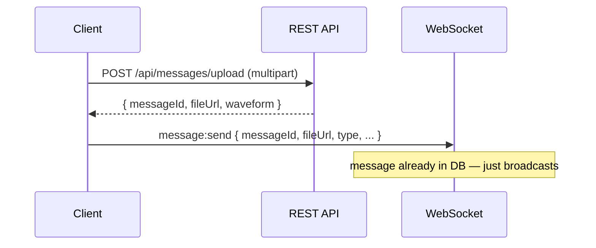
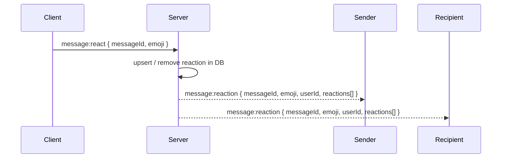
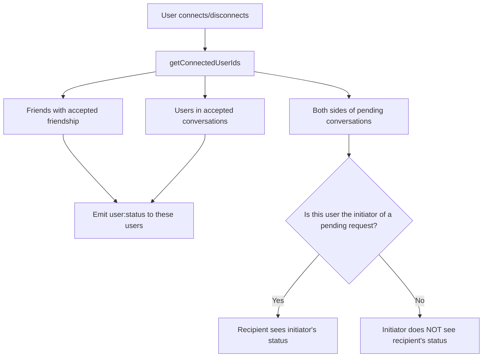

# Messaging

## Message Types

| Type    | Description                      | Storage Path          |
|---------|----------------------------------|-----------------------|
| `text`  | Plain text or emoji-only content | —                     |
| `image` | JPEG, PNG, GIF, WebP             | `/uploads/messages/`  |
| `file`  | Any document/binary              | `/uploads/messages/`  |
| `audio` | Uploaded MP3 / voice recording   | `/uploads/audio/`     |

Emoji-only messages (1-3 emoji) are rendered at 2-4x normal size without a bubble.

---

## Message Requests

When a user sends a message to someone they are not yet connected to, a **message request** is created. The recipient must accept the request before the conversation becomes fully active.


```mermaid
stateDiagram-v2
    [*] --> pending : First message sent to new user
    pending --> accepted : Recipient replies or clicks Accept
    pending --> deleted : Recipient declines
    accepted --> [*]
    deleted --> [*]
```

### How it works

1. **Sender** opens the "New Chat" panel, searches for a user, and sends a message.
2. Server calls `getOrCreateConversation()` which creates a `Conversation` record with `status: "pending"` and `initiatorId` set to the sender.
3. **Recipient** sees the message in the "Requests" tab of their chat list.
4. Recipient can **Accept** (clicks accept button or simply replies) or **Decline** (which deletes all messages).
5. Once accepted, the conversation moves to the "Chats" tab and behaves like a normal conversation.

### Auto-acceptance

If the recipient **replies** to a pending message request, the conversation is automatically accepted:


```mermaid
sequenceDiagram
    participant R as Recipient
    participant SV as Server
    participant S as Sender/Initiator

    R->>SV: message:send (reply to pending request)
    SV->>SV: getOrCreateConversation
    SV->>SV: sender != initiator → auto-accept
    SV->>SV: Update conversation status to accepted
    SV-->>S: conversation:accepted
    SV-->>R: message:sent
    SV-->>S: message:received
```

### What is suppressed during pending state

While a conversation is pending, the following are **suppressed** for the **initiator** (not the recipient):

- `message:status` events (delivered/read) are not sent
- `typing:start` / `typing:stop` events are not forwarded
- `audio:recording` events are not forwarded
- `ghost:typing` events are not forwarded
- Online presence (`user:status`) is hidden via `PresenceContext` suppression

The **recipient** CAN see the initiator's online status even while the request is pending.

---

## Conversation Management

### Accept

`POST /api/conversations/:id/accept` or auto-accept via reply. Invalidates Redis cache, emits `conversation:accepted` to initiator.

### Decline

`POST /api/conversations/:id/decline`. Deletes all messages between the two participants. Invalidates Redis cache, emits `conversation:declined` to initiator. The conversation record is removed.

### Nuke (testing)

`POST /api/conversations/:id/nuke` or `POST /api/conversations/nuke-by-user/:recipientId`. Full reset — deletes the conversation record AND all messages. Both participants are notified. Used for testing to allow re-creating message requests between the same users.


```mermaid
flowchart TD
    A[Nuke initiated] --> B[Delete all messages between users]
    B --> C[Delete Conversation record]
    C --> D[Invalidate Redis cache for both users]
    D --> E["Emit conversation:declined to both"]
    E --> F[Clear IndexedDB cache on frontend]
    F --> G[Close chat panel]
```

---

## Message Status Lifecycle


```mermaid
stateDiagram-v2
    [*] --> sending : optimistic (temp ID)
    sending --> sent : saved to DB (message:sent)
    sent --> delivered : recipient online
    delivered --> read : read emitted
    delivered --> listening : listening start
    listening --> listened : playback ended
    read --> [*]
    listened --> [*]
```

| Status      | Trigger                                        | Types            |
|-------------|------------------------------------------------|------------------|
| `sending`   | Optimistic local insert (temp ID)              | All              |
| `sent`      | Message saved to DB                            | All              |
| `delivered` | Recipient socket online and acknowledged       | All              |
| `read`      | Recipient explicitly marks as read             | text, image, file|
| `listening` | Recipient starts audio playback                | audio            |
| `listened`  | Recipient finishes playback (100%)             | audio            |

Status is displayed beneath the sender's last consecutive message bubble.

> **Note:** Status events are suppressed for pending message requests.

---

## Direct Messaging Flow


```mermaid
sequenceDiagram
    participant S as Sender
    participant SV as Server
    participant R as Recipient

    S->>S: addMessage(temp) — optimistic insert
    S->>SV: message:send { recipientId, content, type }
    SV->>SV: getOrCreateConversation
    SV->>SV: prisma.message.create status=sent
    alt Recipient online
        SV-->>R: message:received { id, senderId, recipientId, ... }
        SV->>SV: update status = delivered
        SV-->>S: message:sent { id, status: delivered, ... }
    else Recipient offline
        SV-->>S: message:sent { id, status: sent, ... }
    end
    S->>S: replace temp message with confirmed message

    R->>SV: message:read "messageId"
    SV->>SV: update status = read, readAt = now
    SV-->>S: message:status { messageId, status: read }
```

---

## File & Audio Upload Flow

Files and voice recordings are uploaded via `POST /api/messages/upload` **before** being announced over WebSocket.


```mermaid
sequenceDiagram
    participant C as Client
    participant API as REST API
    participant WS as WebSocket

    C->>API: POST /api/messages/upload (multipart)
    API-->>C: { messageId, fileUrl, waveform }
    C->>WS: message:send { messageId, fileUrl, type, ... }
    Note over WS: message already in DB — just broadcasts
```

For audio files, a client-side waveform analysis runs **after** upload and PATCHes the result:

```
PATCH /api/messages/:id/waveform  { waveform: number[], duration: number }
```

The server then pushes `audio:waveform` to both parties via WebSocket so the waveform renders in real time without a refresh.

---

## Unsend

Unsending soft-deletes the message (sets `deletedAt`). The original content is retained in the database for legal purposes but hidden from both parties. A "This message was unsent" placeholder is shown in the conversation.

- Only the **sender** can unsend.
- The sender emits: `socket.emit('message:unsend', messageId)` (plain string).
- Both sender and recipient receive `message:unsent { messageId }`.

---

## Edit

Message editing replaces `content` in-place and sets `edited: true`. Every previous version is stored in `MessageEditHistory` for audit/legal purposes.

- Only the **sender** can edit.
- Pressing **Up** in the chat input edits the last sent message.
- Both sender and recipient receive `message:edited { messageId, content }`.
- An "edited" marker is shown on the bubble.

---

## Reactions

Emoji reactions are toggleable. Adding an existing reaction removes it.


```mermaid
sequenceDiagram
    Client->>Server: message:react { messageId, emoji }
    Server->>Server: upsert / remove reaction in DB
    Server-->>Sender: message:reaction { messageId, emoji, userId, reactions[] }
    Server-->>Recipient: message:reaction { messageId, emoji, userId, reactions[] }
```

---

## Reply Threading

Any message type supports replies. When sending a reply:

```json
{
  "recipientId": "uuid",
  "content": "Agreed!",
  "type": "text",
  "replyTo": {
    "id": "uuid",
    "content": "Original text",
    "senderDisplayName": "Alice",
    "senderUsername": "alice",
    "type": "text",
    "duration": null
  }
}
```

The reply snapshot is stored de-normalised in the `Message` row (`replyToId`, `replyToContent`, `replyToSenderName`, `replyToType`, `replyToDuration`) so it remains readable even if the original message is edited or unsent.

---

## Typing & Recording Indicators

| Action                | Client emits              | Server broadcasts        |
|-----------------------|---------------------------|--------------------------|
| User starts typing    | `typing:start { recipientId }` | `typing:status { userId, isTyping: true }` |
| User stops typing     | `typing:stop { recipientId }`  | `typing:status { userId, isTyping: false }` |
| User starts recording | `audio:recording { recipientId, isRecording: true }` | `audio:recording { userId, isRecording: true }` |
| User stops recording  | `audio:recording { recipientId, isRecording: false }` | `audio:recording { userId, isRecording: false }` |

Typing auto-stops after 3 seconds of inactivity. The indicator animates into view and slides back out when activity stops.

> **Note:** Typing and recording indicators are suppressed for pending message requests.

---

## Online Status & Presence

Users may hide their online status in Settings (`showOnlineStatus`). When hidden:
- No `user:status` broadcast is sent on connect/disconnect.
- Presence responses omit their `lastSeen`.
- The conversation list shows no online blob and no "last seen" subtitle.
- The chat panel shows no presence blob and a name-only title.

### Presence Suppression for Message Requests

Online presence is scoped to **connected users** only. The server uses `getConnectedUserIds()` to determine who should receive presence broadcasts:


```mermaid
flowchart TD
    A[User connects/disconnects] --> B[getConnectedUserIds]
    B --> C[Friends with accepted friendship]
    B --> D[Users in accepted conversations]
    B --> E[Both sides of pending conversations]
    C --> F[Emit user:status to these users]
    D --> F
    E --> G{Is this user the initiator of a pending request?}
    G -- Yes --> H["Recipient sees initiator's status"]
    G -- No --> I["Initiator does NOT see recipient's status"]
```

Frontend enforces this with a `suppressedIds` mechanism in `PresenceContext`:
- `page.tsx` computes suppressed IDs from pending outgoing conversations
- `PresenceContext` returns `HIDDEN_PRESENCE` for suppressed users
- `ConversationsList` overrides presence to hidden for outgoing pending requests
- `PanelContainer` hides the status dot and "Last seen" subtitle for suppressed users

---

## Friends Integration

### Friend badges

The conversation list shows a green "Friend" badge next to users who are friends.

### Friend-prioritized search

When searching for users to start a new conversation (New Chat panel), results are sorted with friends first, then alphabetically. Non-friend search results have their online presence hidden.

### Add friend from chat

If a non-friend chat is open, the panel header displays an "Add Friend" icon (`fa-user-plus`). Clicking it sends a friend request via `POST /api/friends/request` and emits a `friend:notify` socket event.

---

## Toast Notifications

Incoming messages trigger an orange `newmessage` toast notification:
- **Title**: sender's display name (or "Message Request from [name]" for pending requests)
- **Body**: message content preview
- **Icon**: `fas fa-comment`

---

## Components

| Component             | Location                                              | Purpose                               |
|-----------------------|-------------------------------------------------------|---------------------------------------|
| `ConversationsList`   | `components/messaging/ConversationsList`              | Tabbed list: Chats / Requests / Search |
| `ConversationView`    | `components/messaging/ConversationView`               | Panel wrapper with accept/decline bar |
| `ChatView`            | `components/messaging/ChatView`                       | Scrollable message list               |
| `MessageInput`        | `components/messaging/MessageInput`                   | Text input + file/emoji/voice toolbar |
| `NewChatPanel`        | `components/messaging/NewChatPanel`                   | User search for starting new chats    |
| `MessageBubble`       | `components/MessageBubble`                            | Individual message renderer           |
| `MessageAudioPlayer`  | `components/MessageAudioPlayer`                       | Waveform audio player                 |
| `VoiceRecorder`       | `components/VoiceRecorder`                            | In-browser voice recording            |
| `EmojiPicker`         | `components/EmojiPicker`                              | Emoji picker with categories & search |
| `PresenceAvatar`      | `components/PresenceAvatar`                           | Avatar with online/offline dot        |
| `PresenceLabel`       | `components/PresenceLabel`                            | "Online" / "Last seen ..." label      |
| `FriendsPanel`        | `components/friends/FriendsPanel`                     | Friend management: list, requests, blocked |
| `BottomNav`           | `components/BottomNav`                                | Navigation with unread badge          |

---

## Hooks

| Hook                   | Purpose                                                    |
|------------------------|------------------------------------------------------------|
| `useConversationView`  | State machine for a single open conversation               |
| `useMessageInput`      | Text / file / voice input state and socket emit helpers    |
| `useConversationList`  | Conversation list, tabs, search, real-time updates         |
| `useConversation`      | Full messaging state machine for the Test Lab              |
| `useFriends`           | Friend list, requests, accept/decline/cancel               |
| `useMessageToast`      | Toast notifications for incoming messages                  |
