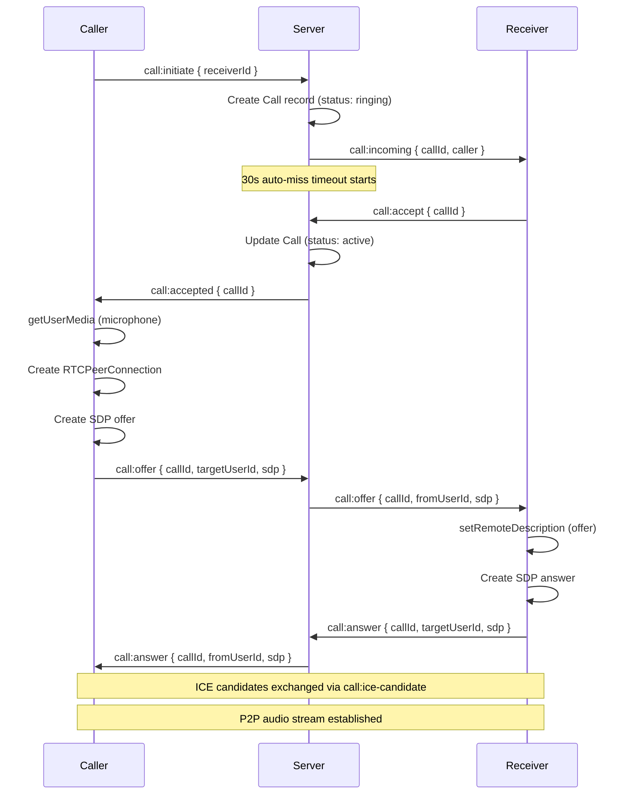
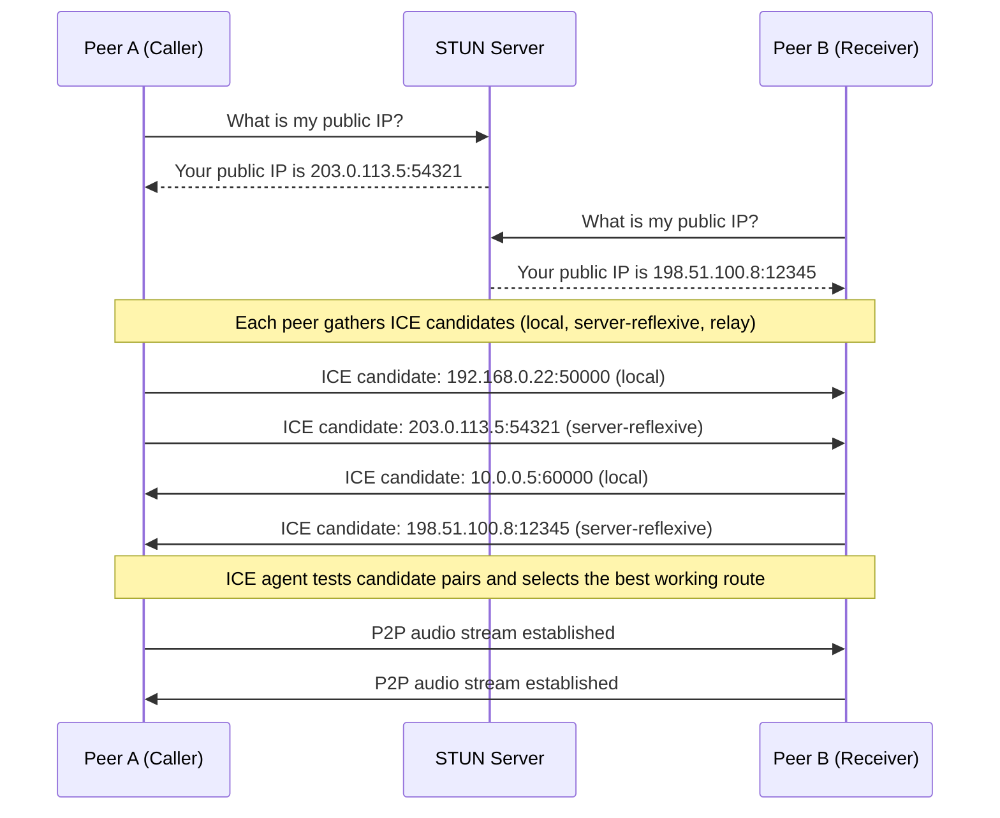
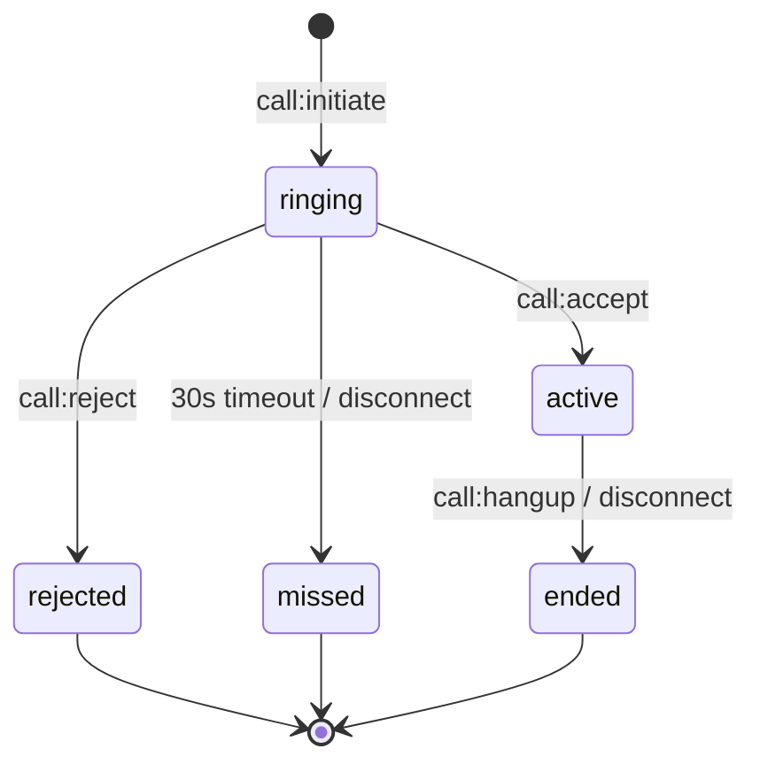

# Voice Calls

> **Status: Development / Not Production Ready**
> Voice calling is functional for local and LAN testing but has not been hardened for production use. See [Limitations & Future Work](#limitations--future-work) for details.

Chatr supports 1-to-1 voice calls using **WebRTC Peer-to-Peer** for audio and **Socket.IO** for signaling. Calls are browser-based — no plugins or native apps required.

## Architecture



## How ICE, STUN & TURN Work

### The problem in plain English

When you make a voice call on Chatr, audio needs to travel directly from your browser to the other person's browser. The catch is that almost nobody's computer is directly reachable on the internet — your home router hides your device behind a private address (like `192.168.0.22`) that the outside world can't see. This is called **NAT** (Network Address Translation).

So how do two browsers find each other? That's the job of three technologies working together:

### STUN — "What's my public address?"

Think of STUN like calling a friend and asking "What number showed up on your caller ID?" Your phone knows its own extension (private IP), but STUN tells you the number the outside world sees (public IP + port). It's a quick, one-time lookup — the STUN server doesn't stay involved after answering.

Chatr uses Google's free STUN servers. They're lightweight and handle millions of requests.

### ICE — "Let me try every possible route"

ICE is the strategy layer. Once each browser knows its own addresses (private and public), ICE collects all of them into a list of "candidates" and sends them to the other person. Then it systematically tries connecting every combination — your public address to their public address, your private address to their private address, and so on — until something works. Think of it like trying every key on a keyring until one opens the lock.

### TURN — "I'll relay if nothing else works"

Sometimes two people are behind especially strict routers (corporate firewalls, certain mobile networks) where no direct route exists — not even using public addresses. In that case, a TURN server acts as a middleman: audio goes from you to the TURN server, then from the TURN server to the other person. It's slower and costs money to run, but it guarantees the call will connect.

**Chatr doesn't use TURN yet** — it's not needed for local/LAN testing and works fine for most home internet connections. See [Limitations & Future Work](#limitations--future-work) for details.

### The analogy

> Imagine you and a friend live in different apartment buildings with locked lobbies.
>
> - **STUN** is the intercom directory — it tells your friend which building and buzzer number to reach you at.
> - **ICE** is you both trying every door, side entrance, and fire escape until you find one that's unlocked.
> - **TURN** is a courier service — if no door works, you hand your message to a runner who carries it between buildings for you.

---

### Technical detail

**ICE** (Interactive Connectivity Establishment) is the mechanism WebRTC uses to find a network path between two peers. Browsers run behind NATs, firewalls, and proxies — ICE systematically discovers which route actually works.



### Candidate Types

| Type | Source | Example | Used when |
|------|--------|---------|-----------|
| **host** | Local network interface | `192.168.0.22:50000` | Both peers on the same LAN |
| **srflx** (server-reflexive) | Discovered via STUN | `203.0.113.5:54321` | Peers behind different NATs (most common) |
| **relay** | Allocated by TURN server | `turn-server:49152` | Direct connection impossible (symmetric NAT) |

### How Chatr exchanges candidates

ICE candidates are gathered asynchronously by the browser's `RTCPeerConnection`. As each candidate is discovered, the `onicecandidate` callback fires and Chatr sends it to the remote peer via Socket.IO (`call:ice-candidate`). The remote peer adds it with `addIceCandidate()`. Candidates that arrive before the remote description is set are buffered in `iceCandidateBuffer` and drained once `setRemoteDescription` completes.

### Why STUN only (no TURN yet)

Chatr currently uses Google's public STUN servers to discover server-reflexive candidates. This works for same-network testing and most residential NATs. Symmetric NATs (common in corporate networks and some mobile carriers) block server-reflexive candidates — a TURN relay server would be needed for those scenarios. See [Limitations & Future Work](#limitations--future-work).

## Key Design Decisions

| Decision | Rationale |
|----------|-----------|
| WebRTC P2P | Audio goes directly between peers — low latency, no server relay costs |
| Socket.IO signaling | Reuses existing WebSocket infrastructure, no extra signaling server needed |
| STUN only (no TURN) | Sufficient for same-network and most NAT scenarios; TURN can be added later |
| 30s ring timeout | Prevents calls from ringing indefinitely; auto-transitions to "missed" |
| Database-backed | Call records persisted for history, duration tracking, and conflict detection |

## Call States



| Status | Description |
|--------|-------------|
| `ringing` | Call initiated, waiting for receiver to respond |
| `active` | Both parties connected, audio streaming |
| `ended` | Call terminated normally by either party |
| `missed` | Receiver didn't answer within 30 seconds, or caller disconnected |
| `rejected` | Receiver explicitly declined the call |
| `busy` | Reserved — not yet implemented |

## Frontend

### CallContext

`CallContext` (`frontend/src/contexts/CallContext.tsx`) manages all call state and WebRTC logic. It exposes:

| Method | Description |
|--------|-------------|
| `initiateCall(receiverId, info?)` | Start an outbound call |
| `acceptCall()` | Accept an incoming call |
| `rejectCall()` | Decline an incoming call |
| `hangup()` | End an active call |
| `toggleMute()` | Toggle local microphone on/off |

| State | Type | Description |
|-------|------|-------------|
| `status` | `CallStatus` | `idle` \| `ringing-outbound` \| `ringing-inbound` \| `connecting` \| `active` \| `ended` |
| `callId` | `string \| null` | Current call's database ID |
| `peer` | `CallPeer \| null` | Remote user's info (id, username, displayName, profileImage) |
| `isMuted` | `boolean` | Whether local mic is muted |
| `duration` | `number` | Seconds elapsed in active call |
| `endReason` | `string \| null` | Why the call ended (`hangup`, `rejected`, `no_answer`, `missed`, `disconnect`, `mic_error`, `mic_https`) |

### CallSocketBridge

`CallProvider` does **not** consume `WebSocketContext` directly — doing so would re-render the entire component tree on every socket reconnect. Instead, an invisible `<CallSocketBridge>` child component subscribes to socket events in isolation and communicates with the provider via a module-level ref. This prevents Chrome compositing flickering.

### CallOverlay

`CallOverlay` (`frontend/src/components/CallOverlay/CallOverlay.tsx`) renders a full-screen overlay during calls. It displays:

- Peer avatar (with pulse animation during ringing)
- Peer name and call status
- Duration timer during active calls
- Context-appropriate controls: Accept/Decline, Cancel, Mute/End

### Initiating Calls from the UI

Calls are triggered via a `chatr:call` custom DOM event:

```typescript
window.dispatchEvent(new CustomEvent('chatr:call', {
  detail: { userId, displayName, username, profileImage }
}));
```

This is dispatched from the conversation action icons (phone icon) in `app/app/page.tsx` and `app/app/friends/page.tsx`. The `CallProvider` listens for this event and calls `initiateCall()`.

## Backend

### Socket Handlers

All call signaling lives in `backend/src/socket/handlers.ts`. The server:

1. **Validates** — checks blocks, online status, and active call conflicts
2. **Persists** — creates/updates `Call` records in the database
3. **Relays** — forwards SDP offers/answers and ICE candidates between peers
4. **Cleans up** — ends active calls when a user disconnects

### Database Model

```prisma
model Call {
  id         String    @id @default(uuid())
  callerId   String
  caller     User      @relation("CallsMade", fields: [callerId], references: [id])
  receiverId String
  receiver   User      @relation("CallsReceived", fields: [receiverId], references: [id])
  status     String    @default("ringing")
  startedAt  DateTime?
  endedAt    DateTime?
  duration   Int?      // seconds
  createdAt  DateTime  @default(now())

  @@index([callerId])
  @@index([receiverId])
  @@index([callerId, receiverId, createdAt(sort: Desc)])
}
```

### ICE Servers

Currently using Google's public STUN servers:

```
stun:stun.l.google.com:19302
stun:stun1.l.google.com:19302
```

No TURN server is configured. For production with users behind symmetric NATs, a TURN server (e.g., Coturn) would need to be added.

## HTTPS Requirement

WebRTC's `getUserMedia` requires a **secure context** (HTTPS). In development:

- The Next.js frontend serves HTTPS on port 3000 via `--experimental-https` with locally-trusted certificates generated by [mkcert](https://github.com/FiloSottile/mkcert)
- The Express backend serves HTTP on port 3001 (internal proxy) and HTTPS on port 3002 (browser connections)
- `getApiBase()` in `frontend/src/lib/api.ts` dynamically selects the correct port based on protocol

For iOS PWA testing, the mkcert root CA must be installed and trusted on the device (Settings → General → About → Certificate Trust Settings).

## Files

| File | Purpose |
|------|---------|
| `backend/src/socket/handlers.ts` | Call signaling handlers (initiate, accept, reject, hangup, SDP relay, ICE relay, disconnect cleanup) |
| `backend/prisma/schema.prisma` | `Call` model definition |
| `frontend/src/contexts/CallContext.tsx` | Call state management, WebRTC peer connection, microphone acquisition |
| `frontend/src/components/CallOverlay/CallOverlay.tsx` | Full-screen call UI overlay |
| `frontend/src/components/CallOverlay/CallOverlay.module.css` | Overlay styles (backdrop, controls, animations) |
| `frontend/src/components/ClientProviders.tsx` | Mounts `CallProvider` and renders `CallOverlay` globally |
| `frontend/src/app/app/page.tsx` | Dispatches `chatr:call` event from conversation actions |
| `frontend/src/app/app/friends/page.tsx` | Dispatches `chatr:call` event from friends list |

## Limitations & Future Work

- **Voice only** — no video calls yet
- **1-to-1 only** — no group/conference calls
- **No TURN server** — calls may fail behind symmetric NATs
- **No call history UI** — call records are persisted but not yet displayed
- **No push notifications** — incoming calls only work when the app is open
- **No ringtone audio** — incoming calls show a visual overlay but play no sound

---

> See the [Glossary](../GLOSSARY.md) for definitions of WebRTC, ICE, STUN, TURN, SDP, NAT, and other terms used on this page.
