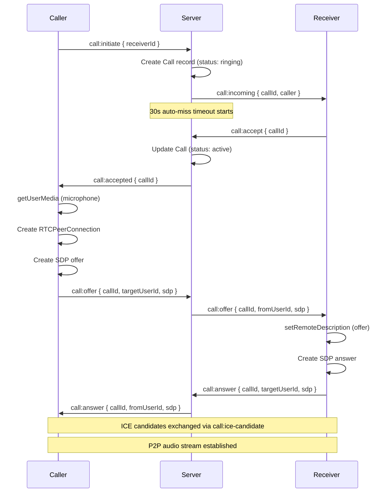
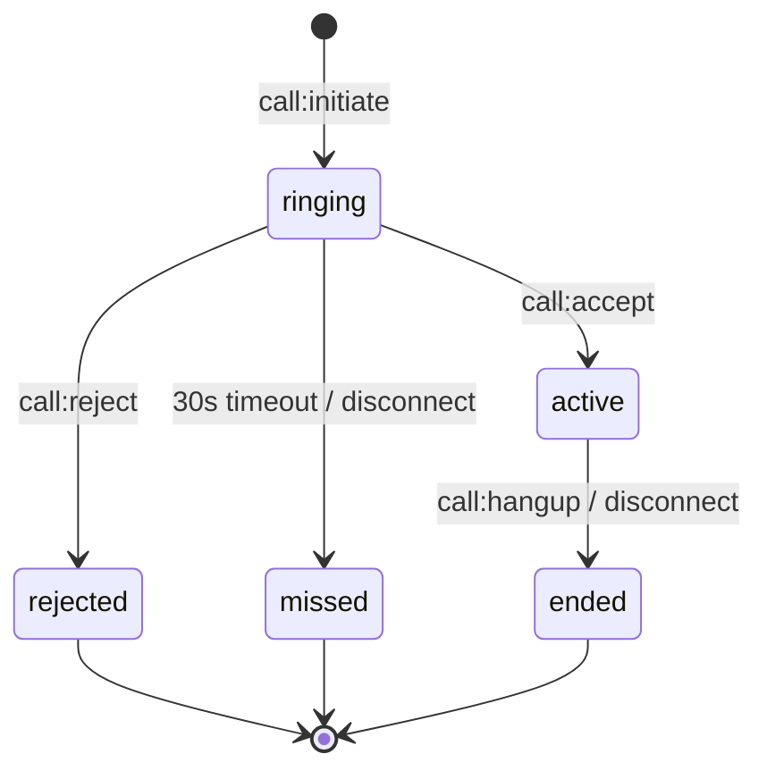

# Voice Calls

> **Status: Development / Not Production Ready**
> Voice calling is functional for local and LAN testing but has not been hardened for production use. See [Limitations & Future Work](#limitations--future-work) for details.

Chatr supports 1-to-1 voice calls using **WebRTC Peer-to-Peer** for audio and **Socket.IO** for signaling. Calls are browser-based — no plugins or native apps required.

## Architecture



## Key Design Decisions

| Decision | Rationale |
|----------|-----------|
| WebRTC P2P | Audio goes directly between peers — low latency, no server relay costs |
| Socket.IO signaling | Reuses existing WebSocket infrastructure, no extra signaling server needed |
| STUN only (no TURN) | Sufficient for same-network and most NAT scenarios; TURN can be added later |
| 30s ring timeout | Prevents calls from ringing indefinitely; auto-transitions to "missed" |
| Database-backed | Call records persisted for history, duration tracking, and conflict detection |

## Call States



| Status | Description |
|--------|-------------|
| `ringing` | Call initiated, waiting for receiver to respond |
| `active` | Both parties connected, audio streaming |
| `ended` | Call terminated normally by either party |
| `missed` | Receiver didn't answer within 30 seconds, or caller disconnected |
| `rejected` | Receiver explicitly declined the call |
| `busy` | Reserved — not yet implemented |

## Frontend

### CallContext

`CallContext` (`frontend/src/contexts/CallContext.tsx`) manages all call state and WebRTC logic. It exposes:

| Method | Description |
|--------|-------------|
| `initiateCall(receiverId, info?)` | Start an outbound call |
| `acceptCall()` | Accept an incoming call |
| `rejectCall()` | Decline an incoming call |
| `hangup()` | End an active call |
| `toggleMute()` | Toggle local microphone on/off |

| State | Type | Description |
|-------|------|-------------|
| `status` | `CallStatus` | `idle` \| `ringing-outbound` \| `ringing-inbound` \| `connecting` \| `active` \| `ended` |
| `callId` | `string \| null` | Current call's database ID |
| `peer` | `CallPeer \| null` | Remote user's info (id, username, displayName, profileImage) |
| `isMuted` | `boolean` | Whether local mic is muted |
| `duration` | `number` | Seconds elapsed in active call |
| `endReason` | `string \| null` | Why the call ended (`hangup`, `rejected`, `no_answer`, `missed`, `disconnect`, `mic_error`, `mic_https`) |

### CallSocketBridge

`CallProvider` does **not** consume `WebSocketContext` directly — doing so would re-render the entire component tree on every socket reconnect. Instead, an invisible `<CallSocketBridge>` child component subscribes to socket events in isolation and communicates with the provider via a module-level ref. This prevents Chrome compositing flickering.

### CallOverlay

`CallOverlay` (`frontend/src/components/CallOverlay/CallOverlay.tsx`) renders a full-screen overlay during calls. It displays:

- Peer avatar (with pulse animation during ringing)
- Peer name and call status
- Duration timer during active calls
- Context-appropriate controls: Accept/Decline, Cancel, Mute/End

### Initiating Calls from the UI

Calls are triggered via a `chatr:call` custom DOM event:

```typescript
window.dispatchEvent(new CustomEvent('chatr:call', {
  detail: { userId, displayName, username, profileImage }
}));
```

This is dispatched from the conversation action icons (phone icon) in `app/app/page.tsx` and `app/app/friends/page.tsx`. The `CallProvider` listens for this event and calls `initiateCall()`.

## Backend

### Socket Handlers

All call signaling lives in `backend/src/socket/handlers.ts`. The server:

1. **Validates** — checks blocks, online status, and active call conflicts
2. **Persists** — creates/updates `Call` records in the database
3. **Relays** — forwards SDP offers/answers and ICE candidates between peers
4. **Cleans up** — ends active calls when a user disconnects

### Database Model

```prisma
model Call {
  id         String    @id @default(uuid())
  callerId   String
  caller     User      @relation("CallsMade", fields: [callerId], references: [id])
  receiverId String
  receiver   User      @relation("CallsReceived", fields: [receiverId], references: [id])
  status     String    @default("ringing")
  startedAt  DateTime?
  endedAt    DateTime?
  duration   Int?      // seconds
  createdAt  DateTime  @default(now())

  @@index([callerId])
  @@index([receiverId])
  @@index([callerId, receiverId, createdAt(sort: Desc)])
}
```

### ICE Servers

Currently using Google's public STUN servers:

```
stun:stun.l.google.com:19302
stun:stun1.l.google.com:19302
```

No TURN server is configured. For production with users behind symmetric NATs, a TURN server (e.g., Coturn) would need to be added.

## HTTPS Requirement

WebRTC's `getUserMedia` requires a **secure context** (HTTPS). In development:

- The Next.js frontend serves HTTPS on port 3000 via `--experimental-https` with locally-trusted certificates generated by [mkcert](https://github.com/FiloSottile/mkcert)
- The Express backend serves HTTP on port 3001 (internal proxy) and HTTPS on port 3002 (browser connections)
- `getApiBase()` in `frontend/src/lib/api.ts` dynamically selects the correct port based on protocol

For iOS PWA testing, the mkcert root CA must be installed and trusted on the device (Settings → General → About → Certificate Trust Settings).

## Files

| File | Purpose |
|------|---------|
| `backend/src/socket/handlers.ts` | Call signaling handlers (initiate, accept, reject, hangup, SDP relay, ICE relay, disconnect cleanup) |
| `backend/prisma/schema.prisma` | `Call` model definition |
| `frontend/src/contexts/CallContext.tsx` | Call state management, WebRTC peer connection, microphone acquisition |
| `frontend/src/components/CallOverlay/CallOverlay.tsx` | Full-screen call UI overlay |
| `frontend/src/components/CallOverlay/CallOverlay.module.css` | Overlay styles (backdrop, controls, animations) |
| `frontend/src/components/ClientProviders.tsx` | Mounts `CallProvider` and renders `CallOverlay` globally |
| `frontend/src/app/app/page.tsx` | Dispatches `chatr:call` event from conversation actions |
| `frontend/src/app/app/friends/page.tsx` | Dispatches `chatr:call` event from friends list |

## Limitations & Future Work

- **Voice only** — no video calls yet
- **1-to-1 only** — no group/conference calls
- **No TURN server** — calls may fail behind symmetric NATs
- **No call history UI** — call records are persisted but not yet displayed
- **No push notifications** — incoming calls only work when the app is open
- **No ringtone audio** — incoming calls show a visual overlay but play no sound
