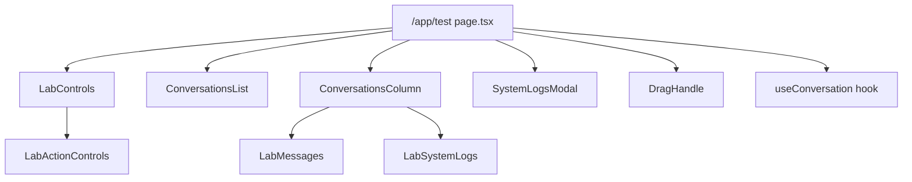

# Test Lab Components

Located in `frontend/src/components/test/`. These components power the `/app/test` developer Test Lab page. They are designed to be reusable — the conversation and messaging components will migrate into the main app UI when the full chat UI is built.

## Component Map



---

## Components

### `LabControls`
Left-panel control surface for the Test Lab. Contains API config display, connection status, manual offline toggle, and message compose/send controls. Delegates action buttons to `LabActionControls`.

**Props:** All state and handlers from `useConversation`.

---

### `LabActionControls`
Sub-component of `LabControls`. Renders the send message, voice recording, file attach, typing simulation, and presence update buttons.

---

### `ConversationsList`
Middle column showing all available users with presence indicators. Selecting a user sets the active conversation.

**Props:**
| Prop | Type | Description |
|---|---|---|
| `isDark` | `boolean` | Theme flag |
| `availableUsers` | `AvailableUser[]` | Users fetched from API |
| `selectedUserId` | `string` | Currently active user |
| `userPresence` | `Record<string, PresenceInfo>` | Presence state keyed by userId |
| `onSelectUser` | `(id: string) => void` | Callback on user selection |

**Presence dot colours:**
- 🟢 `#10b981` — online
- 🟠 `#f97316` — away
- ⚫ `#64748b` — offline

**Subtitle:** `online` / `away` / `Last seen X ago`

---

### `ConversationsColumn`
Right column showing the active message thread, typing indicators, and the message input bar (via `LabMessages`).

---

### `LabMessages`
Renders the scrollable message list with sent/received bubbles, file/image/audio attachments, delivery status indicators, and typing/recording indicators.

---

### `LabSystemLogs`
Collapsible log panel showing all emitted and received Socket.io events with timestamps and payloads. Used inside the `SystemLogsModal`.

---

### `SystemLogsModal`
Full-screen modal overlay that wraps `LabSystemLogs`. Opened via the log count badge button in `ConversationsColumn`. Includes copy-to-clipboard and clear actions.

---

### `DragHandle`
A thin draggable divider between columns. Allows resizing columns within `MIN_W` (220px) and `MAX_W` (700px) bounds.

---

## Types (`types.ts`)

```typescript
export type PresenceStatus = 'online' | 'away' | 'offline';

export interface PresenceInfo {
  status:   PresenceStatus;
  lastSeen: Date | null;
}

export interface AvailableUser {
  id:       string;
  username: string;
  email:    string;
}

export interface LogEntry {
  type:      'sent' | 'received' | 'info';
  event:     string;
  data:      any;
  timestamp: Date;
}
```

---

## Mobile Layout

On viewports `< 768px` the Test Lab switches to a single-panel layout with a top tab bar:

| Tab | Icon | Content |
|---|---|---|
| Controls | `fa-sliders-h` | `LabControls` |
| Conversations | `fa-comments` | `ConversationsList` |
| Messages | `fa-comment-dots` | `ConversationsColumn` |

Selecting a user in Conversations automatically switches to the Messages tab.

---

## See Also

- [`useConversation` hook](../../Hooks/useConversation.md)
- [Presence System](../../../../Features/MESSAGING.md#presence-system)
- [WebSocket Events](../../../../WebSocket/EVENTS.md)

