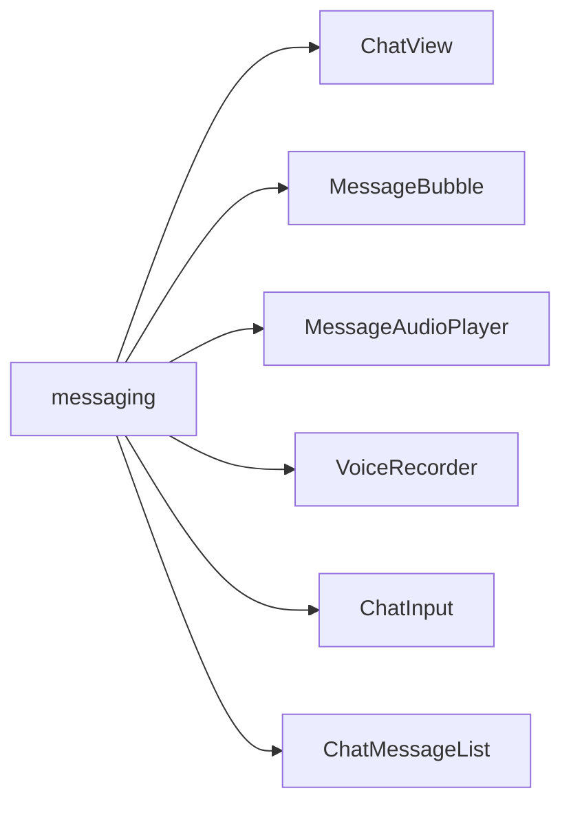
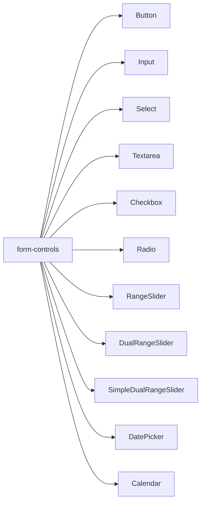
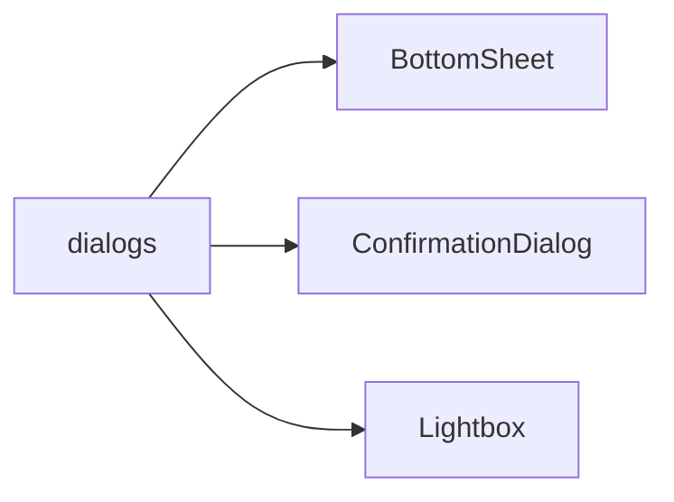
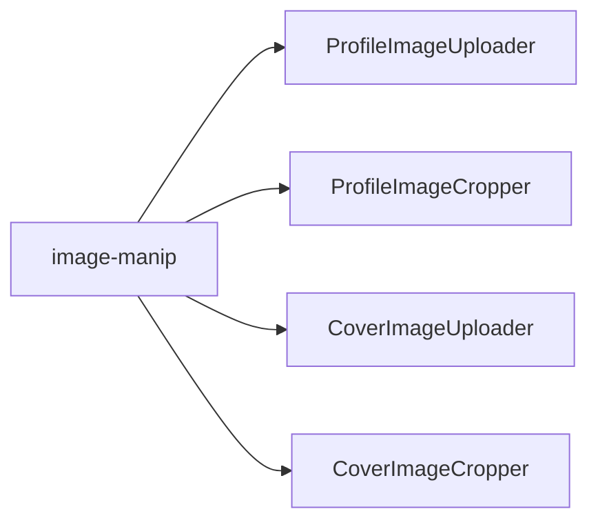
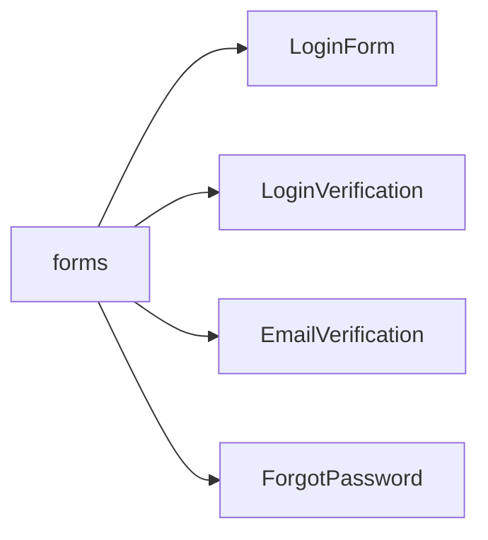
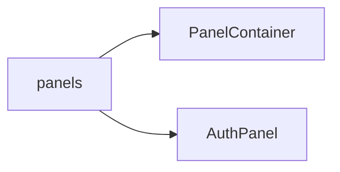
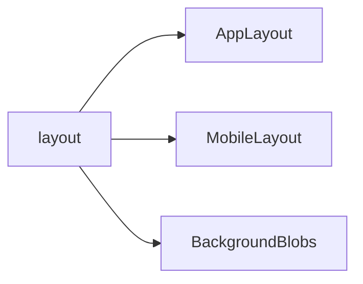
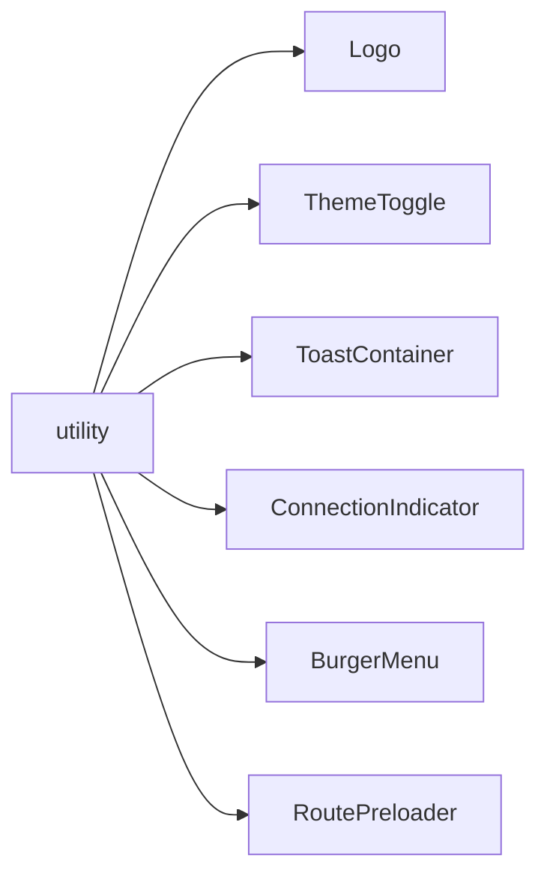
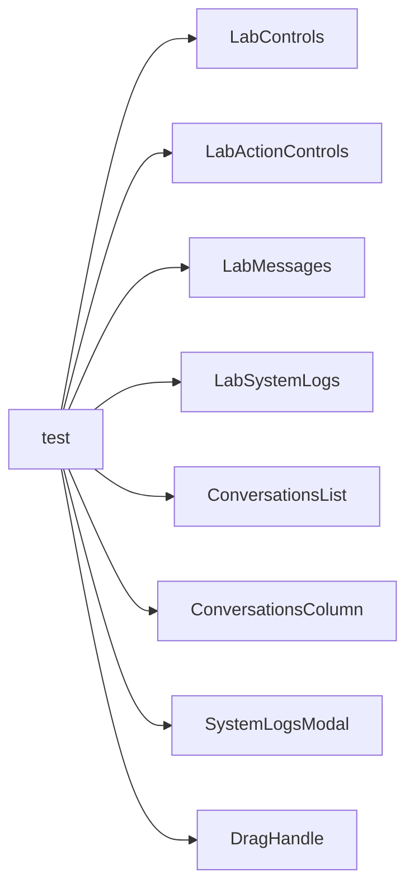
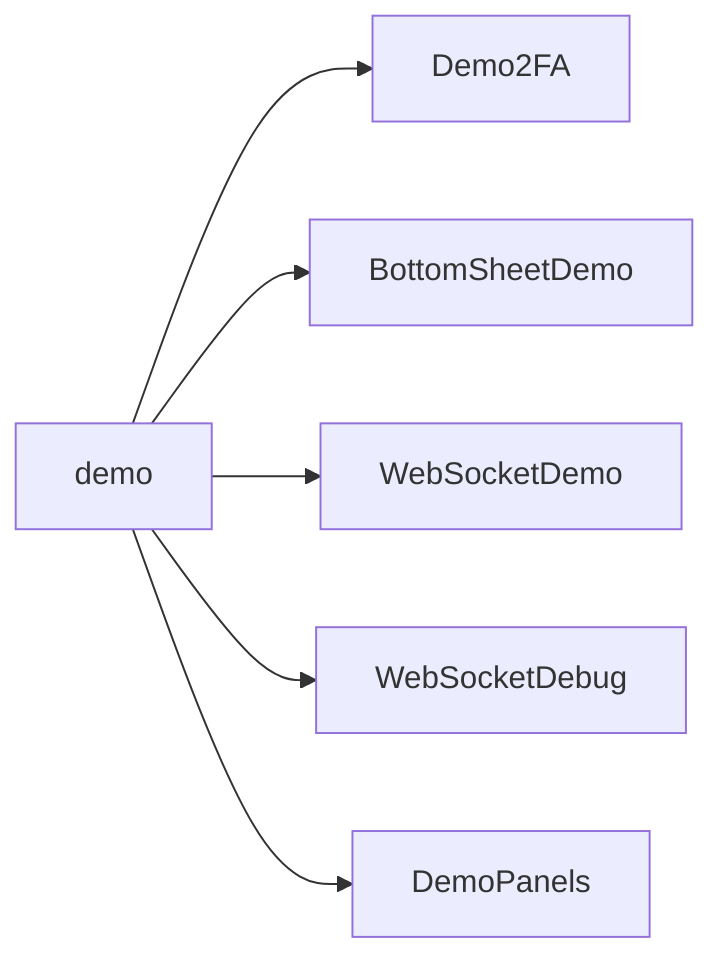

# Components

All reusable UI components are located in `frontend/src/components/`. Each component lives in its own folder with an `index.md` reference document.

## Structure

## Folders

| Folder | Description |
|---|---|
| [messaging](./messaging/index.md) | Message display, audio, voice recording, chat input |
| [form-controls](./form-controls/index.md) | Inputs, selects, sliders, date pickers |
| [dialogs](./dialogs/index.md) | Bottom sheet, confirmation dialog, lightbox |
| [image-manip](./image-manip/index.md) | Profile and cover image upload and crop |
| [forms](./forms/index.md) | Auth forms — login, register, verification |
| [panels](./panels/index.md) | Slide-in panel system |
| [layout](./layout/index.md) | App shell — desktop and mobile layouts |
| [utility](./utility/index.md) | Logo, theme toggle, toasts, connection indicator |
| [test](./test/index.md) | Test Lab components — conversations, messages, logs |
| [demo](./demo/index.md) | Dev/demo-only components |
