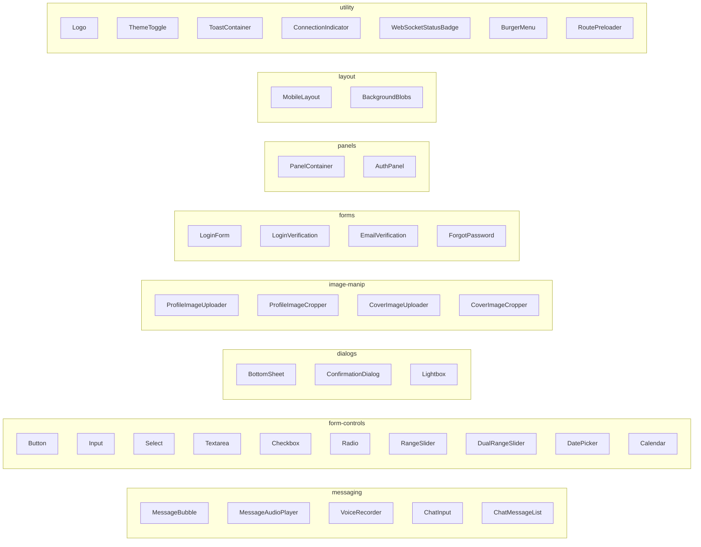

# Components

All reusable UI components are located in `frontend/src/components/`. Each component lives in its own folder with an `index.md` reference document.

## Structure

```mermaid
graph LR
    subgraph messaging
        MessageBubble
        MessageAudioPlayer
        VoiceRecorder
        ChatInput
        ChatMessageList
    end

    subgraph form-controls
        Button
        Input
        Select
        Textarea
        Checkbox
        Radio
        RangeSlider
        DualRangeSlider
        DatePicker
        Calendar
    end

    subgraph dialogs
        BottomSheet
        ConfirmationDialog
        Lightbox
    end

    subgraph image-manip
        ProfileImageUploader
        ProfileImageCropper
        CoverImageUploader
        CoverImageCropper
    end

    subgraph forms
        LoginForm
        LoginVerification
        EmailVerification
        ForgotPassword
    end

    subgraph panels
        PanelContainer
        AuthPanel
    end

    subgraph layout
        MobileLayout
        BackgroundBlobs
    end

    subgraph utility
        Logo
        ThemeToggle
        ToastContainer
        ConnectionIndicator
        WebSocketStatusBadge
        BurgerMenu
        RoutePreloader
    end
```
