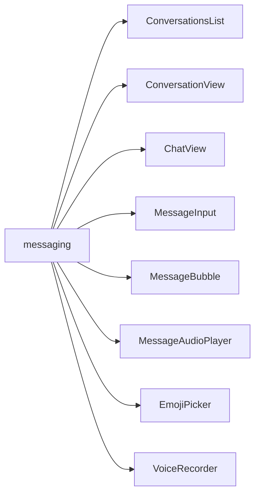
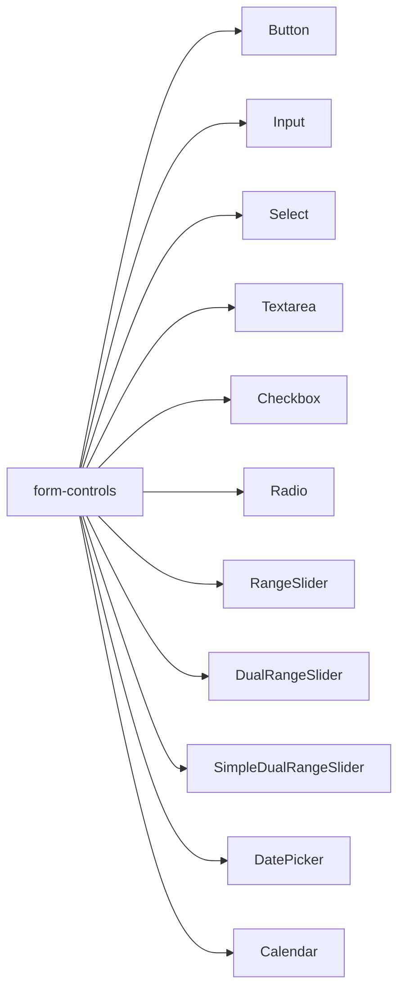
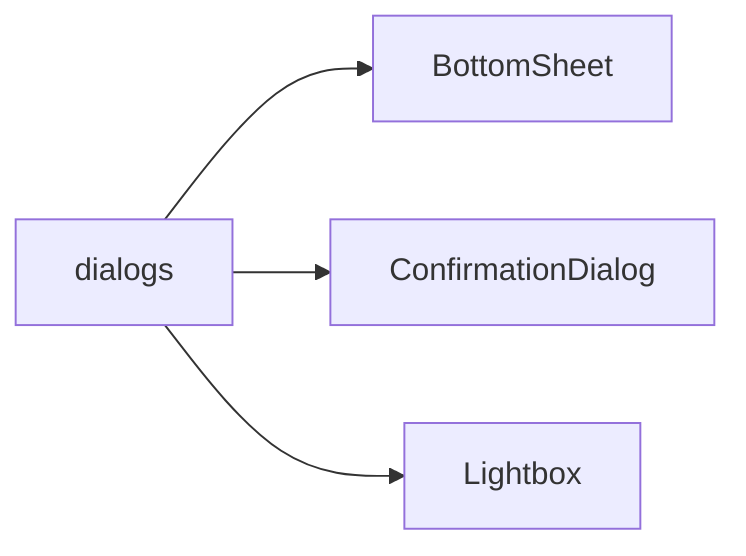
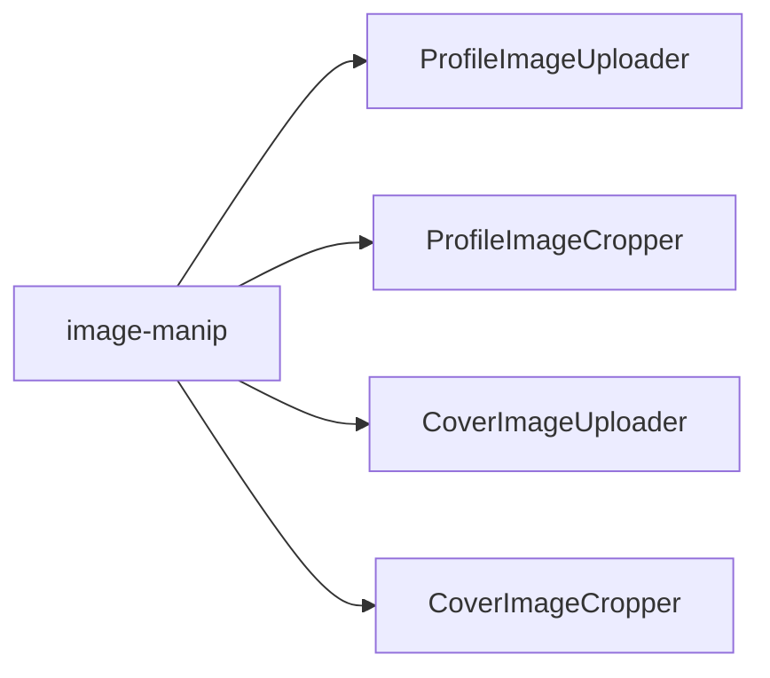
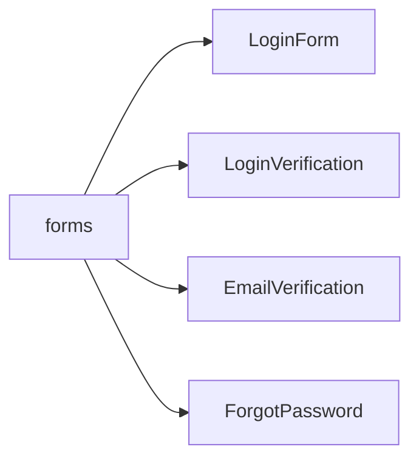
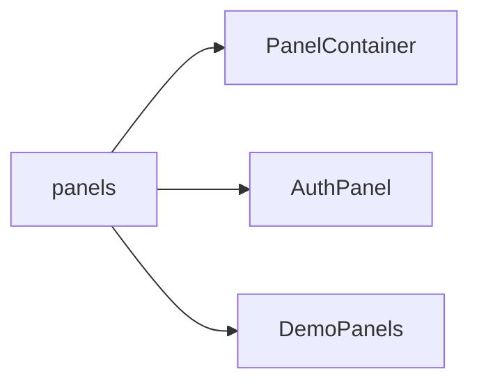
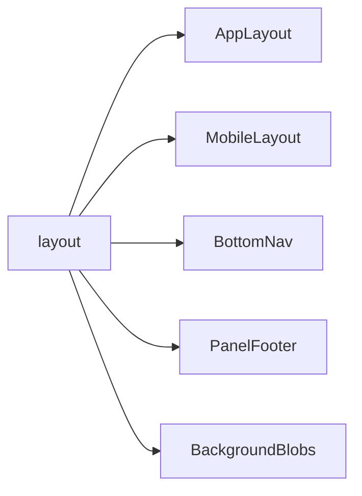
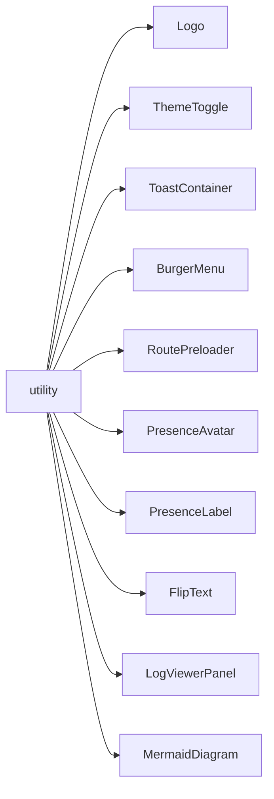
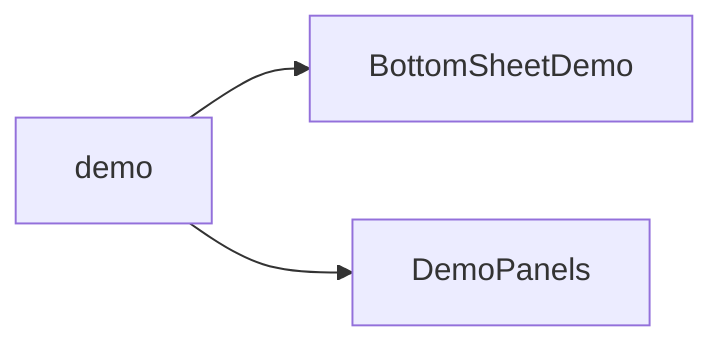

# Components

All reusable UI components are located in `frontend/src/components/`. Each component lives in its own folder with an `index.md` reference document. Every component also has a Storybook story.

## Structure

```mermaid
graph LR
    messaging --> ConversationsList
    messaging --> ConversationView
    messaging --> ChatView
    messaging --> MessageInput
    messaging --> MessageBubble
    messaging --> MessageAudioPlayer
    messaging --> EmojiPicker
    messaging --> VoiceRecorder
```

```mermaid
graph LR
    form-controls --> Button
    form-controls --> Input
    form-controls --> Select
    form-controls --> Textarea
    form-controls --> Checkbox
    form-controls --> Radio
    form-controls --> RangeSlider
    form-controls --> DualRangeSlider
    form-controls --> SimpleDualRangeSlider
    form-controls --> DatePicker
    form-controls --> Calendar
```

```mermaid
graph LR
    dialogs --> BottomSheet
    dialogs --> ConfirmationDialog
    dialogs --> Lightbox
```

```mermaid
graph LR
    image-manip --> ProfileImageUploader
    image-manip --> ProfileImageCropper
    image-manip --> CoverImageUploader
    image-manip --> CoverImageCropper
```

```mermaid
graph LR
    forms --> LoginForm
    forms --> LoginVerification
    forms --> EmailVerification
    forms --> ForgotPassword
```

```mermaid
graph LR
    panels --> PanelContainer
    panels --> AuthPanel
    panels --> DemoPanels
```

```mermaid
graph LR
    layout --> AppLayout
    layout --> MobileLayout
    layout --> BottomNav
    layout --> PanelFooter
    layout --> BackgroundBlobs
```

```mermaid
graph LR
    utility --> Logo
    utility --> ThemeToggle
    utility --> ToastContainer
    utility --> BurgerMenu
    utility --> RoutePreloader
    utility --> PresenceAvatar
    utility --> PresenceLabel
    utility --> FlipText
    utility --> LogViewerPanel
    utility --> MermaidDiagram
```

```mermaid
graph LR
    demo --> BottomSheetDemo
    demo --> DemoPanels
```

## Folders

| Folder | Description |
|---|---|
| [messaging](./Messaging/index.md) | Conversations, messages, audio, emoji, voice recording, chat input |
| [form-controls](./Form-Controls/index.md) | Inputs, selects, sliders, date pickers |
| [dialogs](./Dialogs/index.md) | Bottom sheet, confirmation dialog, lightbox |
| [image-manip](./Image-Manip/index.md) | Profile and cover image upload and crop |
| [forms](./Forms/index.md) | Auth forms — login, register, verification, 2FA |
| [panels](./Panels/index.md) | Slide-in panel system |
| [layout](./Layout/index.md) | App shell — desktop layout, mobile layout, nav bars |
| [utility](./Utility/index.md) | Logo, theme toggle, toasts, presence, flip text, log viewer |
| [demo](./Demo/index.md) | Dev/demo components — bottom sheets, panels |
