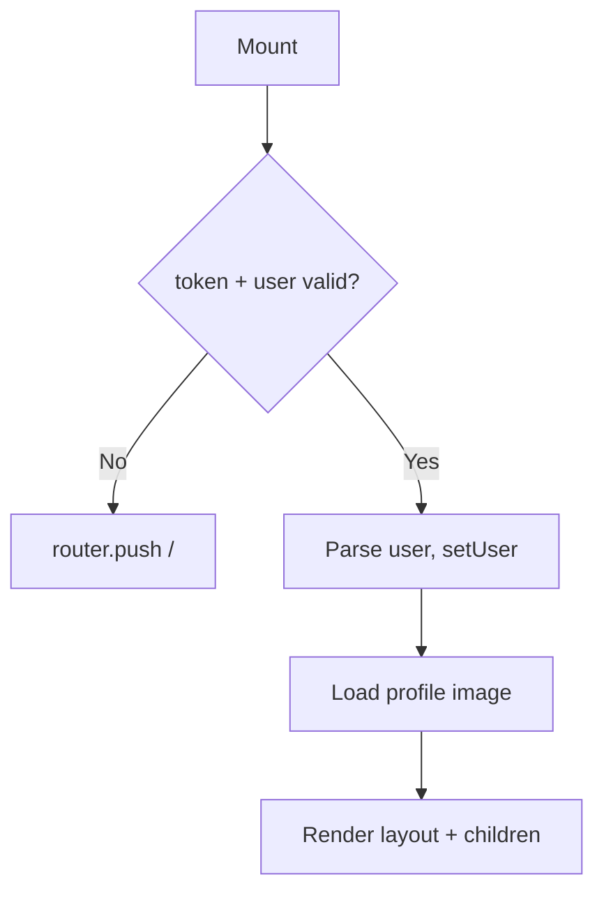

# AppLayout

**File:** `src/components/AppLayout/AppLayout.tsx`

Desktop layout wrapper for all authenticated app pages (`/app/*`). Enforces JWT authentication on mount and renders the desktop navigation sidebar.

---

## Props

| Prop | Type | Description |
|---|---|---|
| `children` | `ReactNode` | Page content |

---

## Behaviour

On mount, reads `token` and `user` from `localStorage`. If either is missing or invalid, redirects to `/`. On success, loads the user's profile image via `profileImageService`.

---

## Navigation

Renders a fixed left sidebar with links to:

| Route | Label |
|---|---|
| `/app` | Chats |
| `/app/groups` | Groups |
| `/app/updates` | Updates |
| `/app/test` | Test Lab |
| `/app/settings` | Settings |

Active route is highlighted. Profile avatar shown at the bottom of the sidebar.

---

## See Also

- [MobileLayout](../layout/MobileLayout/index.md) — mobile equivalent
- [useAuth hook](../../Hooks/useAuth.md)

