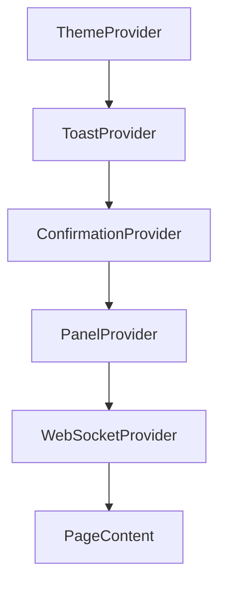

# Contexts

All React contexts live in `frontend/src/contexts/`. They are mounted in `src/app/layout.tsx` in this order:



---

## WebSocketContext

**File:** `contexts/WebSocketContext.tsx`

Manages the Socket.io connection lifecycle.

```typescript
const { socket, connected, connecting, disconnect, reconnect } = useWebSocket();
```

| Value | Type | Description |
|---|---|---|
| `socket` | `Socket \| null` | Raw Socket.io instance |
| `connected` | `boolean` | Socket is currently connected |
| `connecting` | `boolean` | Connection attempt in progress |
| `disconnect()` | `function` | Manually close — used by manual offline mode |
| `reconnect()` | `function` | Re-open after a manual disconnect |

Reads `token` and `user` from `localStorage` on mount. Skips connection if either is missing/invalid. Reconnects automatically up to 5 times with exponential backoff.

---

## ThemeContext

**File:** `contexts/ThemeContext.tsx`

Persists `light` / `dark` preference to `localStorage` under key `theme`.

```typescript
const { theme, toggleTheme } = useTheme();
```

CSS custom properties are applied to `:root` on every toggle. Default is `dark`.

---

## ToastContext

**File:** `contexts/ToastContext.tsx`

Queue-based notification system. Toasts auto-dismiss after a configurable duration. Hovering pauses the timer.

```typescript
const { showToast } = useToast();
showToast('Saved', 'success', 4000);
// type: 'success' | 'error' | 'warning' | 'info'
// duration: ms (default 4000)
```

---

## ConfirmationContext

**File:** `contexts/ConfirmationContext.tsx`

Promise-based confirmation dialog system. Returns the value of whichever action button the user presses.

```typescript
const { showConfirmation } = useConfirmation();

const result = await showConfirmation({
  title: 'Delete message?',
  message: 'This cannot be undone.',
  urgency: 'danger',
  actions: [
    { label: 'Cancel',  variant: 'secondary',    value: false },
    { label: 'Delete',  variant: 'destructive',  value: true  },
  ],
});
if (result === true) { /* confirmed */ }
```

| Prop | Type | Values |
|---|---|---|
| `urgency` | `string` | `info` · `warning` · `danger` |
| `variant` | `string` | `primary` · `secondary` · `destructive` |

---

## PanelContext

**File:** `contexts/PanelContext.tsx`

Stacked slide-in panel system. Panels are pushed onto a stack and can be closed individually or all at once. Used for settings, profiles, and any contextual overlay.

```typescript
const { openPanel, closePanel, closeTopPanel, closeAllPanels } = usePanel();

openPanel(
  'settings',           // id
  <SettingsComponent />, // content
  'Settings',           // title
  'center',             // titlePosition: 'center' | 'left' | 'right'
  'Edit your profile',  // subTitle (optional)
  '/profile/img.jpg',   // profileImage (optional)
  false,                // fullWidth (optional)
  [{ icon: 'fa-cog', onClick: fn, label: 'Options' }] // actionIcons (optional)
);
```

| Value | Type | Description |
|---|---|---|
| `panels` | `Panel[]` | Current panel stack |
| `openPanel(...)` | `function` | Push a new panel |
| `closePanel(id)` | `function` | Close a specific panel by ID |
| `closeTopPanel()` | `function` | Close the topmost panel |
| `closeAllPanels()` | `function` | Clear all panels |
| `maxLevel` | `number` | Index of topmost panel |
| `effectiveMaxLevel` | `number` | Max level excluding closing panels |

---

## See Also

- [Frontend Overview](../index.md)
- [WebSocket Events](../../WebSocket/Events.md)
- [PanelContainer component](../Components/panels/PanelContainer/index.md)

