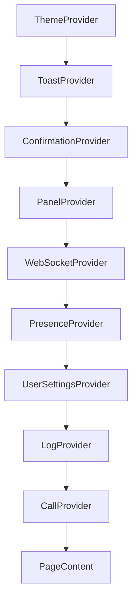
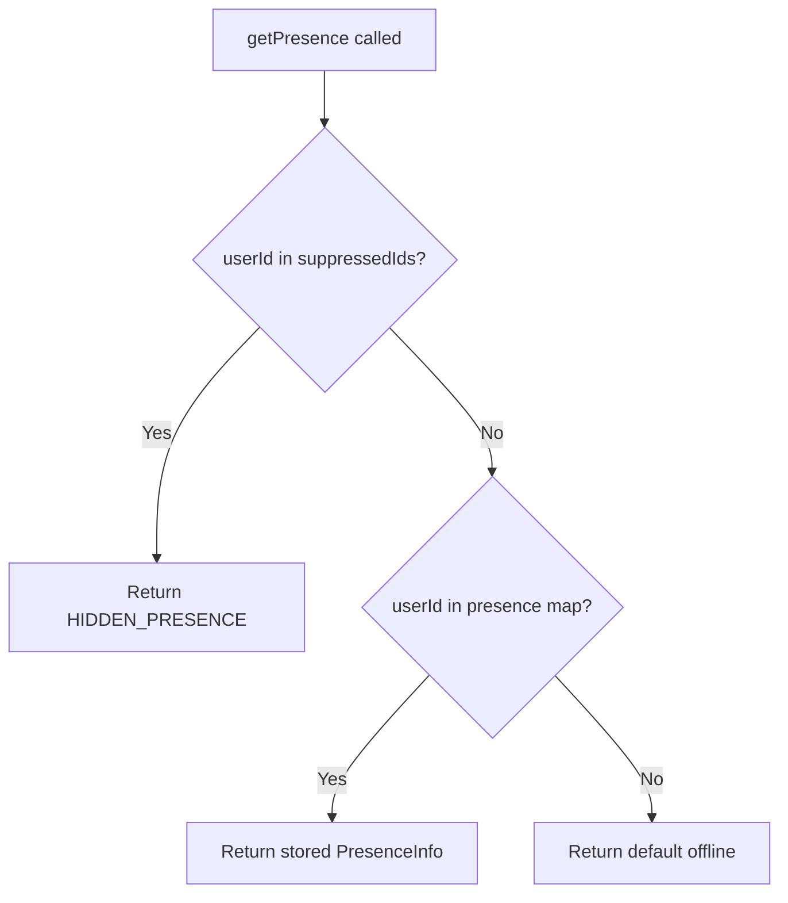

# Contexts

All React contexts live in `frontend/src/contexts/`. They are mounted in `src/app/layout.tsx` in this order:


```mermaid
graph TD
    ThemeProvider --> ToastProvider
    ToastProvider --> ConfirmationProvider
    ConfirmationProvider --> PanelProvider
    PanelProvider --> WebSocketProvider
    WebSocketProvider --> PresenceProvider
    PresenceProvider --> UserSettingsProvider
    UserSettingsProvider --> LogProvider
    LogProvider --> CallProvider
    CallProvider --> PageContent
```

---

## WebSocketContext

**File:** `contexts/WebSocketContext.tsx`

Manages the Socket.io connection lifecycle.

```typescript
const { socket, connected, connecting, disconnect, reconnect } = useWebSocket();
```

| Value | Type | Description |
|---|---|---|
| `socket` | `Socket \| null` | Raw Socket.io instance |
| `connected` | `boolean` | Socket is currently connected |
| `connecting` | `boolean` | Connection attempt in progress |
| `disconnect()` | `function` | Manually close the socket |
| `reconnect()` | `function` | Re-open after a manual disconnect |

Reads `token` and `user` from `localStorage` on mount. Skips connection if either is missing/invalid. Reconnects automatically up to 5 times with exponential backoff.

---

## ThemeContext

**File:** `contexts/ThemeContext.tsx`

Persists `light` / `dark` preference to `localStorage` under key `theme`.

```typescript
const { theme, toggleTheme } = useTheme();
```

CSS custom properties are applied to `:root` on every toggle. Default is `dark`.

---

## ToastContext

**File:** `contexts/ToastContext.tsx`

Queue-based notification system. Toasts auto-dismiss after a configurable duration. Hovering pauses the timer. Supports custom titles and multiple types including `newmessage` for incoming message notifications.

```typescript
const { showToast } = useToast();
showToast('Saved', 'success', 4000);
// type: 'success' | 'error' | 'warning' | 'info' | 'newmessage'
// duration: ms (default 4000)
// optional title: custom title string (overrides type-based default)
```

The `newmessage` type renders an orange toast with a message icon, used for incoming message and message request notifications.

---

## ConfirmationContext

**File:** `contexts/ConfirmationContext.tsx`

Promise-based confirmation dialog system. Returns the value of whichever action button the user presses.

```typescript
const { showConfirmation } = useConfirmation();

const result = await showConfirmation({
  title: 'Delete message?',
  message: 'This cannot be undone.',
  urgency: 'danger',
  actions: [
    { label: 'Cancel',  variant: 'secondary',    value: false },
    { label: 'Delete',  variant: 'destructive',  value: true  },
  ],
});
if (result === true) { /* confirmed */ }
```

| Prop | Type | Values |
|---|---|---|
| `urgency` | `string` | `info` · `warning` · `danger` |
| `variant` | `string` | `primary` · `secondary` · `destructive` |

---

## PanelContext

**File:** `contexts/PanelContext.tsx`

Stacked slide-in panel system. Panels are pushed onto a stack and can be closed individually or all at once. Used for chat conversations, settings, profiles, New Chat search, and any contextual overlay.

```typescript
const { openPanel, closePanel, closeTopPanel, closeAllPanels } = usePanels();

openPanel(
  'settings',           // id
  <SettingsComponent />, // content
  'Settings',           // title
  'center',             // titlePosition: 'center' | 'left' | 'right'
  'Edit your profile',  // subTitle (optional)
  '/profile/img.jpg',   // profileImage (optional)
  false,                // fullWidth (optional)
  [{ icon: 'fa-cog', onClick: fn, label: 'Options' }] // actionIcons (optional)
);
```

| Value | Type | Description |
|---|---|---|
| `panels` | `Panel[]` | Current panel stack |
| `openPanel(...)` | `function` | Push a new panel |
| `closePanel(id)` | `function` | Close a specific panel by ID |
| `closeTopPanel()` | `function` | Close the topmost panel |
| `closeAllPanels()` | `function` | Clear all panels |
| `maxLevel` | `number` | Index of topmost panel |
| `effectiveMaxLevel` | `number` | Max level excluding closing panels |

---

## PresenceContext

**File:** `contexts/PresenceContext.tsx`

Manages real-time user presence state across the application. Tracks online/offline/away status and `lastSeen` timestamps via `user:status` and `presence:response` socket events.

```typescript
const { getPresence, setSuppressedIds } = usePresence();
```

| Value | Type | Description |
|---|---|---|
| `getPresence(userId)` | `function` | Returns `PresenceInfo` for a user |
| `setSuppressedIds(ids)` | `function` | Set user IDs whose presence should be hidden |

### Presence Suppression

The `setSuppressedIds` function accepts a `Set<string>` of user IDs whose presence should be hidden. When a user ID is suppressed:
- `getPresence()` returns a static `HIDDEN_PRESENCE` object (`{ status: 'offline', lastSeen: null, hidden: true }`)
- Incoming `user:status` events for that user are ignored

This is used for pending outgoing message requests — the initiator should not see the recipient's online status until the request is accepted.


```mermaid
flowchart TD
    A[getPresence called] --> B{userId in suppressedIds?}
    B -- Yes --> C[Return HIDDEN_PRESENCE]
    B -- No --> D{userId in presence map?}
    D -- Yes --> E[Return stored PresenceInfo]
    D -- No --> F["Return default offline"]
```

---

## LogContext

**File:** `contexts/LogContext.tsx`

Provides WebSocket event logging for developer tools. Captures all emitted and received socket events with timestamps and payloads.

```typescript
const { logs, addLog, clearLogs, copyLogs } = useLog();
```

| Value | Type | Description |
|---|---|---|
| `logs` | `LogEntry[]` | Array of logged events |
| `addLog(type, event, data)` | `function` | Add a log entry (`'sent'` / `'received'` / `'info'` / `'error'`) |
| `clearLogs()` | `function` | Clear all log entries |
| `copyLogs()` | `function` | Copy logs to clipboard as formatted text |

---

## UserSettingsContext

**File:** `contexts/UserSettingsContext.tsx`

Manages user preference state. Reads initial values and persists changes to the server via `settings:update` socket events.

```typescript
const { settings, setSetting } = useUserSettings();
```

| Setting | Type | Description |
|---|---|---|
| `showOnlineStatus` | `boolean` | Whether this user's presence is visible to others |
| `ghostTypingEnabled` | `boolean` | Whether ghost typing (live text preview) is enabled |

---

## CallContext

Manages voice call state, WebRTC peer connections, and microphone access. Mounted via `CallProvider` in `ClientProviders.tsx`. See [Voice Calls](../../Features/VOICE_CALLS.md) for the full feature overview.

```typescript
const { status, peer, isMuted, duration, endReason, initiateCall, acceptCall, rejectCall, hangup, toggleMute } = useCall();
```

| Value | Type | Description |
|-------|------|-------------|
| `status` | `CallStatus` | `idle` \| `ringing-outbound` \| `ringing-inbound` \| `connecting` \| `active` \| `ended` |
| `peer` | `CallPeer \| null` | Remote user info |
| `isMuted` | `boolean` | Local mic muted |
| `duration` | `number` | Seconds elapsed |
| `initiateCall` | `(receiverId, info?) => Promise<void>` | Start an outbound call |
| `acceptCall` | `() => void` | Accept incoming call |
| `rejectCall` | `() => void` | Decline incoming call |
| `hangup` | `() => void` | End active call |
| `toggleMute` | `() => void` | Toggle microphone |

`CallProvider` does not consume `WebSocketContext` directly. An invisible `<CallSocketBridge>` child handles socket subscriptions in isolation to prevent re-render cascading.

---

## See Also

- [Frontend Overview](../index.md)
- [Voice Calls](../../Features/VOICE_CALLS.md)
- [WebSocket Events](../../WebSocket/Events.md)
- [PanelContainer component](../Components/Panels/PanelContainer/index.md)
