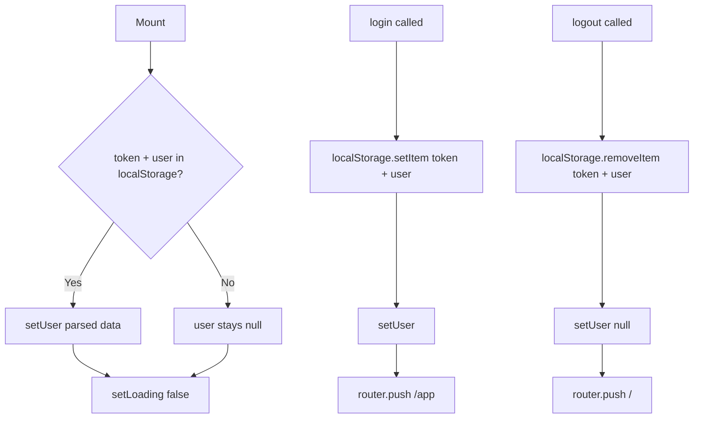

# `useAuth`

**File:** `frontend/src/hooks/useAuth.ts`

Handles authentication state, login, and logout. Reads from `localStorage` on mount and exposes helpers that update both storage and router.

---

## Usage

```typescript
const { user, loading, login, logout } = useAuth();
```

---

## Returned Values

| Name | Type | Description |
|---|---|---|
| `user` | `User \| null` | Parsed user object from `localStorage`, or `null` if not authenticated |
| `loading` | `boolean` | `true` until the initial localStorage check completes |
| `login(token, userData)` | `function` | Persists token + user to `localStorage`, sets state, redirects to `/app` |
| `logout()` | `function` | Clears `localStorage`, resets state, redirects to `/` |

---

## Behaviour



---

## See Also

- [`useOfflineSync`](./useOfflineSync.md)
- [Authentication](../../Backend/AUTHENTICATION.md)

