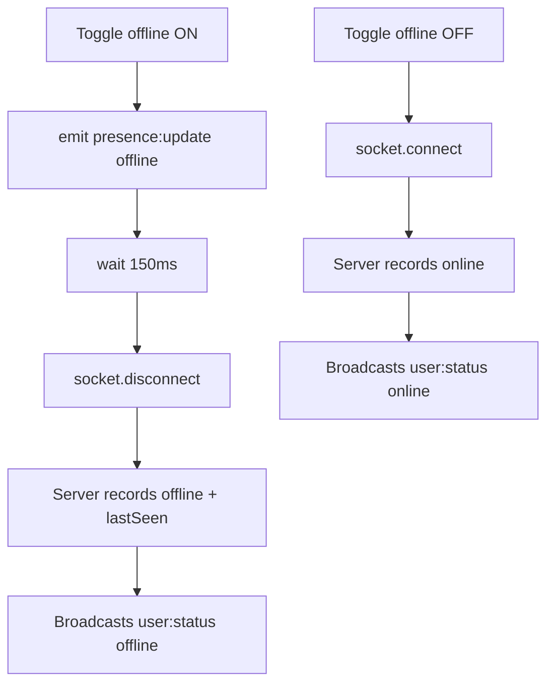

# `useConversation`

**File:** `frontend/src/hooks/useConversation.ts`

The primary hook for the Test Lab (`/app/test`). Manages all state and socket interactions for the messaging test interface. Designed to be extracted into production pages once the full chat UI is built.

---

## Usage

```typescript
const lab = useConversation();
```

---

## Returned State

| Name | Type | Description |
|---|---|---|
| `logs` | `LogEntry[]` | All emitted/received socket events |
| `messages` | `Message[]` | Message thread for the active conversation |
| `messageQueue` | `Message[]` | Messages queued while offline |
| `testRecipientId` | `string` | Currently selected recipient user ID |
| `testMessage` | `string` | Current message input value |
| `currentUserId` | `string` | Authenticated user's ID |
| `manualOffline` | `boolean` | Whether manual offline mode is active |
| `availableUsers` | `AvailableUser[]` | All users fetched from `/api/users` |
| `loadingUsers` | `boolean` | Loading state for user fetch |
| `userPresence` | `Record<string, PresenceInfo>` | Live presence state keyed by userId |
| `effectivelyOnline` | `boolean` | `connected && !manualOffline` |
| `isUserTyping` | `boolean` | Whether the local user is typing |
| `isRecipientTyping` | `boolean` | Whether the recipient is typing |
| `isRecipientRecording` | `boolean` | Whether the recipient is recording audio |
| `isRecipientListeningToMyAudio` | `boolean` | Whether the recipient is playing your audio |
| `ghostTypingEnabled` | `boolean` | Whether ghost typing simulation is on |
| `recipientGhostText` | `string` | Ghost typing text being simulated |
| `selectedFile` | `File \| null` | File staged for sending |
| `filePreviewUrl` | `string \| null` | Preview URL for staged image |
| `uploadingFile` | `boolean` | Upload in progress |
| `listeningMessageIds` | `Set<string>` | Message IDs currently being played |
| `logsEndRef` | `RefObject<HTMLDivElement>` | Scroll ref for logs list |
| `messagesEndRef` | `RefObject<HTMLDivElement>` | Scroll ref for messages list |

---

## Returned Handlers

| Name | Description |
|---|---|
| `setManualOffline(val)` | Toggle offline mode — emits `presence:update: offline`, then disconnects socket. Reconnects on `false`. |
| `handleRecipientChange(id)` | Set active recipient |
| `handleMessageInputChange(val)` | Update message input |
| `handleMessageSend()` | Send the composed message |
| `handleTypingStart()` | Emit `typing:start` |
| `handleTypingStop()` | Emit `typing:stop` |
| `handleGhostTypingToggle()` | Toggle ghost typing simulation |
| `handlePresenceUpdate(status)` | Emit `presence:update` with given status |
| `handlePresenceRequest()` | Emit `presence:request` for all users |
| `handleFileSelect(file)` | Stage a file for sending |
| `sendFile()` | Upload and send the staged file |
| `cancelFileSelection()` | Clear the staged file |
| `handleVoiceRecording(blob)` | Upload and send a voice recording |
| `handleAudioRecordingStart()` | Emit `audio:recording:start` |
| `handleAudioRecordingStop()` | Emit `audio:recording:stop` |
| `handleAudioPlayStatusChange(id, playing)` | Track which audio messages are playing |
| `clearMessages()` | Clear the message thread |
| `clearLogs()` | Clear the socket event log |
| `copyLogs()` | Copy all logs to clipboard |

---

## Presence Polling

The hook automatically polls presence for all known users every **10 seconds** while the socket is connected:

```typescript
setInterval(() => {
  socket.emit('presence:request', userIds);
}, 10000);
```

This catches users who go offline without emitting a disconnect event (e.g. killed app, airplane mode).

---

## Manual Offline Flow



---

## See Also

- [Test Lab Components](../components/test/index.md)
- [Presence System](../../Features/MESSAGING.md#presence-system)
- [WebSocket Events](../../WebSocket/EVENTS.md)

