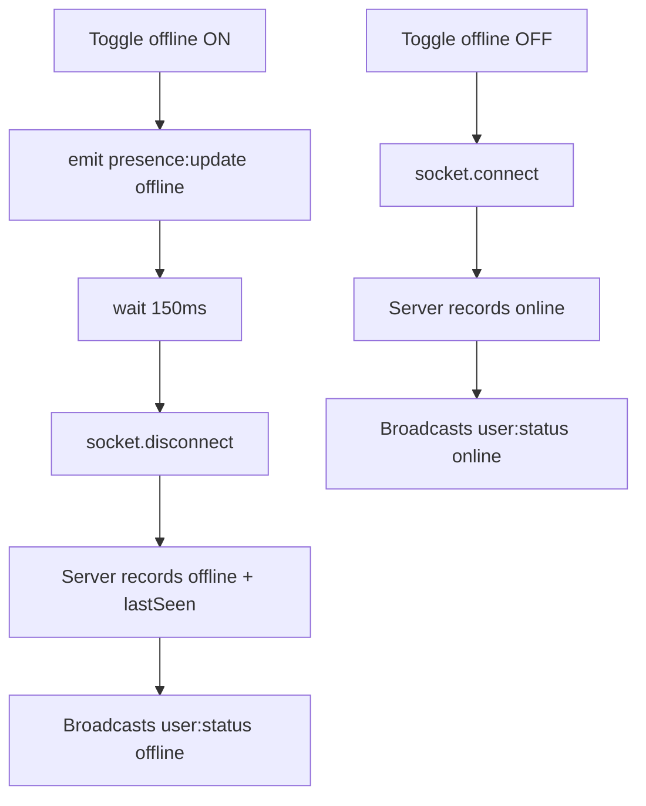

# `useConversation`

**File:** `frontend/src/hooks/useConversation.ts`

Full messaging state machine used by the `/app/test` developer page. Manages all state and socket interactions for a standalone messaging test interface with conversation list, message history, presence polling, and developer controls.

---

## Usage

```typescript
const lab = useConversation();
```

---

## Returned State

| Name | Type | Description |
|---|---|---|
| `logs` | `LogEntry[]` | All emitted/received socket events (via LogContext) |
| `messages` | `Message[]` | Message thread for the active conversation |
| `messageQueue` | `Message[]` | Messages queued while offline |
| `testRecipientId` | `string` | Currently selected recipient user ID |
| `testMessage` | `string` | Current message input value |
| `currentUserId` | `string` | Authenticated user's ID |
| `manualOffline` | `boolean` | Whether manual offline mode is active |
| `availableUsers` | `AvailableUser[]` | All users fetched from `/api/users` |
| `loadingUsers` | `boolean` | Loading state for user fetch |
| `conversations` | `Record<string, ConversationSummary>` | Conversation summaries keyed by userId |
| `userPresence` | `Record<string, PresenceInfo>` | Live presence state keyed by userId |
| `effectivelyOnline` | `boolean` | `connected && !manualOffline` |
| `isUserTyping` | `boolean` | Whether the local user is typing |
| `isRecipientTyping` | `boolean` | Whether the recipient is typing |
| `isRecipientRecording` | `boolean` | Whether the recipient is recording audio |
| `isRecipientListeningToMyAudio` | `string \| null` | Message ID of audio currently being played by recipient |
| `ghostTypingEnabled` | `boolean` | Whether ghost typing is enabled (via UserSettings) |
| `recipientGhostText` | `string` | Ghost typing text from recipient |
| `selectedFiles` | `File[]` | Files staged for sending |
| `filePreviews` | `(string \| null)[]` | Preview URLs for staged images |
| `uploadingFile` | `boolean` | Upload in progress |
| `listeningMessageIds` | `Set<string>` | Message IDs currently being played |
| `activeAudioMessageId` | `string \| null` | Currently playing audio message (auto-play chain) |
| `replyingTo` | `Message \| null` | Message being replied to |
| `editingMessage` | `Message \| null` | Message being edited |
| `logsEndRef` | `RefObject` | Scroll ref for logs list |
| `messagesEndRef` | `RefObject` | Scroll ref for messages list |

---

## Returned Handlers

| Name | Description |
|---|---|
| `setManualOffline(val)` | Toggle offline mode — emits `presence:update: offline`, then disconnects socket |
| `handleRecipientChange(id)` | Set active recipient, clear messages, load from cache then server |
| `handleMessageInputChange(e)` | Update message input, emit typing/ghost events |
| `handleMessageSend()` | Send text message or commit edit if editing |
| `handleEmojiInsert(emoji)` | Append emoji to text input |
| `handleFileSelect(e)` | Stage files for sending (validates 10 MB limit) |
| `cancelFileSelection(index?)` | Remove one or all staged files |
| `sendFile()` | Upload and send all staged files sequentially |
| `handleVoiceRecording(blob, waveform)` | Upload and send a voice recording |
| `handleAudioRecordingStart()` | Emit `audio:recording { isRecording: true }` |
| `handleAudioRecordingStop()` | Emit `audio:recording { isRecording: false }` |
| `handleAudioPlayStatusChange(id, senderId, playing, ended?)` | Track audio playback, auto-play next audio message |
| `handleReaction(messageId, emoji)` | Toggle an emoji reaction (optimistic) |
| `handleUnsend(messageId)` | Soft-delete a message (optimistic) |
| `handleReply(msg)` | Set reply-to context |
| `clearReply()` | Clear reply-to context |
| `handleStartEdit(msg)` | Begin editing a message |
| `handleCancelEdit()` | Cancel editing |
| `editLastSentMessage()` | Edit the last sent text message (Up arrow shortcut) |
| `handleTypingStart()` | Emit `typing:start` |
| `handleTypingStop()` | Emit `typing:stop` |
| `handlePresenceUpdate(status)` | Emit `presence:update` with given status |
| `handlePresenceRequest()` | Emit `presence:request` for the selected user |
| `handleGhostTypingToggle(val)` | Toggle ghost typing via UserSettings |
| `clearMessages()` | Clear the message thread |
| `clearLogs()` | Clear the socket event log |
| `copyLogs()` | Copy all logs to clipboard |

---

## Presence Polling

The hook automatically polls presence for all known users every **10 seconds** while the socket is connected:

```typescript
setInterval(() => {
  socket.emit('presence:request', userIds);
}, 10000);
```

This catches users who go offline without emitting a disconnect event (e.g. killed app, airplane mode).

---

## Message Caching

Messages are cached locally in IndexedDB via `messageCache.ts`. When switching conversations:
1. Cached messages are loaded instantly for immediate display.
2. Fresh messages are fetched from the server and overwrite the cache.

---

## Manual Offline Flow


```mermaid
flowchart TD
    A[Toggle offline ON] --> B[emit presence:update offline]
    B --> C[wait 150ms]
    C --> D[socket.disconnect]
    D --> E[Server records offline + lastSeen]
    E --> F[Broadcasts user:status offline]

    G[Toggle offline OFF] --> H[socket.connect]
    H --> I[Server records online]
    I --> J[Broadcasts user:status online]
```

---

## See Also

- [Presence System](../../Features/MESSAGING.md#online-status--presence)
- [WebSocket Events](../../WebSocket/Events.md)
