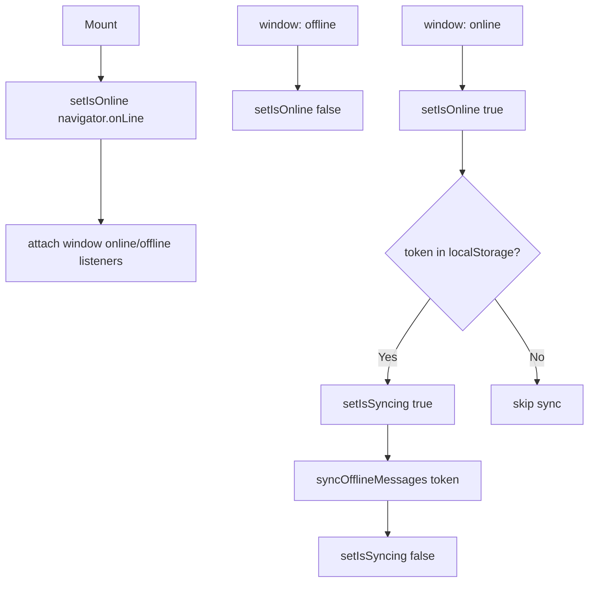

# `useOfflineSync`

**File:** `frontend/src/hooks/useOfflineSync.ts`

Monitors the browser's online/offline status and automatically syncs any messages queued in IndexedDB when connectivity is restored.

---

## Usage

```typescript
const { isOnline, isSyncing } = useOfflineSync();
```

---

## Returned Values

| Name | Type | Description |
|---|---|---|
| `isOnline` | `boolean` | Current network state — mirrors `navigator.onLine` |
| `isSyncing` | `boolean` | `true` while queued messages are being flushed to the API |

---

## Behaviour



---

## Offline Queue

Messages are queued via `src/lib/offline.ts` which uses **Dexie** (IndexedDB wrapper). `syncOfflineMessages` replays each queued message via REST POST and marks them synced on success.

---

## See Also

- [`useAuth`](./useAuth.md)
- [`useConversation`](./useConversation.md)
- [Offline Support](../index.md#offline-support)

