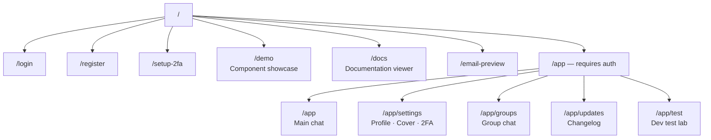
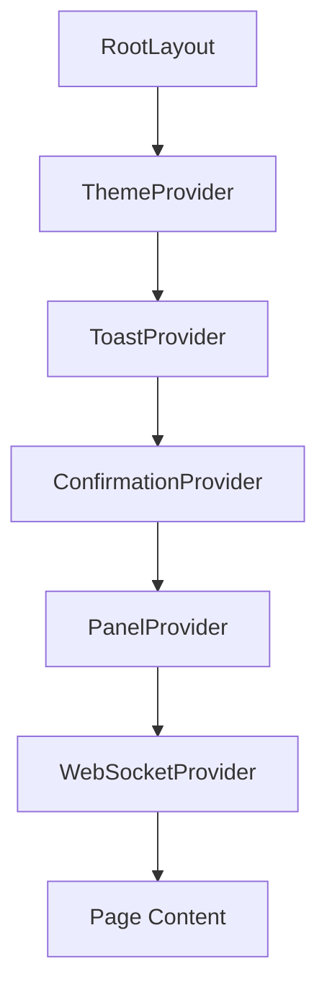
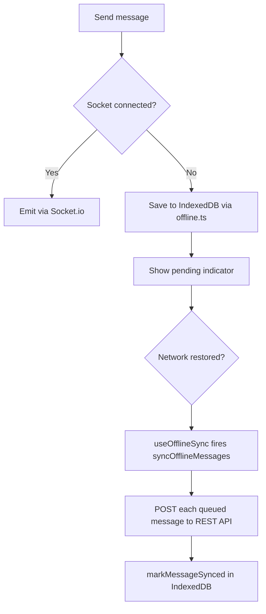

# Frontend

## Overview

The frontend is a Next.js 15 application using the App Router with React 19 and TypeScript. All authenticated pages live under `/app/app/` and are protected by `AppLayout` which enforces JWT authentication. The app supports light/dark themes, offline message queuing via IndexedDB, real-time messaging via Socket.io, and a comprehensive component library.

---

## Page Structure



---

## Context Providers

All contexts are mounted in `src/app/layout.tsx` in this order:



### WebSocketContext

Manages the Socket.io connection lifecycle. Reads `token` and `user` from `localStorage` on mount. If either is missing or invalid, the connection is skipped.

```typescript
const { socket, connected, connecting } = useWebSocket();
```

**Reconnection config:**
- `reconnectionDelay`: 1000ms
- `reconnectionDelayMax`: 5000ms
- `reconnectionAttempts`: 5

Automatically connects on mount and disconnects on unmount. Exposes the raw `socket` instance so components can attach event listeners directly.

### ThemeContext

Persists light/dark preference to `localStorage` under key `theme`. Provides:

```typescript
const { theme, toggleTheme } = useTheme();
// theme: 'light' | 'dark'
```

CSS custom properties are applied to `:root` based on the active theme. Dark mode root background is `#0f172a`, light mode is `#f8fafc`.

### ToastContext

Queue-based notification system. Toasts auto-dismiss after a configurable duration. Hovering a toast pauses the timer.

```typescript
const { showToast } = useToast();
showToast('Message sent', 'success', 4000);
// type: 'success' | 'error' | 'warning' | 'info'
// duration: milliseconds (default 4000)
```

### PanelContext

Stacked slide-in panel system. Panels stack on top of each other with animated transitions. Supports titles, subtitles, profile images, and action icons in the panel header.

```typescript
const { openPanel, closePanel, closeTopPanel, closeAllPanels } = usePanels();

openPanel(
  'panel-id',
  <MyComponent />,
  'Panel Title',
  'center',           // titlePosition: 'left' | 'center' | 'right'
  'Subtitle text',
  '/uploads/profile.jpg',
  false,              // fullWidth
  [{ icon: 'fas fa-edit', onClick: handleEdit, label: 'Edit' }]
);
```

Panels track `level` to manage z-index stacking. A `isClosing` flag triggers the exit animation before removal.

### ConfirmationContext

Promise-based confirmation dialog system. Returns the value of whichever action button was clicked.

```typescript
const { showConfirmation } = useConfirmation();

const result = await showConfirmation({
  title: 'Delete message?',
  message: 'This cannot be undone.',
  urgency: 'danger',   // 'info' | 'warning' | 'danger'
  actions: [
    { label: 'Cancel', variant: 'secondary', value: false },
    { label: 'Delete', variant: 'destructive', value: true },
  ],
});
// result === true if Delete was clicked, false if Cancel
```

---

## Hooks

### `useAuth`
Reads `token` and `user` from `localStorage`. Provides `login(token, user)` which stores credentials and redirects to `/app`, and `logout()` which clears credentials and redirects to `/`.

```typescript
const { user, loading, login, logout } = useAuth();
```

### `useOfflineSync`
Monitors online/offline status. When the app comes back online, it processes the IndexedDB queue and syncs undelivered messages to the server via `syncOfflineMessages()`.

---

## Key Components

### AppLayout
Authentication guard component wrapping all `/app/*` pages. On mount it reads `localStorage` for `token` and `user`. If either is missing, the user is immediately redirected to `/`. Also renders the navigation sidebar and header.

### MessageBubble
Renders a complete conversation thread. Accepts an array of messages and handles all types:

| Type | Rendering |
|------|-----------|
| `text` | Plain text with timestamps |
| `image` | Thumbnail with lightbox on click |
| `file` | File icon, name, and size |
| `audio` | `MessageAudioPlayer` component |
| `voice` | `MessageAudioPlayer` with waveform |

Groups consecutive messages from the same sender visually (hides repeated avatars). Shows delivery status (`sent` / `delivered` / `read` / `listening` / `listened`) below the sender's last message in a group.

### MessageAudioPlayer
Renders audio messages with a 100-bar SVG waveform visualisation.

- Loads audio from `fileUrl` via the HTML5 `<audio>` element
- Play/pause toggle with animated progress on the waveform
- Elapsed and total duration display
- Emits `audio:listening` on play with `isListening: true`
- Emits `audio:listening` with `isEnded: true` when playback completes (marks message as read)
- Shows `listening` / `listened` status indicator

### VoiceRecorder
Modal component for recording voice messages.

```mermaid
flowchart LR
    A[Tap Record] --> B[getUserMedia audio]
    B --> C[MediaRecorder starts]
    C --> D[Emit audio:recording isRecording=true]
    D --> E[Live waveform via AnalyserNode]
    E --> F[Tap Stop]
    F --> G[Assemble Blob from chunks]
    G --> H[Emit audio:recording isRecording=false]
    H --> I[POST /api/messages/upload type=voice]
    I --> J[Client decodes with OfflineAudioContext]
    J --> K[PATCH /api/messages/:id/waveform]
```



Uses WebM/Opus on Chrome, MP4/AAC on Safari. Real-time waveform rendered via `AnalyserNode` → `getByteTimeDomainData`.

### ChatInput
Message compose bar. Supports:
- Text input with Enter-to-send
- File attachment picker
- Image attachment picker
- Voice recording button (opens VoiceRecorder modal)
- Ghost typing — sends keystrokes in real-time to recipient via `ghost:typing` event

### Lightbox
Full-screen image viewer overlay. Opens on clicking an image message. Supports keyboard `Escape` to close.

### ConnectionIndicator / WebSocketStatusBadge
Visual indicators for WebSocket connection state. Shows `connecting`, `connected`, or `disconnected` states.

---

## Offline Support

Chatr uses Dexie (an IndexedDB wrapper) to queue messages when the network is unavailable.



**IndexedDB schema** (`lib/db.ts`):
```typescript
messages: {
  id, senderId, recipientId?, groupId?,
  content, type, createdAt,
  synced: 0 | 1
}
```

---

## Versioning

Current version stored in `src/version.ts`:
```typescript
export const version = '0.0.26';
```

Auto-incremented by `scripts/increment-version.js` via the `post-commit` git hook on every commit. The hook is installed by `npm install` (via `prepare` script → `scripts/install-hooks.js`).

---

## Environment Variables

| Variable | Description | Example |
|----------|-------------|---------|
| `NEXT_PUBLIC_API_URL` | REST + WebSocket base URL | `https://api.chatr-app.online` |
| `NEXT_PUBLIC_WS_URL` | WebSocket server URL | `https://api.chatr-app.online` |
| `NEXT_PUBLIC_PRODUCT_NAME` | App display name | `Chatr` |

Set at build time. In production written to `frontend/.env.production` by `deployAWS.sh`.

---

## Theme System

CSS custom properties on `:root` drive all colours. Components read the theme via `ThemeContext` and apply styles inline or via CSS modules.

| Property | Dark | Light |
|----------|------|-------|
| `--bg-primary` | `#0f172a` | `#f8fafc` |
| `--bg-container` | `#1e293b` | `#ffffff` |
| `--text-primary` | `#f1f5f9` | `#0f172a` |
| `--text-secondary` | `#94a3b8` | `#64748b` |
| `--blue-500` | `#3b82f6` | `#3b82f6` |
| `--orange-500` | `#f97316` | `#f97316` |
