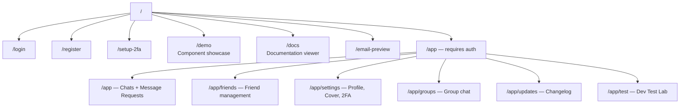
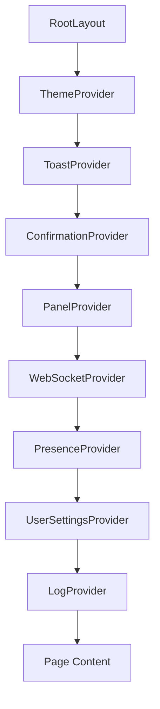
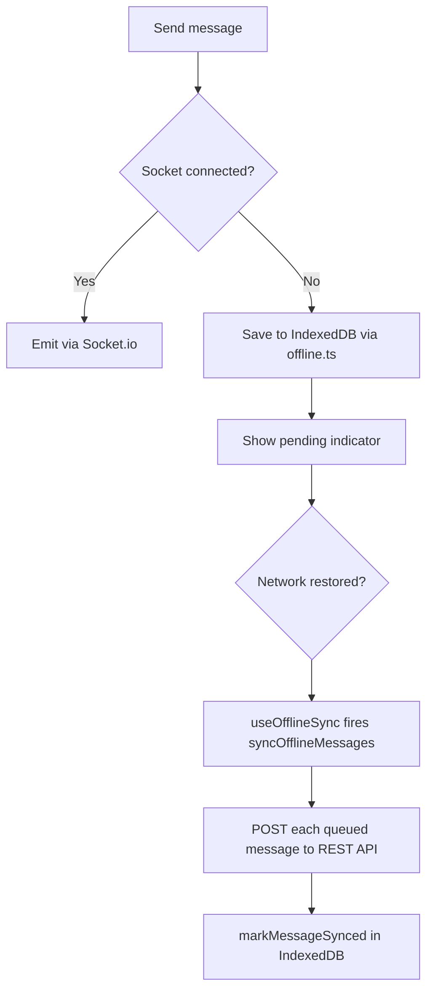

# Frontend

## Overview

The frontend is a Next.js 16 application using the App Router with React 19 and TypeScript. All authenticated pages live under `/app/app/` and are protected by `AppLayout` which enforces JWT authentication. The app supports light/dark themes, offline message queuing via IndexedDB, real-time messaging via Socket.io, message requests, friend management, and a comprehensive component library.

---

## Page Structure


```mermaid
graph TD
    root["/"] --> login["/login"]
    root --> register["/register"]
    root --> setup2fa["/setup-2fa"]
    root --> demo["/demo<br/>Component showcase"]
    root --> docs["/docs<br/>Documentation viewer"]
    root --> emailpreview["/email-preview"]
    root --> app["/app — requires auth"]

    app --> apphome["/app — Chats + Message Requests"]
    app --> friends["/app/friends — Friend management"]
    app --> settings["/app/settings — Profile, Cover, 2FA"]
    app --> groups["/app/groups — Group chat"]
    app --> updates["/app/updates — Changelog"]
    app --> test["/app/test — Dev Test Lab"]
```

---

## Context Providers

All contexts are mounted in `src/app/layout.tsx` in this order:


```mermaid
graph TD
    RootLayout --> ThemeProvider
    ThemeProvider --> ToastProvider
    ToastProvider --> ConfirmationProvider
    ConfirmationProvider --> PanelProvider
    PanelProvider --> WebSocketProvider
    WebSocketProvider --> PresenceProvider
    PresenceProvider --> UserSettingsProvider
    UserSettingsProvider --> LogProvider
    LogProvider --> PageContent["Page Content"]
```

### WebSocketContext

Manages the Socket.io connection lifecycle. Reads `token` and `user` from `localStorage` on mount. If either is missing or invalid, the connection is skipped.

```typescript
const { socket, connected, connecting, disconnect, reconnect } = useWebSocket();
```

| Value | Type | Description |
|---|---|---|
| `socket` | `Socket \| null` | Raw Socket.io instance |
| `connected` | `boolean` | Whether the socket is currently connected |
| `connecting` | `boolean` | Whether a connection attempt is in progress |
| `disconnect` | `() => void` | Manually close the socket |
| `reconnect` | `() => void` | Reconnect after a manual disconnect |

**Reconnection config:**
- `reconnectionDelay`: 1000ms
- `reconnectionDelayMax`: 5000ms
- `reconnectionAttempts`: 5

### ThemeContext

Persists light/dark preference to `localStorage` under key `theme`. Provides:

```typescript
const { theme, toggleTheme } = useTheme();
// theme: 'light' | 'dark'
```

CSS custom properties are applied to `:root` based on the active theme. Dark mode root background is `#0f172a`, light mode is `#f8fafc`.

### ToastContext

Queue-based notification system. Toasts auto-dismiss after a configurable duration. Hovering a toast pauses the timer. Supports custom titles and multiple toast types.

```typescript
const { showToast } = useToast();
showToast('Message sent', 'success', 4000);
// type: 'success' | 'error' | 'warning' | 'info' | 'newmessage'
// duration: milliseconds (default 4000)
// optional title parameter for custom toast titles
```

### PanelContext

Stacked slide-in panel system. Panels stack on top of each other with animated transitions. Supports titles, subtitles, profile images, and action icons in the panel header.

```typescript
const { openPanel, closePanel, closeTopPanel, closeAllPanels } = usePanels();

openPanel(
  'panel-id',
  <MyComponent />,
  'Panel Title',
  'center',           // titlePosition: 'left' | 'center' | 'right'
  'Subtitle text',
  '/uploads/profile.jpg',
  false,              // fullWidth
  [{ icon: 'fas fa-edit', onClick: handleEdit, label: 'Edit' }]
);
```

Panels track `level` to manage z-index stacking. A `isClosing` flag triggers the exit animation before removal.

### ConfirmationContext

Promise-based confirmation dialog system. Returns the value of whichever action button was clicked.

```typescript
const { showConfirmation } = useConfirmation();

const result = await showConfirmation({
  title: 'Delete message?',
  message: 'This cannot be undone.',
  urgency: 'danger',   // 'info' | 'warning' | 'danger'
  actions: [
    { label: 'Cancel', variant: 'secondary', value: false },
    { label: 'Delete', variant: 'destructive', value: true },
  ],
});
// result === true if Delete was clicked, false if Cancel
```

### PresenceContext

Manages real-time presence state for all users. Tracks online/offline/away status and `lastSeen` timestamps. Supports suppressed IDs to hide presence for pending outgoing message requests.

```typescript
const { getPresence, setSuppressedIds } = usePresence();
```

### LogContext

Provides WebSocket event logging for the developer tools panel. Captures all emitted and received socket events with timestamps and payloads.

### UserSettingsContext

Manages user preference state such as `showOnlineStatus`. Reads from and persists to the server via socket events.

---

## Hooks

### `useAuth`
Reads `token` and `user` from `localStorage`. Provides `login(token, user)` which stores credentials and redirects to `/app`, and `logout()` which clears credentials and redirects to `/`.

```typescript
const { user, loading, login, logout } = useAuth();
```

### `useOfflineSync`
Monitors online/offline status. When the app comes back online, it processes the IndexedDB queue and syncs undelivered messages to the server via `syncOfflineMessages()`.

---

## Key Components

### AppLayout
Authentication guard component wrapping all `/app/*` pages. On mount it reads `localStorage` for `token` and `user`. If either is missing, the user is immediately redirected to `/`. Also renders the `BottomNav` navigation and a header with a "New Chat" button.

### ConversationsList
Scrollable list of conversations with tabbed views for "Chats" and "Message Requests". Supports local search by message content. Shows presence indicators, unread counts, friend badges, and "incoming request" markers. Dispatches `chatr:compose` custom events to open the New Chat panel.

### ConversationView
Panel wrapper for a single conversation. Renders `ChatView` and `MessageInput`. Displays an accept/decline bar for incoming message requests. Includes a floating "Nuke" button for testing conversation resets. Tracks conversation status dynamically via socket events.

### NewChatPanel
User search interface for initiating new conversations. Fetches users via `GET /api/users/search` with friends prioritised first. Presence is hidden for non-friend search results.

### FriendsPanel
Tabbed panel for managing friendships: Friends list, incoming/outgoing requests, and blocked users. Supports accept/decline/cancel friend request actions.

### MessageBubble
Renders individual message bubbles. Handles all types:

| Type | Rendering |
|------|-----------|
| `text` | Plain text with timestamps |
| `image` | Thumbnail with lightbox on click |
| `file` | File icon, name, and size |
| `audio` | `MessageAudioPlayer` component |
| `voice` | `MessageAudioPlayer` with waveform |

Groups consecutive messages from the same sender visually (hides repeated avatars). Shows delivery status (`sent` / `delivered` / `read` / `listening` / `listened`) below the sender's last message in a group.

### MessageAudioPlayer
Renders audio messages with a 100-bar SVG waveform visualisation.

- Loads audio from `fileUrl` via the HTML5 `<audio>` element
- Play/pause toggle with animated progress on the waveform
- Elapsed and total duration display
- Emits `audio:listening` on play with `isListening: true`
- Emits `audio:listening` with `isEnded: true` when playback completes (marks message as read)
- Shows `listening` / `listened` status indicator

### VoiceRecorder
Modal component for recording voice messages.


```mermaid
flowchart LR
    A[Tap Record] --> B[getUserMedia audio]
    B --> C[MediaRecorder starts]
    C --> D[Emit audio:recording isRecording=true]
    D --> E[Live waveform via AnalyserNode]
    E --> F[Tap Stop]
    F --> G[Assemble Blob from chunks]
    G --> H[Emit audio:recording isRecording=false]
    H --> I[POST /api/messages/upload type=voice]
    I --> J[Client decodes with OfflineAudioContext]
    J --> K[PATCH /api/messages/:id/waveform]
```

Uses WebM/Opus on Chrome, MP4/AAC on Safari. Real-time waveform rendered via `AnalyserNode` → `getByteTimeDomainData`.

### Lightbox
Full-screen image viewer overlay. Opens on clicking an image message. Supports keyboard `Escape` to close.

### BottomNav
Bottom navigation menu with tabs for Chats, Friends, Groups, Updates, and User profile. Shows the user's first name on the User tab. Displays an unread message count badge on the Chats tab.

---

## Offline Support

Chatr uses Dexie (an IndexedDB wrapper) to queue messages when the network is unavailable and to cache conversation message history locally.


```mermaid
flowchart TD
    A[Send message] --> B{Socket connected?}
    B -- Yes --> C[Emit via Socket.io]
    B -- No --> D[Save to IndexedDB via offline.ts]
    D --> E[Show pending indicator]
    E --> F{Network restored?}
    F --> G[useOfflineSync fires syncOfflineMessages]
    G --> H[POST each queued message to REST API]
    H --> I[markMessageSynced in IndexedDB]
```

**IndexedDB schema** (`lib/db.ts`):
```typescript
messages: {
  id, senderId, recipientId?, groupId?,
  content, type, createdAt,
  synced: 0 | 1
}
```

---

## Versioning

Current version stored in `src/version.ts`. Auto-incremented by `scripts/increment-version.js` via the `post-commit` git hook on every commit. The hook is installed by `npm install` (via `prepare` script → `scripts/install-hooks.js`).

---

## Environment Variables

| Variable | Description | Example |
|----------|-------------|---------|
| `NEXT_PUBLIC_API_URL` | REST + WebSocket base URL | `https://api.chatr-app.online` |
| `NEXT_PUBLIC_WS_URL` | WebSocket server URL | `https://api.chatr-app.online` |
| `NEXT_PUBLIC_PRODUCT_NAME` | App display name | `Chatr` |

Set at build time. In production written to `frontend/.env.production` by `deployAWS.sh`.

---

## Theme System

CSS custom properties on `:root` drive all colours. Components read the theme via `ThemeContext` and apply styles inline or via CSS modules.

| Property | Dark | Light |
|----------|------|-------|
| `--bg-primary` | `#0f172a` | `#f8fafc` |
| `--bg-container` | `#1e293b` | `#ffffff` |
| `--text-primary` | `#f1f5f9` | `#0f172a` |
| `--text-secondary` | `#94a3b8` | `#64748b` |
| `--blue-500` | `#3b82f6` | `#3b82f6` |
| `--orange-500` | `#f97316` | `#f97316` |

---

## Contexts

All contexts in `src/contexts/`. See [Contexts](./Contexts/index.md) for full detail.

| Context | Hook | Description |
|---|---|---|
| `WebSocketContext` | `useWebSocket()` | Socket.io lifecycle — connect, disconnect, reconnect |
| `ThemeContext` | `useTheme()` | Light/dark preference — persisted to `localStorage` |
| `ToastContext` | `useToast()` | Queue-based toast notifications with custom types and titles |
| `ConfirmationContext` | `useConfirmation()` | Promise-based confirmation dialogs |
| `PanelContext` | `usePanels()` | Stacked slide-in panel system |
| `PresenceContext` | `usePresence()` | User presence state, suppression for message requests |
| `LogContext` | `useLogs()` | WebSocket event logging for dev tools |
| `UserSettingsContext` | `useUserSettings()` | User preferences (e.g. showOnlineStatus) |

---

## Hooks

Custom hooks in `src/hooks/`. See [Hooks index](./Hooks/index.md) for full detail.

| Hook | Description |
|---|---|
| [`useAuth`](./Hooks/useAuth.md) | Auth state, login, logout — reads/writes `localStorage`, redirects via router |
| [`useOfflineSync`](./Hooks/useOfflineSync.md) | Monitors `navigator.onLine`, auto-syncs IndexedDB-queued messages on reconnect |
| [`useConversation`](./Hooks/useConversation.md) | Messaging state machine for the Test Lab — messages, presence, socket events |
| `useConversationList` | Conversation list state — fetch, tabs, search, real-time updates, unread counts |
| `useConversationView` | Single conversation state — message list, typing/recording indicators, lightbox, reply, edit |
| `useMessageInput` | Text input, file selection, voice recording, typing indicators, send/edit/reply |
| `useFriends` | Friend list, friend requests, accept/decline/cancel actions |
| `useMessageToast` | Toast notifications for incoming messages with sender name and preview |
| `useTTS` | Text-to-speech synthesis |

---

## Lib

Utility modules in `src/lib/`. See [Lib](./Lib/index.md) for full detail.

| Module | Description |
|---|---|
| `api.ts` | Typed REST API wrapper |
| `db.ts` | Dexie (IndexedDB) schema — offline messages, images |
| `offline.ts` | Offline queue helpers — save, sync, mark synced |
| `authUtils.ts` | Token save/clear with WebSocket reconnect trigger |
| `profileImageService.ts` | Profile image URL resolver (IndexedDB → server → default) |
| `coverImageService.ts` | Cover image URL resolver |
| `messageCache.ts` | IndexedDB-backed message cache — store, retrieve, clear per conversation |

---

## Types

Shared TypeScript interfaces in `src/types/`. See [Types](./Types/index.md).

```typescript
User · AuthResponse · Message · ConversationSummary · Group · PresenceInfo · ToastType
```
