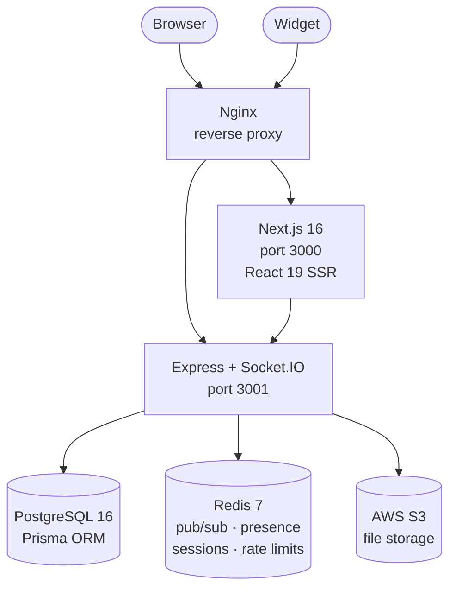

# Chatr — Real-Time Messaging Platform

> A complete, production-deployed real-time messaging platform built, tested, and deployed by a single developer.
> Product Overview · Technical Architecture · Commercial Case

---

## Table of Contents

1. [Executive Summary](#1-executive-summary)
2. [The Commercial Opportunity](#2-the-commercial-opportunity)
3. [At a Glance](#3-at-a-glance)
4. [Why Chatr](#4-why-chatr)
5. [Use Cases](#5-use-cases)
6. [Quick Start](#6-quick-start)
7. [Feature Breakdown](#7-feature-breakdown)
8. [Product Walkthrough](#8-product-walkthrough)
9. [Messaging Deep Dive](#9-messaging-deep-dive)
10. [Groups & Social](#10-groups--social)
11. [Embeddable Support Widget](#11-embeddable-support-widget)
12. [AI Intelligence](#12-ai-intelligence)
13. [Security, Authentication & Privacy](#13-security-authentication--privacy)
14. [Design & Themes](#14-design--themes)
15. [Profile & Settings](#15-profile--settings)
16. [Technical Architecture](#16-technical-architecture)
17. [Testing Strategy](#17-testing-strategy)
18. [The Dashboard](#18-the-dashboard)
19. [Developer Experience](#19-developer-experience)
20. [Pricing & Support](#20-pricing--support)
21. [Competitor Comparison](#21-competitor-comparison)
22. [By the Numbers & Why Invest](#22-by-the-numbers--why-invest)

---

## 1. Executive Summary

Chatr is a **fully functional, production-deployed, real-time messaging platform** that demonstrates the breadth of a funded engineering team — delivered by a single developer in 30 days. It is not a prototype or proof of concept. It is a working product with 50+ user-facing features, 3,000+ automated tests, and a deployment running on AWS infrastructure.

**For a commercial audience**, Chatr shows what a complete product looks like when messaging, AI, and customer support converge into a single platform. Its embeddable chat widget allows any business to add real-time customer support to their website with a single line of code — competing directly with tools like Intercom (£39–£99/seat/month) at zero recurring cost.

**For a technical audience**, Chatr demonstrates mastery across frontend development (React 19, Next.js 16), backend engineering (Node.js, Express, Socket.IO), database design (PostgreSQL, Prisma), caching infrastructure (Redis), AI integration (OpenAI GPT-4o-mini), cloud deployment (AWS), and automated testing (Jest, Playwright). Every layer is production-grade, documented, and covered by automated tests.

> This document serves as both a commercial presentation and a technical reference. Each section explains what a feature does, why it matters commercially, and how it is implemented technically.

---

## 2. The Commercial Opportunity

### The Market Problem

Every business needs real-time communication. Internal teams need to collaborate instantly. Support teams need to respond to customers while they are still on the website. Users expect the experience they get from consumer apps — instant delivery, typing indicators, read receipts, voice notes, file sharing, and a mobile-first interface that works flawlessly on any device.

Today, companies face a costly trade-off:

- **Option A:** Buy a third-party SaaS solution (Intercom, Zendesk Chat, Drift) and pay £39–£99 per agent per month, with limited customisation, vendor lock-in, and no control over user data.
- **Option B:** Build from scratch, spending 3–6 months on WebSocket infrastructure, message queuing, presence tracking, and delivery guarantees before writing a single user-facing feature.

### The Chatr Answer

**Chatr eliminates that trade-off.** It is a fully functional messaging platform that delivers enterprise-grade features at zero licensing cost. It is open, extensible, and built on industry-standard technology (React, Node.js, PostgreSQL, Redis) that any JavaScript developer can understand, modify, and extend on day one.

Its embeddable chat widget turns any website into a live support channel — creating a direct, zero-friction communication bridge between businesses and their customers. That is where the commercial value lives.

Live chat is one of the fastest-growing segments in customer support. Businesses using real-time chat see **48% higher revenue per chat hour** compared to email support, and customers report **73% satisfaction rates** with live chat — the highest of any support channel.

The market for live chat software is dominated by expensive SaaS products:

- **Intercom:** £39–£99/seat/month, with feature gating and usage limits.
- **Drift:** £50–£150/seat/month, focused on sales automation.
- **Zendesk Chat:** £19–£99/seat/month, bundled with ticketing overhead.
- **→ Chatr Widget:** £0/seat, full ownership, no recurring cost, no vendor lock-in.

**For a company with a 10-person support team, that is £4,700–£11,900/year in savings compared to Intercom alone.** Beyond cost savings, Chatr gives businesses complete control over their data, full white-label customisation, and the ability to extend functionality without waiting for a vendor's roadmap.

---

## 3. At a Glance

| Metric | Value |
|--------|-------|
| Open Source | 100% — MIT Licensed |
| Features | 50+ |
| Automated Tests | 3,000+ |
| Lines of Code | 120,000+ |
| Source Files | 432 |
| REST API Endpoints | 88 |
| WebSocket Events | 85+ |
| Development Time | 30 days |
| Total Commits | 243 |

---

## 4. Why Chatr

### Rich Messaging
Text, voice notes, images, video, files, code blocks, and link previews. Reactions, replies, edits, and unsend.

### Real-Time Everything
Typing indicators, ghost typing, presence dots, read receipts, and recording indicators — all within 200ms.

### Groups & Roles
Create groups with Owner, Admin, and Member roles. Invite by search, manage permissions, all message types.

### AI Assistant
Luna (GPT-4o-mini) appears as a regular contact. Typing indicators, conversation history, zero learning curve.

### Support Widget
One line of JavaScript adds live chat to any website. White-label, zero-friction, replaces Intercom at £0/seat.

### Enterprise Security
JWT + 2FA + SMS verification. Per-field privacy controls. Redis rate limiting. Server-side enforcement.

---

## 5. Use Cases

### SaaS Companies
Embed the support widget on your product. Replace Intercom at £0/seat and own every line of code. White-label it to match your brand.

### Internal Teams
Deploy a private messaging platform behind your firewall. Full control over data residency, compliance, and access. No third-party dependencies.

### Startups & MVPs
Skip 6 months of development. Clone the repo, customise, and launch with 50+ features on day one. Focus your team on what makes you unique.

### Agencies & Freelancers
Offer live chat as a white-label service to your clients. Deploy unique instances per client with custom branding and domains.

### Education & Learning
A complete full-stack reference implementation. TypeScript, React 19, Node.js, PostgreSQL, Redis, WebSockets, AI — all production-grade.

### Acquirers & Investors
A tested, documented, deployed product with 120,000+ lines of code and 3,000+ tests. Ready to integrate, resell, or build upon.

---

## 6. Quick Start

Three commands. That's it. Docker handles the databases, the dev script handles the rest.

### 1. Clone

```bash
git clone https://github.com/neofuture/chatr.git
```

### 2. Configure

```bash
cp .env.example .env
```

### 3. Launch

```bash
bash dev.sh
```

**What dev.sh does:** Starts Docker (PostgreSQL + Redis), runs database migrations, launches 5 development servers (frontend, backend, widget, CSS watcher, cache invalidator), and opens the app — all with hot reload. One command replaces 15 minutes of manual setup.

```
# ✅ PostgreSQL + Redis running (Docker)
# ✅ Migrations applied
# ✅ Frontend on localhost:3000
# ✅ Backend on localhost:3001
# ✅ Widget dev server on localhost:3003
# ✅ All watchers active
```

---

## 7. Feature Breakdown

### 7.1 Authentication & Security

| Feature | Detail |
|---------|--------|
| Email + password registration | With server-side validation and password strength meter |
| Email verification | 6-digit OTP delivered via Mailtrap |
| Phone verification | SMS OTP via SMS Works API (UK mobile) |
| Two-factor authentication | TOTP via QR code or manual secret (Speakeasy) |
| Login verification | Additional OTP challenge on login (SMS or email) |
| Password reset | Email-based reset flow with branded templates |
| JWT auth | 7-day tokens, Redis blacklist on logout |
| Rate limiting | Redis-backed per-route limits (5 registrations/15min, 10 logins/15min) |
| Security headers | Helmet middleware, CORS, token blacklisting |

### 7.2 Real-Time Messaging

| Feature | Detail |
|---------|--------|
| Direct messages | 1:1 real-time text with delivery and read receipts |
| Group messaging | Multi-user rooms with per-group message history |
| Typing indicators | Live "user is typing..." with timeout |
| Ghost typing | See what the other person is typing in real-time, character by character |
| Message editing | Edit sent messages with full edit history preserved |
| Unsend messages | Soft-delete with "message removed" placeholder |
| Emoji reactions | React to any message, toggle on/off |
| Reply-to | Quote and reply to specific messages |
| Link previews | Auto-fetched Open Graph / oEmbed cards |
| Code blocks | Syntax-highlighted code in messages with copy button |
| Offline queue | Messages queued in IndexedDB, auto-synced on reconnect |

### 7.3 Voice & Media

| Feature | Detail |
|---------|--------|
| Voice recording | In-app recorder with live waveform visualisation |
| Audio playback | Custom player with waveform, duration, and play/pause |
| Audio listening status | See when someone is listening to your voice message |
| Image sharing | Upload and view images in chat with lightbox |
| File sharing | Send documents, PDFs, videos, archives (up to 50MB) |
| Profile image upload | Crop, resize, and upload profile photos |
| Cover image upload | Banner-style cover photo with crop tool |
| Image processing | Server-side Sharp resizing (multiple variants: 400px, 320px, 96px) |
| S3 storage | Production file storage on AWS S3, local dev fallback |

### 7.4 Presence & Status

| Feature | Detail |
|---------|--------|
| Online/Away/Offline | Real-time presence via Socket.IO + Redis |
| Last seen | "Last seen 5 minutes ago" / "Last seen at 3:42 PM" / "Last seen on Mar 12 at 9:15 AM" |
| Privacy controls | Hide online status, phone, email, full name, gender, join date |
| Blocked user handling | Blocked users can't see presence, send messages, or find you in search |

### 7.5 Friends & Relationships

| Feature | Detail |
|---------|--------|
| Friend requests | Send, accept, decline, cancel |
| Friends list | Searchable list with presence indicators |
| Block/unblock | Full block with bidirectional enforcement |
| Message requests | Non-friends land in a "Requests" tab — accept or decline |

### 7.6 Groups

| Feature | Detail |
|---------|--------|
| Create groups | Name, description, invite members |
| Member roles | Owner, Admin, Member — with role-based permissions |
| Promote/demote | Admins can be promoted or demoted |
| Transfer ownership | Owners can hand off the group |
| Group profile | Group avatar, cover image, member list |
| Group invites | Pending invite tab with accept/decline |
| AI summaries | GPT-4o-mini generated conversation summaries for groups and DMs |

### 7.7 Embeddable Support Widget

| Feature | Detail |
|---------|--------|
| Drop-in script tag | One line of HTML to embed on any website |
| Guest sessions | Visitors chat without creating an account (24h session persistence) |
| Real-time messaging | Full Socket.IO integration for live chat |
| File uploads | Images, documents, audio — from the widget |
| Customisable | Accent colours, title, greeting message, light/dark/auto theme |
| Widget designer | Visual palette tool with presets and live embed snippet |
| Lightweight | Vanilla JS, no framework dependency, Terser-minified |

### 7.8 User Experience

| Feature | Detail |
|---------|--------|
| Mobile-first design | Responsive layout with bottom navigation and safe area support |
| Dark/light theme | System-aware with manual toggle, persisted to localStorage |
| Sliding panels | Stacked panel system (up to 4 deep) for profiles, settings, groups |
| Bottom sheets | iOS-style sheets for forms and actions |
| Toast notifications | Success, error, info, warning — with auto-dismiss |
| Confirmation dialogs | Urgency-aware (danger/warning) with accessible markup |
| Route preloading | Critical routes prefetched for instant navigation |
| Animated transitions | Framer Motion page transitions |
| Emoji picker | Categorised grid, search, recent history |

### 7.9 Accessibility

| Feature | Detail |
|---------|--------|
| ARIA roles | `role="article"`, `role="dialog"`, `role="log"`, `role="status"`, `role="tablist"` throughout |
| Live regions | `aria-live="polite"` for messages and typing indicators |
| Keyboard navigation | Escape to close, Enter/Space on interactive elements, arrow keys in OTP inputs |
| Focus management | Auto-focus on inputs, `tabIndex={0}` on message bubbles |
| Screen reader labels | `aria-label` on all buttons, toggles, and interactive elements |
| Semantic HTML | Hidden decorative elements with `aria-hidden="true"` |

### 7.10 Developer Tools

| Feature | Detail |
|---------|--------|
| System logs | In-app log viewer with filters (Sent, Received, Info, Error) |
| Storage inspector | IndexedDB usage chart |
| Component demo page | Live demos of panels, toasts, dialogs, form controls |
| API documentation | Swagger UI with Basic auth in production |
| Email template preview | Visual preview of all transactional email templates |
| Docs page | Markdown documentation with Mermaid diagrams and code blocks |

---

## 8. Product Walkthrough

### Conversation List

The main conversation screen demonstrates over a dozen capabilities working together in real time: groups, direct messages, AI conversations, guest visitors from the widget, typing indicators, unread badges, online presence, friend badges, and AI-generated conversation summaries.


Every row in the conversation list is information-dense by design:

- **Presence** — Whether the contact is online (green dot), away (amber dot), or offline (grey dot) via real-time presence tracking.
- **Typing indicators** — If someone is currently typing, the last-message preview is replaced with an animated "typing…" indicator, visible without opening the conversation.
- **Unread badges** — Per-conversation unread message counts displayed as badges on each row, plus an aggregate badge on the bottom navigation tab.
- **Conversation badges** — "Friend", "Group", "AI", and "Guest" badges distinguish conversation types at a glance.
- **Smart summaries** — AI summaries replace the last-message preview with a concise description of what was discussed, animated with a flip transition.
- **Message requests** — Messages from unknown contacts are separated into a "Requests" tab.

### Registration & Login

New users register with a username, email address, and password. During registration, a real-time password strength indicator shows the strength of the chosen password as the user types: Weak (red), Fair (amber), Good (green), Strong (bright green).

 

After submitting the registration form, a 6-digit one-time code is sent to the user's email address to verify their identity. Authentication supports four methods: email/password, SMS verification, email-based login codes, and optional TOTP two-factor authentication.

> **Technical:** JWT access tokens (localStorage) with long-lived HttpOnly refresh cookies. Expired/revoked tokens blacklisted in Redis. Rate-limited login attempts prevent brute-force attacks.

---

## 9. Messaging Deep Dive

Chatr delivers a messaging experience that matches or exceeds what users expect from WhatsApp, iMessage, and Slack. Every message type, interaction pattern, and real-time indicator found in those apps has been implemented, tested, and refined.

### 9.1 Seven Message Types

**Text Messages** — Delivery status tracking through three states: "sending" (clock icon), "delivered" (single tick), and "read" (double tick, blue). Messages are grouped by date with separator headers and consecutive messages from the same sender are visually grouped. Transmitted via WebSocket (Socket.IO) for instant delivery — under 100ms when the recipient is online.

**Voice Messages** — Users record voice notes directly from the chat input bar. Voice messages display an interactive waveform visualisation, duration counter, and playback controls. The sender receives a "listened" receipt when the recipient plays the message. Recorded using the Web Audio API and MediaRecorder, encoded as WebM/Opus, uploaded to AWS S3.

**Image Sharing** — Images appear as inline previews. Tapping opens a fullscreen lightbox with pinch-to-zoom on mobile. Server-side Sharp processing generates thumbnail, medium, and full-resolution variants.

**Video Sharing** — Videos display as inline players with thumbnail, duration badge, and standard playback controls.

**File Attachments** — Supports uploads up to 50 MB — PDFs, Word, Excel, ZIP, and more. Type-specific icons, file name, size, and download link.

**Link Previews** — URLs are automatically fetched server-side for Open Graph metadata (title, description, image, favicon) and rendered as rich preview cards — the same way link previews function in Slack and iMessage.

**Code Blocks** — Triple-backtick fenced code is rendered with syntax highlighting, automatic language detection, and a "Copy" button. 40+ languages supported.

### 9.2 Message Actions

**Emoji Reactions** — Tap-and-hold to add emoji badges below any message. Multiple reactions per message from different users. Hovering reveals who reacted.

**Reply to Message** — Swipe right (mobile) or context menu to reply. Quoted preview shows original sender, content type, and truncated text. Tap to scroll back to the original.

**Edit Sent Messages** — Edit any sent message. Up-arrow shortcut on desktop (like Slack). "(edited)" label shown. Full edit history stored for audit. Edits are versioned and broadcast via Socket.IO in real time.

**Unsend Messages** — Delete for everyone — message replaced with a "deleted" placeholder, equivalent to WhatsApp's "Delete for Everyone".

**Emoji Picker** — Full emoji picker with category tabs, search, and a recently-used section.

### 9.3 Real-Time Awareness

**Typing Indicators in Chat** — Animated "typing…" indicator with bouncing dots appears at the bottom of the conversation within 200ms of the first keystroke. In group chats, it shows who is typing.

**Typing Indicators on the Chat List** — A feature most messaging apps lack. The last-message preview on the conversation list is replaced with "typing…" — users can see who is composing without opening the conversation.

**Ghost Typing** — An optional mode that streams every character the other person types in real time, letter by letter. No mainstream messaging app offers this.

**Audio Recording Indicator** — When someone is recording a voice note, the other participant sees a "recording…" indicator in real time.

**Online Presence** — Green (online), amber (away, idle 5+ minutes), grey (offline) dots on every avatar. "Last seen X ago" for offline contacts. Presence tracked via Redis with TTLs, broadcast to all contacts via Socket.IO.

**Read Receipts** — Three delivery states: sending (clock), delivered (tick), read (blue double tick). Voice messages add a "listened" state.

**Smart Summaries** — AI-generated one-line summaries replace the last message on the conversation list. Scan every thread at a glance without opening them.

### 9.4 Offline & Sync

- **IndexedDB Cache** — Conversations, contacts, and messages cached locally. App renders instantly from cache while syncing in the background.
- **Outbound Queue** — Messages sent offline are queued locally, displayed with a "sending" icon, and delivered automatically when the connection restores.
- **Audio Cache** — Voice messages cached after first playback for instant offline replay.
- **Storage Management** — Visual breakdown of storage by category with one-tap reset in Settings.

---

## 10. Groups & Social

### Group Chat

Each group has a name, avatar, cover image, and description. All seven message types are supported, along with reactions, replies, and edits.

**Role Management:**

- **Owner** — Full control: promote, demote, remove anyone, transfer ownership, delete group, edit details.
- **Admin** — Add and remove members (not other admins or owner). Edit group details.
- **Member** — Send messages, react, reply, and leave.

**Invitations** — Owners and Admins invite new members via search. Pending invitations appear as a badge on the Groups tab.

### Friends & Social Layer

**Friend Requests** — Users send friend requests via search. Recipients can accept, decline, or block. Accepted contacts show a "Friend" badge on the conversation list.

**Blocking** — Comprehensive: blocked users cannot search for you, message you, view your profile, or see your online status. Managed from Settings.

**User Search** — Find any user by name or username. Start conversations, send friend requests, or view profiles from search results.

---

## 11. Embeddable Support Widget

> The widget transforms Chatr from a messaging app into a revenue-generating customer support platform. This is where the commercial value proposition is strongest.

### 11.1 How It Works

Any website adds live support by pasting one line of JavaScript. A floating chat bubble appears. When a visitor clicks, a panel opens asking for their name and question — no sign-up, no email, zero friction.

Messages arrive instantly in the agent's Chatr inbox, tagged with a "Guest" badge. The agent replies from Chatr; the visitor sees the response in real time. Sessions persist for 24 hours.

**Four steps from embed to live conversation:**

1. **Paste Embed Code** — One `<script>` tag. Drop it into any HTML page — WordPress, Shopify, React, plain HTML. A floating chat bubble appears.
2. **Visitor Asks a Question** — The visitor enters their name and types a question. No email, no sign-up, zero friction.
3. **Agent Gets It in Chatr** — The message arrives instantly in the agent's Chatr inbox, tagged with a "Guest" badge. No separate dashboard needed.
4. **Real-Time Conversation** — The agent replies from Chatr; the visitor sees the response in real time. Full two-way messaging with typing indicators.

### 11.2 Embed Code

```html
<!-- Paste before </body> -->
<script
  src="https://your-server.com/chatr.js"
  data-server="https://your-server.com"
  data-position="bottom-right"
  data-theme="dark"
  data-primary-color="#3b82f6"
  data-header-color="#1e293b"
  data-greeting="How can we help?"
  data-company="Your Company"
></script>

<!-- That's it. Chat bubble appears. -->
```

### 11.3 White-Label Customisation

The widget is fully white-labelled. A visual Palette Designer lets agents configure:

- Primary, background, text, and header colours via colour pickers
- Dark/light mode toggle
- Custom greeting text and placeholder messages
- Preset colour themes for quick configuration
- One-click "Copy Embed Code" button

### 11.4 Full Feature Support

The widget isn't a stripped-down chat box. It supports the full Chatr messaging experience:

- **Text Messages** — Real-time delivery with typing indicators and read receipts
- **Voice Notes** — Record and send voice messages with waveform playback
- **File Sharing** — Upload images, documents, and files up to 50 MB
- **Typing Indicators** — Both visitor and agent see animated typing indicators
- **Read Receipts** — Sent, delivered, and read — full delivery tracking
- **Link Previews** — URLs rendered as rich preview cards with metadata

### 11.5 Technical Implementation

The widget is a standalone JavaScript file (`chatr.js`) that injects its own DOM without interfering with the host page. It creates a guest session via Socket.IO with a 24-hour TTL in localStorage.

| Aspect | Detail |
|--------|--------|
| Runtime | Standalone JS — no dependencies, no framework required |
| Transport | Socket.IO — WebSocket with automatic fallback to long-polling, sub-100ms delivery |
| Sessions | localStorage — 24h TTL, visitors can close tab and return to conversation |
| Auth | None required — name and message, that's it |
| Isolation | Scoped CSS — no style conflicts with host page |

### 11.6 Platform Compatibility

- **React / Next.js** — Add to `_app.tsx` or `layout.tsx`. Works with SSR and client-side rendering.
- **Vue / Nuxt** — Drop into your main template or Nuxt plugin. Reactive and non-blocking.
- **Angular** — Add to `index.html` or load dynamically in a component. Zone-safe.
- **WordPress** — Paste into your theme `footer.php` or use a custom HTML widget. No plugin needed.
- **Shopify** — Add to `theme.liquid` before the closing body tag. Works with all Shopify themes.
- **Plain HTML** — Any static or dynamic site. Paste the script tag and you're done. No build step.

### 11.7 Programmatic Control

```javascript
// Open the widget programmatically
window.ChatrWidget.open();

// Close it
window.ChatrWidget.close();

// Toggle visibility
window.ChatrWidget.toggle();

// Update theme at runtime
window.ChatrWidget.setTheme('light');

// Set custom greeting
window.ChatrWidget.setGreeting('Welcome back! How can we help?');
```

### 11.8 The Business Case

Live chat is a growing market. Companies pay £39–99 per seat per month for tools like Intercom, Drift, and Zendesk. The Chatr widget delivers equivalent functionality at zero recurring cost.

- **Resell as SaaS** — Deploy per-client instances and charge a monthly fee. Your cost: one server per client (~£15/month). Their alternative: £39–99/seat/month on Intercom.
- **Bundle with Your Product** — Add live customer support to your existing SaaS product. Increase retention, reduce churn, and differentiate from competitors — all with code you own.
- **Agency White-Label** — Offer live chat as a managed service to your clients. Custom branding per client with the palette designer. Scale without per-seat overhead.

> **Market context:** The live chat software market is projected to reach $1.7 billion by 2030. Intercom alone is valued at over $1 billion. Chatr gives you a production-ready entry point into this market — tested, deployed, and ready to customise.

---

## 12. AI Intelligence

Chatr integrates AI at two levels: a conversational assistant and a background intelligence layer.

### Luna — AI Chat Assistant

Luna is Chatr's built-in AI chatbot, powered by OpenAI's GPT-4o-mini. She appears as a regular contact in the conversation list. Users interact with Luna exactly as they would with a human — same UI, same features, zero learning curve.

- Streaming token-by-token responses
- Typing indicators while "thinking"
- Full conversation history & context
- AI-generated conversation summaries
- Code help, brainstorming, Q&A
- Swap model via environment variable

> **Technical:** Conversation history sent to OpenAI API with a personality system prompt. Responses stream token by token. Rate-limited with error recovery.

### Automatic Conversation Summaries

AI-generated one-line summaries appear on the conversation list, replacing the last-message preview. Managers can scan every conversation's status without opening a single thread.

### Toast Notifications

Incoming messages trigger non-intrusive toast notifications with the sender's avatar, name, and message preview. Tapping opens the conversation. Auto-dismiss after 5 seconds.

---

## 13. Security, Authentication & Privacy

Enterprise-grade identity verification and granular privacy controls.

### 13.1 Authentication Methods

**Registration** — Username, email, password with real-time strength indicator. 6-digit email verification code activates the account.

**Login** — Credentials plus email or SMS verification code. Two-step login prevents compromised-password attacks.

**Two-Factor Authentication (2FA)** — Optional TOTP via any authenticator app. QR code setup. Backup codes provided. Implemented using RFC 6238.

**SMS Verification** — Phone number verification via one-time SMS code. Can be used as a secondary login channel.

**Password Recovery** — Secure email-based reset link with configurable expiry. Single-use.

> **Technical:** JWT with short-lived access + long-lived HttpOnly refresh tokens. Redis-backed token blacklisting. Helmet middleware, CORS, and security headers throughout.

### 13.2 Privacy Controls

Users control who can see each piece of their profile — online status, name, phone, email, gender, join date — with three visibility levels: Everyone, Friends only, or Nobody.

> **Technical:** Enforced server-side: the API strips restricted fields before responding. Cannot be bypassed via network inspection.

### 13.3 Rate Limiting & Protection

All sensitive endpoints are rate-limited using Redis-backed sliding window counters. Failed login attempts trigger temporary lockout. Message sending is throttled per-client. Protects against brute-force, credential stuffing, and denial-of-service.

---

## 14. Design & Themes

Every screen is designed mobile-first at 390×844 (iPhone 14) and scales up to desktop with a persistent sidebar layout. Bottom tab navigation, touch-optimised targets, swipe gestures, and iOS safe-area insets.

### Dark & Light Themes

Switch with a single tap — no reload, no flicker. Dark theme uses deep navy optimised for OLED screens.

> **Technical:** CSS custom properties toggled at the document root. Theme stored in localStorage, applied before first paint via blocking script.

### Mobile-First Responsive Design

- Bottom tab navigation for mobile
- Persistent sidebar layout on desktop
- Touch-optimised targets and swipe gestures
- iOS safe-area insets for notch devices
- Framer Motion page transitions
- Sliding panel system (up to 4 deep)
- iOS-style bottom sheets for forms and actions

---

## 15. Profile & Settings

### Profile

Circular avatar, 16:9 cover banner with built-in crop tools. Display name, bio, username, and personal details. Profile cards show friend status, online indicator, and mutual groups.

### Settings

- Theme toggle (dark/light) with instant preview
- Ghost typing toggle
- Privacy settings (per-field visibility controls)
- Blocked users management
- Storage usage chart with per-category breakdown
- Notification preferences
- Account settings, 2FA setup, logout

---

## 16. Technical Architecture

### 16.1 The Stack

| Layer | Technology |
|-------|-----------|
| **Frontend** | Next.js 16, React 19, TypeScript |
| **State** | Zustand, TanStack Query, React Context |
| **Real-time** | Socket.IO Client |
| **Offline** | Dexie (IndexedDB), outbound queue with auto-sync |
| **Animations** | Framer Motion |
| **Backend** | Express, TypeScript |
| **Real-time server** | Socket.IO with Redis adapter (multi-instance support) |
| **Database** | PostgreSQL 16 via Prisma ORM |
| **Cache/Pub-Sub** | Redis 7 (presence, rate limits, token blacklist, session data) |
| **AI** | OpenAI GPT-4o-mini (bot replies, conversation summaries) |
| **Email** | Mailtrap (verification, login OTP, password reset) |
| **SMS** | SMS Works API (phone verification, login OTP) |
| **Storage** | AWS S3 (production), local filesystem (development) |
| **Image processing** | Sharp (multi-variant resizing) |
| **Auth** | JWT (7-day), TOTP 2FA (Speakeasy), Redis token blacklist |
| **Deployment** | AWS EC2 + RDS + ElastiCache + S3, PM2 (cluster mode), Nginx |
| **Containers** | Docker Compose (PostgreSQL + Redis for local dev) |
| **Monorepo** | npm workspaces (frontend, backend) |

### 16.2 Monorepo Structure

```
chatr/
├── frontend/          → Next.js 16 app (React 19)
├── backend/           → Express + Socket.IO server
├── e2e/               → Playwright end-to-end tests
├── widget/            → Built embeddable widget (minified)
├── widget-src/        → Widget source + build system
├── scripts/           → Tooling (cache, hooks)
├── .test-cache/       → Persisted test results (JSON)
├── Documentation/     → Generated docs and test reports
├── playwright.config.ts
├── docker-compose.yml
└── package.json       → Workspace root
```

### 16.3 Message Delivery Pipeline

From keypress to read receipt in under 100ms. Six stages, fully observable, horizontally scalable:

1. **Emit** — Client sends `message:send` via Socket.IO with content, type, and recipient.
2. **Validate** — Server validates auth, permissions, rate limits, and message payload.
3. **Persist** — Message written to PostgreSQL with sender, recipient, timestamp, and status.
4. **Deliver** — Server emits `message:new` to recipient's Socket room in real time.
5. **Acknowledge** — `message:delivered` fires back to sender. UI updates from clock to tick.
6. **Read Receipt** — When message scrolls into view, `message:read` completes the cycle.

Offline messages are stored in PostgreSQL and delivered automatically on reconnection. The Socket.IO Redis adapter enables horizontal scaling across multiple backend instances.

### 16.4 Database Schema (Prisma)

| Model | Purpose |
|-------|---------|
| **User** | Auth, profile, privacy settings, 2FA, verification state, guest/bot/support flags |
| **Message** | DM messages with file/audio metadata, reactions, edit history, reply snapshots |
| **MessageEditHistory** | Immutable edit audit log |
| **MessageReaction** | Emoji reactions on messages |
| **GroupMessage** | Group chat messages with file/audio metadata |
| **Group** | Groups with AI-generated summaries |
| **GroupMember** | Membership with roles (owner/admin/member) and status (pending/accepted) |
| **Conversation** | DM conversations with status tracking and AI summaries |
| **Friendship** | Friend requests, accepted friendships, blocks |

### 16.5 API Surface

The backend exposes **88 REST endpoints** across 13 route modules:

| Module | Endpoints | Covers |
|--------|-----------|--------|
| Auth | 9 | Register, login, verification, 2FA, logout, password reset |
| Users | 14 | Search, profile, images, settings, username, conversations |
| Messages | 3 | History, upload, waveform |
| Groups | 23 | CRUD, members, roles, invites, images, messages |
| Friends | 12 | Requests, accept/decline, block/unblock, search |
| Conversations | 4 | Accept, decline, nuke |
| Widget | 5 | Guest session, history, upload, end chat |
| Dashboard | 8 | Metrics, test results, test runs, live streaming |
| File Upload | 2 | Upload, serve |
| Test Cleanup | 5 | Test mode, cleanup, restore |
| Other | 3 | Health check, link preview, contact form |

### 16.6 Real-Time Events (Socket.IO)

**85+ bidirectional events** covering:

| Category | Events |
|----------|--------|
| Connection | `connect`, `socket:ready`, `disconnect`, `reconnect` |
| Presence | `presence:request`, `presence:response`, `user:status` |
| Messaging | `message:send`, `message:received`, `message:edited`, `message:unsent`, `message:react` |
| Typing | `typing:start`, `typing:stop`, `typing:status`, `ghost:typing` |
| Audio | `audio:recording`, `audio:listening`, `audio:listened`, `audio:waveform` |
| Groups | `group:message`, `group:typing`, `group:memberJoined`, `group:memberLeft`, `group:deleted`, `group:invite` |
| Friends | `friend:update`, `friend:notify` |
| Conversations | `conversation:accepted`, `conversation:declined` |

### 16.7 Infrastructure



PM2 runs the backend in **cluster mode** (`instances: 'max'`) with the Redis adapter enabling Socket.IO to broadcast across all worker processes.

### 16.8 Infrastructure Scaling

- **PM2 Cluster Mode** — Backend runs in cluster mode across all CPU cores. Add instances behind a load balancer for horizontal scaling — no code changes.
- **Managed PostgreSQL (RDS)** — Automated backups, point-in-time recovery, read replicas for scaling reads. Prisma handles connection pooling.
- **Redis Adapter (ElastiCache)** — Socket.IO Redis adapter enables WebSocket events across multiple backend instances. Managed Redis with failover.
- **S3 Media Storage** — All uploaded files stored in S3 with server-side processing (Sharp for images). CDN-ready URLs, unlimited storage.
- **Nginx Reverse Proxy** — SSL termination, WebSocket proxying, gzip compression, and static asset caching. Let's Encrypt auto-renewal.
- **Zero-Downtime Deploy** — PM2 handles rolling restarts. Deploy new code while existing connections stay active. No maintenance windows.

### 16.9 Security Architecture

- **JWT + Refresh Tokens** — Short-lived access tokens with secure HTTP-only refresh tokens. Automatic rotation, server-side blacklisting on logout.
- **Multi-Factor Auth** — Email verification, SMS codes (The SMS Works), and TOTP authenticator apps. Users choose their security level.
- **Redis Rate Limiting** — Per-endpoint, per-user rate limits enforced via Redis. Prevents brute-force, spam, and API abuse.
- **Server-Side Enforcement** — Every permission check happens server-side. The frontend is a UI layer — all business logic is authoritative on the backend.
- **Input Validation & Sanitisation** — All user input validated and sanitised server-side. SQL injection, XSS, and CSRF protections throughout.
- **Granular Privacy Controls** — Users control visibility of online status, last seen, profile info, and read receipts on a per-field basis.

### 16.10 Deployment Options

- **Local (Docker)** — `bash dev.sh` — Docker Compose spins up PostgreSQL and Redis. All servers start with hot reload. Ready in under 60 seconds.
- **AWS (Production)** — `bash aws.sh` — Deploys to EC2 with RDS, ElastiCache, S3, Nginx, SSL, and PM2 cluster mode.
- **Any Cloud** — Standard Node.js + PostgreSQL + Redis. Works on DigitalOcean, Hetzner, Railway, Render, Azure, GCP — anywhere that runs Docker or Node.js.

### 16.11 Live URLs

| Service | URL |
|---------|-----|
| App | https://app.chatr-app.online |
| Marketing Website | https://chatr-app.online |
| API | https://api.chatr-app.online |
| Swagger (API docs) | https://api.chatr-app.online/api/docs |
| Storybook (UI library) | https://app.chatr-app.online/storybook/ |
| Prisma Studio (DB admin) | https://db.chatr-app.online |
| Health check | https://api.chatr-app.online/api/health |

---

## 17. Testing Strategy

### The Numbers

| Category | Tests | Suites |
|----------|-------|--------|
| Frontend unit tests | **1,475** | 134 files |
| Backend unit tests | **1,133** | 27 files |
| Widget unit tests | **54** | 1 file |
| Website tests | **233** | 33 files |
| E2E tests (Playwright) | **168** | 14 spec files × 2 browsers (Desktop Chrome + iPhone 14) |
| **Total** | **3,000+** | — |

### What's Tested

**Frontend (1,475 tests):** Every form control, every dialog, every panel, every messaging component, every context provider, every custom hook, every page — with full ARIA/accessibility assertions. 99% coverage. Runs in under 30 seconds.

**Backend (1,133 tests):** Auth flows, all CRUD operations, socket event handlers, email/SMS services, Redis operations, AI integration, file uploads, the dashboard API, and the summary engine. 73% coverage.

**E2E (14 spec files × Desktop Chrome + iPhone 14):**

| Spec | What It Proves |
|------|---------------|
| auth | Login with OTP, unauthenticated redirect, wrong-password handling |
| smoke | Full navigation: chats, friends, groups, settings, profile, search, sign out |
| conversations | Accept/decline requests, send/remove messages, block/unblock |
| messaging | Cross-user messaging (User A sends to User B) |
| dm-messaging | Text, links, images, audio, files, unsend, emoji |
| friends | Search, tabs (Friends/Blocked) |
| groups | Page load, group creation, group list |
| group-management | Create, promote/demote admin, transfer ownership, kick, leave, delete |
| group-messaging | Text, image, voice, file, link — with real-time cross-user visibility |
| group-profile | Edit name, upload/delete avatar and cover image |
| settings | Dark mode toggle, privacy controls |
| profile | Display name, profile image, cover image, gender |
| registration | Full registration flow via API and browser UI, email/phone verification |
| sockets | 10+ REST endpoint validations (users, friends, groups, conversations) |

**E2E Infrastructure:**
- Dedicated test users (User A + User B) with separate browser contexts
- Global setup: enables test mode, authenticates both users, provisions test assets
- Global teardown: cleans up messages, groups, blocks, restores profiles, disables test mode
- Test assets: `test-image.png`, `test-audio.wav`, `test-file.txt`, `test-cover.png`

### Test Result Caching

Test results persist to `.test-cache/` as JSON, surviving backend restarts, page refreshes, and IDE reloads:

- `.test-cache/frontend.json` — Frontend test results, all suites, coverage data
- `.test-cache/backend.json` — Backend test results, all suites, coverage data
- `.test-cache/e2e.json` — E2E results with per-browser breakdown (chromium + mobile)

Written automatically by Jest runs (via dashboard API), custom Playwright reporter (`e2e/cache-reporter.ts`), and manual export (`npm run test:export`).

---

## 18. The Dashboard

The developer dashboard at `/dashboard` is a **full analytics command centre** for the project. It auto-refreshes every 30 seconds and provides:

### Overview Cards (17+ metrics at a glance)
Total commits, lines of code, source files, test files, E2E tests, API endpoints, components, DB models, dependencies, days active, contributors, commit streak, branches, socket events, TODOs, pages, and bundle size.

### Code Health Gauges
Semicircle gauges showing average file size, backend coverage, frontend coverage, commits per day, and largest file — all colour-coded (green/amber/red).

### Commit Intelligence
- **Commit types**: feat, fix, chore, test, refactor, docs, style — with bar chart and percentages
- **Size analysis**: Average lines/commit, files/commit, churn rate
- **Size distribution**: Histogram of commit sizes (≤10, 11–50, 51–200, 201–500, 500+)
- **Biggest commits**: Top commits ranked by total lines changed

### Weekly Velocity
Bar chart showing insertions (green) and deletions (red) per week — at a glance you see development momentum.

### Security & Build Health
- **Dependency audit**: Critical/high/moderate/low vulnerabilities for frontend and backend
- **Build status**: TypeScript `tsc --noEmit` pass/fail for each area

### Git Activity Visualisations
- **Contribution heatmap**: GitHub-style 52-week heatmap
- **Daily commits**: Bar chart over time
- **Weekly trend**: Aggregated weekly bars
- **Activity by hour**: 24-hour distribution
- **Activity by day**: Day-of-week distribution

### Code Structure Analysis
- **Language breakdown**: TypeScript, CSS, JavaScript, Shell — with donut chart
- **LOC by area**: Frontend vs Backend vs Widget vs Shell — with donut
- **File types**: `.tsx`, `.ts`, `.module.css`, `.css`, `.js`, `.sh` — with donut
- **Architecture inventory**: Components, hooks, contexts, API routes, middleware, utils, pages, DB models, migrations, socket event lines — all enumerated with line counts and badges (has test / has story / has CSS)

### File & Churn Analysis
- **Largest files** by line count
- **Recently modified** files
- **Code churn** (hot files with high change frequency)
- **Stale files** (oldest untouched source files)
- **Code ownership** (author contribution by net lines)

### Test Coverage Matrix
- **Backend**: Tested vs total modules by category (routes, middleware, lib, services, socket)
- **Frontend**: Tested vs total modules by category (components, hooks, contexts, utils, pages)

### Live Test Runner
Run tests directly from the dashboard with **real-time streaming results**:

- **One-click run**: Frontend, backend, or E2E — start from the UI
- **Live feed**: Tests stream in as they complete, with pass/fail icons, duration, and suite grouping
- **Re-run failed**: One button to re-run only the tests that failed
- **Progress bar**: Live summary (completed / total, passed, failed, retrying)
- **Filters**: All, Frontend, Backend, Failed, Chrome, Mobile, Flaky, Retried
- **Coverage display**: Statement, branch, function, and line coverage for each area
- **Cached results**: Results persist to disk — refresh the page and they're still there

### Environment Info
Chatr version, Git SHA, Node.js version, npm version, Git version, Next.js version, Prisma version, TypeScript version, OS — all displayed in the footer.

---

## 19. Developer Experience

Tooling built alongside the application with the same attention to quality.

### One Command Setup
Run `bash dev.sh` — Docker spins up PostgreSQL and Redis, migrations run, all five servers start with hot reload. Ready in under 60 seconds.

### TypeScript Strict Mode
Every file — frontend, backend, and widget — is strict TypeScript. No implicit any, full type inference, and Prisma-generated types for the database.

### Three-Tier Testing
3,000+ tests across Jest (unit/integration) and Playwright (E2E). 99% frontend coverage. Tests run in parallel and complete in under 30 seconds.

### Hot Reload Everything
Frontend (Next.js Fast Refresh), backend (nodemon), and widget (esbuild watcher) — all live-reload on save. No manual restarts.

### Git Hooks & CI
Husky pre-commit runs all tests. Post-commit auto-increments version and updates the changelog. Every commit is validated before it lands.

### Storybook — 69 Component Stories
Every major component — messaging, profiles, settings, navigation, image croppers, panels — has dedicated Storybook stories. Dark and light theme variants. The a11y addon audits every story for WCAG violations.

### Developer Tools

- **Docs** — Searchable documentation with architecture diagrams, API reference, and setup guides.
- **Email Templates** — Visual previews of every transactional email.
- **API Docs** — Interactive Swagger UI for all 88 REST endpoints.
- **Log Viewer** — In-app logs with filtering, search, and severity levels.
- **Docker Compose** — `git clone` to running app in under 2 minutes.

### API Examples

```
POST /api/messages
Authorization: Bearer <token>
Content-Type: application/json

{
  "conversationId": "abc-123",
  "content": "Hello from the API!",
  "type": "text"
}

// → 201 Created
// Real-time delivery via WebSocket
```

```javascript
import { io } from "socket.io-client";

const socket = io("https://your-server.com", {
  auth: { token: "Bearer <jwt>" }
});

socket.on("message:new", (msg) => {
  console.log("New message:", msg);
});

socket.on("user:typing", ({ userId }) => {
  showTypingIndicator(userId);
});
```

> **Interactive API docs:** Full Swagger UI is available at `/api-docs` on any running instance. Explore, test, and integrate directly from your browser.

### Project Structure

```
frontend/
├── src/app/          # Next.js pages
├── src/components/   # 186 React components
├── src/contexts/     # 9 React contexts
├── src/hooks/        # 15+ custom hooks
├── src/lib/          # Utilities & helpers
├── src/services/     # API & socket clients
└── 134 test files    # 99% coverage
```

```
backend/
├── src/routes/       # 88 REST endpoints
├── src/socket/       # 85+ event handlers
├── src/services/     # Business logic
├── src/middleware/    # Auth, rate limiting
├── src/utils/        # Helpers & validators
├── prisma/           # 9 models, migrations
└── 27 test files     # 73% coverage
```

```
widget/
├── src/chatr.ts      # Standalone JS widget
├── src/styles/       # Scoped CSS
└── tests/            # 54 tests

e2e/
├── 14 spec files     # Playwright E2E
├── Desktop Chrome    # + iPhone 14
Documentation/        # Markdown guides
scripts/              # Dev & deploy tools
```

---

## 20. Pricing & Support

### Three Paths to Live Chat

| | Intercom | Chatr | Build from Scratch |
|---|---|---|---|
| **Price** | £39–99 /seat/month | £0 /forever | £50k–150k /estimate |
| **Model** | SaaS subscription | Open source (MIT) | Custom development |
| **Key trait** | Powerful but expensive and locked down | Full-featured, yours forever | Full control but months before shipping |

**Intercom drawbacks:** £39–99/seat/month, usage caps, vendor lock-in, limited customisation, your data on their servers, monthly bills that never stop.

**Chatr advantages:** Open source (MIT) — yours forever, unlimited seats at zero per-user fees, complete white-label customisation, runs on your own servers, no recurring cost, full customisation — change anything, all features included from day one.

**Build from scratch drawbacks:** 3–6 months development, WebSocket infrastructure from scratch, authentication & security system, file handling & media pipeline, testing across three tiers, ongoing maintenance & bug fixes.

### Support Packages

| Plan | Price | Includes |
|------|-------|----------|
| **Community** | £0 forever | Full source code (MIT), Getting Started guide, documentation & API reference, GitHub Issues, community discussions |
| **Pay As You Go** | £15/hour | Everything in Community + 1-on-1 expert support, setup & deployment help, troubleshooting & debugging, 48-hour response time |
| **Starter** (Most Popular) | £99/month | 8 hours/month (£12.38/hr), additional hours at £12/hr, 24-hour response time, email & video call support, AWS deployment assistance |
| **Professional** | £249/month | 20 hours/month (£12.45/hr), additional hours at £10/hr, same-day response, custom feature development, priority bug fixes, architecture & scaling advice |

**What's included in support:** Setup and installation, AWS/cloud deployment, environment configuration, database migrations, Nginx & SSL setup, widget integration, custom branding, feature customisation, performance tuning, troubleshooting, and architecture guidance.

### Cost of Delay

| Team Size | Intercom /year | Chatr /year | You Save | 5-Year Savings |
|-----------|---------------|-------------|----------|----------------|
| 5 agents | £2,340 | £0 | £2,340 | £11,700 |
| 10 agents | £4,680 | £0 | £4,680 | £23,400 |
| 25 agents | £11,700 | £0 | £11,700 | £58,500 |
| 50 agents | £23,400 | £0 | £23,400 | £117,000 |
| 100 agents | £46,800 | £0 | £46,800 | £234,000 |

> **Infrastructure cost:** A single AWS EC2 t3.small (~£15/month) runs the entire Chatr platform — backend, frontend, and widget. Add RDS and ElastiCache for managed databases and you're still under £100/month total, regardless of team size.

### ROI Analysis

- **10-Person Team** — £4,700/yr saved vs. Intercom at £39/seat/month. That's £23,500 over 5 years.
- **50-Person Team** — £23,400/yr saved vs. Intercom. Over 5 years, that's £117,000 back in your budget.
- **White-Label Reseller** — Unlimited. Deploy per-client instances. Charge clients a flat fee while your cost stays at £0/seat.

> **Total cost of ownership:** Chatr costs nothing to license. Your only expense is infrastructure — a single AWS EC2 instance (from ~£15/month) runs the entire platform. Compare that to £39–99/seat/month for Intercom, Drift, or Zendesk.

### Build vs Buy

| Role / Resource | Duration | Est. Cost (UK) |
|-----------------|----------|----------------|
| Senior Full-Stack Developer | 6 months | £45,000–£60,000 |
| UI/UX Designer | 3 months | £15,000–£25,000 |
| DevOps / Infrastructure Engineer | 2 months | £12,000–£18,000 |
| QA / Test Engineer | 3 months | £15,000–£22,000 |
| Project Manager | 6 months | £20,000–£30,000 |
| AWS Infrastructure (dev + staging + prod) | 6 months | £3,000–£6,000 |
| Third-party services (email, SMS, AI) | 6 months | £1,500–£3,000 |
| **Total Estimate** | **3–6 months** | **£111,500–£164,000** |

> And that's before ongoing maintenance, bug fixes, security patches, dependency updates, and feature requests. Chatr delivers all of this today — built, tested, documented, deployed, and ready to customise.

### Four Ways to Monetise Chatr

**Managed SaaS** — Host Chatr as a multi-tenant service. Charge £10–50/month per workspace. One server handles dozens of small teams. Your margins: 80%+.

**White-Label Reselling** — Deploy branded instances for agency clients. Custom domains, logos, and colour schemes via the palette designer. Charge per client, not per seat.

**Product Integration** — Embed the widget or full messaging into your existing SaaS product. Differentiate from competitors. Reduce churn with in-app support.

**Enterprise Licensing** — Sell on-premise licenses to compliance-sensitive organisations (healthcare, finance, government). They get data sovereignty; you get recurring licence fees.

---

## 21. Competitor Comparison

Feature-for-feature comparison with the biggest names in messaging and live chat.

| Feature | Chatr | Intercom | Zendesk | Drift |
|---------|-------|----------|---------|-------|
| Real-time messaging | Yes | Yes | Yes | Yes |
| Voice messages | Yes | No | No | No |
| Video sharing | Yes | No | No | No |
| File sharing (50 MB) | Yes | Yes | Yes | Yes |
| Code blocks with syntax highlighting | Yes | No | No | No |
| Link previews (Open Graph) | Yes | Yes | No | No |
| Typing indicators | Yes | Yes | Yes | Yes |
| Ghost typing (live keystrokes) | Yes | No | No | No |
| Read receipts (3-state) | Yes | Yes | Partial | No |
| AI chatbot (GPT-4o-mini) | Yes | Paid | Paid | Paid |
| Conversation summaries (AI) | Yes | Paid | No | No |
| Group chats with roles | Yes | No | No | No |
| Friend system & blocking | Yes | No | No | No |
| Embeddable support widget | Yes | Yes | Yes | Yes |
| White-label widget branding | Yes | Paid | Partial | Partial |
| TOTP 2FA | Yes | Yes | Yes | No |
| SMS verification | Yes | No | No | No |
| Per-field privacy controls | Yes | No | No | No |
| Dark & light themes | Yes | No | Partial | No |
| Offline message queue | Yes | No | No | No |
| Self-hosted / on-premise | Yes | No | No | No |
| Full source code access | Yes | No | No | No |
| No per-seat pricing | Yes | No | No | No |
| MIT license | Yes | No | No | No |

---

## 22. By the Numbers & Why Invest

### Quick Reference

| Metric | Value |
|--------|-------|
| User-facing features | **50+** |
| Automated tests | **3,000+** |
| Lines of code | **120,000+** |
| Source files | **432** |
| REST API endpoints | **88** |
| WebSocket event types | **85+** |
| UI components | **186 (60+ custom)** |
| Database models | **9** |
| Auth methods | **4** |
| Message types | **7** |
| File upload limit | **50 MB** |
| Frontend coverage | **99%** |
| Backend coverage | **73%** |
| E2E browsers | **Chrome + iPhone 14** |
| Deployment | **AWS** |
| Offline support | **IndexedDB + queue** |
| Development time | **30 days** |
| Total commits | **243** |

### What Makes This Impressive

1. **Solo-built, production-grade** — One developer built the entire stack: frontend, backend, real-time, AI, widget, deployment, testing, and tooling.

2. **3,000+ automated tests** — Not just unit tests. Full E2E flows across desktop and mobile browsers with proper setup/teardown, test isolation, and result caching.

3. **Real-time everything** — WebSockets with Redis adapter for multi-instance support. Presence, typing, ghost typing, reactions, read receipts — all live.

4. **Embeddable widget** — A drop-in `<script>` tag that adds live chat to any website. Built in vanilla JS, no dependencies, fully customisable.

5. **AI integration** — GPT-4o-mini powers the Luna bot and auto-generates conversation summaries for DMs and groups.

6. **Developer dashboard** — Not just metrics. A full command centre with live test streaming, commit intelligence, security audits, architecture analysis, and code health gauges.

7. **Offline-first** — IndexedDB caching, outbound message queue, automatic sync on reconnect. The app works without a connection.

8. **Accessibility** — ARIA roles, live regions, keyboard navigation, focus management, screen reader labels — throughout every component.

9. **Production deployment** — AWS (EC2 + RDS + ElastiCache + S3), PM2 cluster mode, Nginx reverse proxy, Docker Compose for local dev.

10. **Mobile-first** — Responsive design, safe area insets, bottom navigation, slide-up sheets, touch-friendly interactions.

### Commercial Value

| Metric | Value |
|--------|-------|
| Estimated build cost | **£150k+** |
| Annual savings (10-person team vs Intercom) | **£4,700** |
| Time to build | **30 days** |
| Recurring cost | **£0** |

> **For acquirers:** Chatr represents production-ready IP with immediate commercial value. The embeddable widget alone competes with Intercom (£39–99/seat/month), and the full platform includes AI integration, enterprise authentication, and a three-tier test suite — all documented, deployed, and ready to integrate or resell.

### The Story

> A complete, production-deployed messaging platform — with real-time WebSockets, AI integration, enterprise auth, an embeddable widget, and 3,000+ automated tests — designed, built, tested, documented, and deployed by a single developer in 30 days.
>
> — The kind of output that demonstrates what focused, senior-level engineering looks like.

### Why Invest in Chatr

**It Is a Complete Product** — Not a mockup, tutorial, or proof of concept. 50+ features — real-time messaging, voice notes, video, file sharing, code blocks, link previews, typing indicators, ghost typing, read receipts, reactions, replies, editing, unsending, group chats with roles, friend requests, blocking, search, AI chatbot, conversation summaries, toast notifications, offline support, dark/light themes, profile system, privacy controls, 2FA, SMS verification, email verification, and a fully embeddable support widget. Every feature is built, integrated, and tested.

**It Generates Revenue** — The widget competes directly with Intercom (£39–£99/seat/month), Drift, and Zendesk Chat — at zero recurring cost. A 10-person team saves £4,700–£11,900/year.

**It Is Tested Like Enterprise Software** — 3,000+ tests across three tiers. 99% frontend and 73% backend coverage. Custom dashboard visualises test results, code health, and security in real time.

**It Is Built on Proven Technology** — React 19, Next.js 16, Node.js, PostgreSQL, Redis, AWS — the same stack trusted by Slack, Shopify, Netflix, and Uber. Any JavaScript developer can be productive on day one.

**It Scales Without Rewriting** — PM2 cluster mode, Socket.IO Redis adapter, managed PostgreSQL, S3. Scaling means adding servers, not rewriting architecture.

**It Demonstrates Exceptional Engineering Range** — Frontend. Backend. Real-time WebSocket infrastructure. AI integration. Cloud deployment. Database design. Security. Accessibility. Three-tier testing. Developer tooling. Analytics dashboard. Email/SMS services. Embeddable widget. All designed, built, tested, documented, and deployed by a single developer in 30 days.

---

## Contact

Need expert support at £15/hour, interested in acquiring the platform, or want to discuss a partnership?

- **Paid Support** — £15/hour pay-as-you-go, or monthly plans from £99/month
- **Acquisition & Licensing** — Production-ready code, 3,000+ tests, full documentation
- **Custom Development** — Bespoke features, integrations, or white-label deployments
- **Quick Response** — Within 24 hours (Starter plan), same-day (Professional plan)

**Website:** [chatr-app.online/contact](https://chatr-app.online/contact)
**GitHub:** [github.com/neofuture/chatr](https://github.com/neofuture/chatr)
