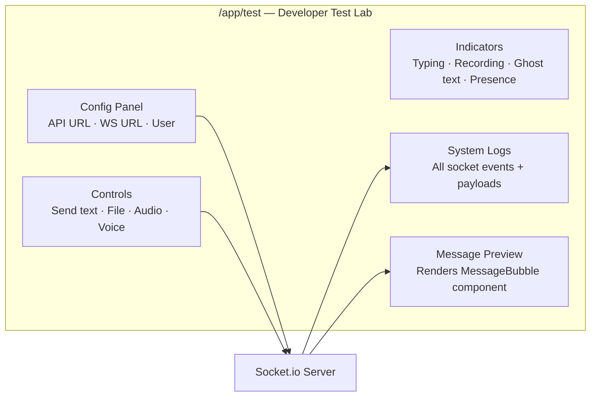

# Testing

## Test Stack

| Layer | Tool |
|-------|------|
| Test runner | Jest |
| Frontend component tests | React Testing Library |
| Backend integration tests | Supertest |
| Coverage | Jest built-in |
| DOM environment | jest-environment-jsdom |

## Running Tests

```bash
# All tests (from monorepo root)
npm test

# Frontend only
cd frontend && npm test

# Backend only
cd backend && npm test

# Watch mode
cd frontend && npm run test:watch
cd backend && npm run test:watch

# Coverage report
cd frontend && npm run test:coverage
cd backend && npm run test:coverage
```

## Frontend Tests

Located in `frontend/src/**/*.test.tsx`. Tests use React Testing Library to render components and assert on DOM output.

### Coverage areas
- Form components (Input, Button, Select, Checkbox, Textarea, Radio, DatePicker, RangeSlider)
- Auth forms (LoginForm, ForgotPassword, EmailVerification, LoginVerification)
- Layout components (AppLayout, MobileLayout)
- Feature components (ProfileImageUploader, CoverImageUploader, BottomSheet)
- Utility components (ThemeToggle, ToastContainer, Logo)

### Jest config (`frontend/jest.config.js`)

```js
module.exports = {
  testEnvironment: 'jsdom',
  setupFilesAfterFramework: ['./jest.setup.js'],
  moduleNameMapper: {
    '^@/(.*)$': '<rootDir>/src/$1',
    '\\.(css|scss)$': 'identity-obj-proxy'
  }
}
```

## Backend Tests

Located in `backend/src/__tests__/`. Tests use Supertest to make HTTP requests against the Express app with a mocked Prisma client.

### Coverage areas

| Test file | Routes covered |
|-----------|---------------|
| `auth.test.ts` | Registration, login, verification flows |
| `users.test.ts` | Username check, search, profile |
| `messages.test.ts` | History, conversations |
| `groups.test.ts` | CRUD, join, leave, messages |
| `images.test.ts` | Profile/cover image upload endpoints |

### Prisma mock

Prisma is mocked at the module level:

```typescript
jest.mock('@prisma/client', () => ({
  PrismaClient: jest.fn().mockImplementation(() => ({
    user: {
      findUnique: jest.fn(),
      create: jest.fn(),
      update: jest.fn(),
    },
    // ...
  }))
}));
```

### Jest config (`backend/jest.config.js`)

```js
module.exports = {
  preset: 'ts-jest',
  testEnvironment: 'node',
  testPathPattern: 'src/__tests__',
  moduleNameMapper: { '^@/(.*)$': '<rootDir>/src/$1' }
}
```

## Coverage

Coverage reports are generated in `coverage/lcov-report/`. To view:

```bash
# Frontend
cd frontend && npm run test:coverage
open coverage/lcov-report/index.html

# Backend
cd backend && npm run test:coverage
open coverage/lcov-report/index.html
```

Target coverage thresholds (configured in Jest):

| Metric | Target |
|--------|--------|
| Statements | 70% |
| Branches | 60% |
| Functions | 70% |
| Lines | 70% |

## Export Test Results

Both frontend and backend have an export script that writes Jest results to a JSON file for CI/reporting use:

```bash
cd frontend && npm run test:export
cd backend && npm run test:export
# or from root:
npm run test:export
```

Output: `frontend/test-results.json`, `backend/test-results.json`

## Test Lab (Developer Tool)

The `/app/test` page is a full WebSocket playground for manually testing the messaging stack without needing two browser sessions.



**Features:**
- WebSocket connection status + config display (API URL, WS URL, Node env)
- User selector (loads all registered users from `GET /api/users`)
- Send text, file, image, audio, and voice messages
- Typing indicator buttons (start/stop)
- Ghost typing mode — real-time keystroke broadcast
- Presence toggle (go online/offline manually)
- Scrollable system log with full event name + payload for every socket event
- Message bubble preview using the production `MessageBubble` component
- Audio waveform visualisation testing
- Lightbox image viewer testing

This page is only accessible to authenticated users and is not linked from the main navigation.


